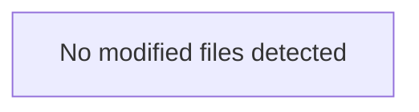

## 📌 PR Overview: ✅ [PASS]

### 🎯 Summary & Motivation
PR satisfies all security, contract, lint, eval, and incident invariants.

### 📂 Modified Files
- No modified files

### 💥 Blast-Radius Impact Map

### 🧪 Verification Evidence
- [x] Secrets Scanned: 0 leaks
- [x] API Contract Backwards Compatibility Verified
- [x] Linting & Typecheck Verified
- [x] Continuous Eval Regression Gate (Workflow 6): NOT_TRIGGERED
- [x] Incident Defense MFR Test (Workflow 7): NOT_TRIGGERED

---
*Audited by **Workflow 4: PR Gatekeeper v2.0***