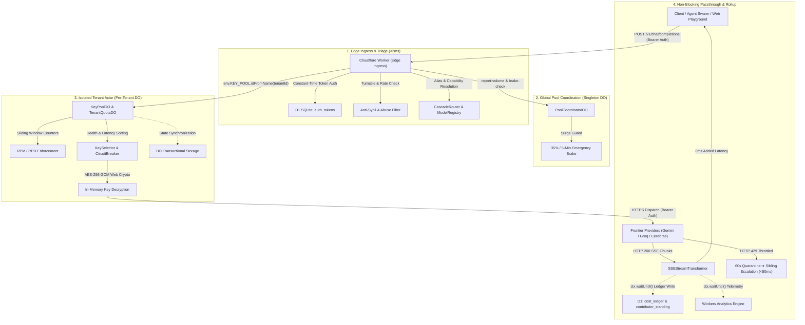

# 🔑 Key Collective v4.0 (Community Capacity & Developer Platform)

[](https://www.typescriptlang.org/)
[](https://developers.cloudflare.com/workers/)
[-brightgreen.svg)](Makefile)
[](src/crypto/)

Key Collective is a **high-throughput, edge-native AI proxy, community capacity exchange, and quota multiplexer** running globally on Cloudflare Workers and Durable Objects. It federates free-tier and provisioned API keys across frontier AI providers (Google Gemini, GroqCloud, SambaNova, Cerebras) into unified, OpenAI-compatible streaming endpoints (`/v1/chat/completions`) with sub-millisecond failover, continuous credit scoring, and zero cross-tenant state leakage.

---

## ⚡ Key Capabilities & Architecture Highlights

- **Communal Capacity Exchange:** A cooperative key pool where developers contribute provider keys in exchange for elevated capacity multipliers (`1.5x` up to `4.5x`).
- **5-Minute Surge Emergency Brake:** The global `PoolCoordinatorDO` monitors communal token consumption and automatically applies a 60-second isolation brake to any tenant whose traffic exceeds **35% of total pool volume** in a rolling 5-minute window.
- **Graduated Jail Demotion Cycle:** Contributor standing evaluates Community Debt against Contributed Capacity:
  - `PRISTINE` ($\text{Debt} / \text{Contributed} \le 0.50$): Full capacity multipliers and burst headroom.
  - `SOFT_WARNING` ($0.50 < \text{Debt} / \text{Contributed} \le 1.00$): Multiplier frozen, warning surfaced.
  - `HARD_JAIL` ($\text{Debt} / \text{Contributed} > 1.00$): Clamped to probationary bounds (2 RPM / 50 RPD).
- **Dedicated Interactive Playground:** Full-featured testing bench in the web console (`ui/src/lib/Playground.svelte`) with real-time SSE streaming inspection, latency profiling, dynamic model discovery via `/v1/models`, and instant overview telemetry synchronization.
- **Developer Workbench:** Project-level isolation with virtual client API keys, custom sub-caps, and per-project usage telemetry.
- **Zero-Mock Real Telemetry:** All dashboard counters, latency charts, and ledger balances reflect ground-truth production traffic and live response headers (`x-request-cost-micros`).

---

## 🏗️ System Topology



---

## 🛡️ Non-Negotiable Invariants

1. **Zero Plaintext Keys at Rest:** Upstream provider keys are encrypted with AES-256-GCM using unique 12-byte CSPRNG nonces and PBKDF2/HKDF master key derivation. Plaintext keys exist only in ephemeral V8 isolate memory during request dispatch.
2. **Per-Tenant Compute Isolation:** Routed via `env.KEY_POOL.idFromName(tenantId)`. Each tenant executes inside an isolated Durable Object actor with zero cross-tenant state.
3. **Fixed-Point Microdollars (`int64` / `bigint`):** All financial computations use 64-bit integer microdollars ($1.00 USD = 1,000,000 µ$). Floating-point math is strictly forbidden.
4. **DO Transactional Storage for Hot State:** Sliding-window rate counters and circuit breaker trip states persist to `this.ctx.storage`, surviving worker evictions and edge restarts.
5. **Non-Blocking Telemetry:** High-frequency event emission and cost ledger persistence are deferred to asynchronous `ctx.waitUntil()` tasks, guaranteeing zero proxy latency penalty.
6. **Automated Upstream Failover:** Upstream HTTP 429 or 5xx responses trigger immediate key quarantine and transparent escalation across sibling keys or fallback models without breaking client streams.

---

## 📊 Live Model Registry & Cascades

The proxy maps logical aliases to canonical models and automatically falls back when capacity limits or upstream rate-limits occur:

| Model Alias | Primary Upstream Model | Fallback Candidates | Supported Capabilities |
|---|---|---|---|
| `auto` | `gemini-2.5-flash` | `groq/llama-3.3-70b-versatile`, `cerebras/llama3.1-8b` | Chat, Tools, JSON Mode |
| `smart-fast` | `gemini-2.5-flash` | `groq/llama-3.3-70b-versatile` | Chat, Tools, Vision |
| `coder-high` | `gemini-2.5-pro` | `groq/deepseek-r1-distill-llama-70b` | Extended Reasoning, Coding, Long Context |
| `open-groq` | `groq/llama-3.3-70b-versatile` | `cerebras/llama3.1-8b` | Ultra-Low Latency, Chat |
| `cerebras-speed`| `cerebras/llama3.1-8b` | `groq/llama-3.1-8b-instant` | Instant Inference (>1000 tok/s) |

---

## 🚀 Quickstart & Development

### 1. Prerequisites
- Node.js >= 20.x
- `npm` or `pnpm`
- Cloudflare Wrangler CLI (`npm install -g wrangler`)

### 2. Installation & Quality Gate
```bash
# Install root and UI dependencies
make setup

# Run strict typecheck and all 304 automated tests in <10s
make gate
```

### 3. Local Development
```bash
# Apply local D1 schema migrations
npx wrangler d1 migrations apply key-collective-db --local

# Start local Worker & Durable Objects runtime
npm run dev

# In another terminal, run the Svelte 5 frontend console
cd ui && npm run dev
```

### 4. Sending an OpenAI-Compatible Chat Request
```bash
curl -X POST http://127.0.0.1:8787/v1/chat/completions \
  -H "Authorization: Bearer <your-token>" \
  -H "Content-Type: application/json" \
  -d '{
    "model": "auto",
    "messages": [
      {"role": "system", "content": "You are a helpful assistant."},
      {"role": "user", "content": "Explain zero-knowledge proofs in one concise paragraph."}
    ],
    "stream": true
  }'
```

---

## 📁 Repository Structure

```
.
├── src/
│   ├── durable_objects/     # KeyPoolDO, CircuitBreakers, KeySelector & RateLimiter
│   ├── pool/                # PoolCoordinatorDO (35% surge brake, leaky bucket, debt engine)
│   ├── quota/               # TenantQuotaDO (sliding-window multi-project limits)
│   ├── router/              # CascadeRouter, ModelRegistry, CapabilityFilter
│   ├── proxy/               # UpstreamClient, SSEStreamTransformer, CostCalculator
│   ├── crypto/              # AES-256-GCM Web Crypto encryption & nonce utilities
│   ├── worker/              # Worker entry, router_handler, pool_routes, auth_middleware
│   └── contracts/           # Strict TypeScript contracts & domain models
├── ui/                      # Svelte 5 Developer Console & Interactive Playground
│   ├── src/lib/Playground.svelte   # Standalone model testbench & stream reader
│   ├── src/lib/Workbench.svelte    # Multi-project key management & sub-caps
│   ├── src/lib/PoolCommonsTab.svelte # Communal pool telemetry & contributor standing
│   └── src/lib/MetricCards.svelte  # Real-time telemetry cards (RPM, latency, spend)
├── docs/
│   ├── architecture/        # LLDs, UI designs, and state machines
│   └── codeflow/            # Microscopic CFGs, call graphs, and Def-Use matrices
├── migrations/              # D1 SQL relational schema migrations
└── Makefile                 # Quality gate & development automation harness
```

---

## 🏛️ Governance & Second Brain Integration

- **Architecture Decision Records:** Documented in [`docs/architecture/`](docs/architecture/) and mirrored to `~/Vault/1-Projects/Key-Collective/`.
- **Knowledge Base Synchronization:** Codebase Scribe exports evergreen concepts (`communal-capacity-credit-and-jail-cycle`, `adaptive-cascade-routing-and-fallback-escalation`) to Obsidian Vault at `~/Vault/2-Areas/ai-systems/`.
