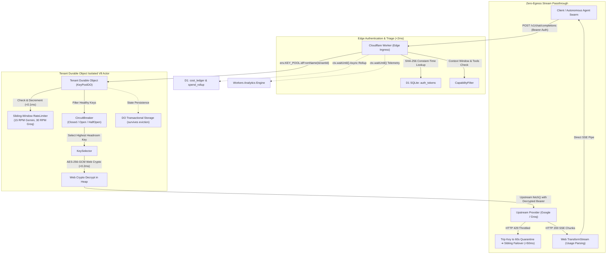

# 🔑 Key Collective v2.1 (Free-Tier Edition)

[](https://www.typescriptlang.org/)
[](https://developers.cloudflare.com/workers/)
[-brightgreen.svg)](Makefile)
[](src/crypto/)

Key Collective is an **edge-native, multi-tenant reverse proxy and quota multiplexer** deployed natively across the Cloudflare global network. It aggregates pools of cardless free-tier API keys across frontier AI providers (Google Gemini, Groq, Cerebras, SambaNova, Cloudflare Workers AI) into a single, unified OpenAI-compatible endpoint (`/v1/chat/completions`).

---

## ⚡ Core Value: Free-Tier Quota Multiplexing

Frontier AI providers offer generous cardless free tiers, but individual keys suffer from aggressive rate limits (e.g. 15 RPM for Gemini, 30 RPM for Groq). Key Collective solves this by multiplexing traffic across pools of free-tier keys with in-memory sliding-window concurrency control and sub-50ms 429 failover.

### Multiplexing Math (22 Keys Pool)
| Provider | Pooled Keys | Per-Key Quota | Aggregate Continuous Capacity | Daily Volume | Compute Cost |
|---|---|---|---|---|---|
| **Google Gemini** | 17 keys | 15 RPM / 1,500 RPD | **255 RPM** | **25,500 RPD** | **$0.00** |
| **GroqCloud** | 5 keys | 30 RPM / 1,000 RPD | **150 RPM** | **5,000 RPD** | **$0.00** |
| **Combined Pool** | **22 keys** | — | **405 RPM** | **30,500 RPD** | **$0.00** |

---

## 🏗️ Architecture Overview



---

## 🛡️ Non-Negotiable Invariants

1. **No Plaintext Keys at Rest:** Keys are encrypted using AES-256-GCM via the Web Crypto API with unique 12-byte CSPRNG nonces stored in Cloudflare D1. Decryption occurs strictly in ephemeral heap memory at upstream dispatch time.
2. **Per-Tenant Durable Object Isolation:** `env.KEY_POOL.idFromName(tenantId)` allocates a dedicated, single-threaded V8 isolate per tenant. Zero cross-tenant memory or state leakage.
3. **Fixed-Point Microdollars (`int64` / `bigint`):** Financial accounting uses 64-bit integer microdollars ($1.00 USD = 1,000,000 µ$). Eliminates IEEE-754 floating-point drift. Actual spend is `0 µ$`, while commercial market value is tracked as `virtual_savings_microdollars`.
4. **DO Transactional Storage for Hot State:** Circuit breaker states and sliding-window RPM counters synchronize to `this.ctx.storage`, surviving worker evictions and restarts.
5. **Non-Blocking Observability:** High-frequency telemetry streams asynchronously to Cloudflare Workers Analytics Engine via `ctx.waitUntil()`. The proxy hot path is never blocked by database writes.
6. **Sub-50ms 429 Failover:** When an upstream key hits an HTTP 429 rate limit, it is automatically isolated into a 60-second cooldown quarantine, immediately failing over to healthy sibling keys without dropping client requests.

---

## 🚀 Quickstart & Development

### 1. Prerequisites
- Node.js >= 20.x
- `pnpm` >= 9.x
- Cloudflare Wrangler CLI

### 2. Installation & Verification
```bash
# Install dependencies
pnpm install

# Run strict typecheck, linter, and 806 unit/integration tests
make gate
```

### 3. Local Database & Key Seeding
```bash
# Apply local D1 schema migrations
pnpm run db:migrate:local

# Seed test tenant, auth tokens, and encrypted free-tier keys
node scripts/seed_local.mjs
```

### 4. Start Local Edge Server
```bash
# Launch Cloudflare Workers & Durable Objects on port 8787
pnpm run dev
```

### 5. Send an OpenAI-Compatible Chat Request
```bash
curl -X POST http://127.0.0.1:8787/v1/chat/completions   -H "Authorization: Bearer kc_test_token_alpha"   -H "Content-Type: application/json"   -d '{
    "model": "gemini-2.5-flash",
    "messages": [{"role": "user", "content": "Explain quantum tunneling in one sentence."}],
    "stream": true
  }'
```

---

## 🧪 Test Suite & Quality Gate

Key Collective enforces a strict sub-10s quality gate before every commit:

```bash
make gate
```

```text
 Test Files  26 passed (26)
      Tests  806 passed (806)
   Duration  2.32s
🎉 [GATE PASSED] TypeScript typecheck and tests satisfied in <10s.
```

---

## 🏛️ Project Governance & Architecture Links

- **[PRD Specification](docs/PRD.md):** Free-tier multiplexer scope, boundaries, and acceptance criteria.
- **[System Design](docs/system_design.md):** Detailed component breakdown and stream lifecycle.
- **[Free-Tier Provider Landscape](docs/research/free_tier_provider_landscape.md):** In-depth limits, reset schedules, and cardless provider nuances.
- **[ADR 001](docs/adr/001-architecture-selection.md):** Architectural decision record for Cloudflare-Native Edge Actor.
- **[Chaos & Resilience Matrix](docs/qa_defense.md):** Red-team defense against concurrency bursts and 429 cascades.
- **[Obsidian Project Hub](~/Vault/1-Projects/Key-Collective/Key-Collective-Hub.md):** Central knowledge graph hub.
