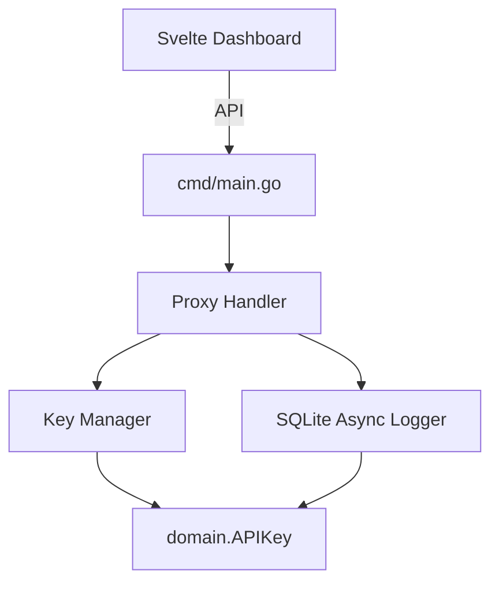

# 🚀 HIVE Stage 3: Proxy Engine & Sliding Window Circuit Breaker

## Overview
This PR introduces the core backend infrastructure for Key Collective, transforming it from a static specification into a fully functional, high-throughput LLM proxy.

## 🏗️ Architectural Changes
- **Key Manager (`internal/proxy/manager.go`):** Implements a sliding window rate limiter (60s reset) and priority-based fallback router.
- **Crypto Vault (`internal/proxy/crypto.go`):** Introduces AES-256-GCM symmetric encryption for securing LLM keys at rest.
- **SQLite Async Logger (`internal/db/sqlite.go`, `main.go`):** Implements WAL mode and a buffered Go channel (`size 1000`) for zero-latency telemetry.
- **Proxy Handler (`internal/proxy/handler.go`):** Reverse proxies OpenAI/LiteLLM schema requests seamlessly to Gemini/Groq upstreams, injecting decrypted keys at runtime.

## 🌐 Blast Radius Map

## 🔒 Security Posture
- 🛡️ Keys are never stored in plaintext on disk.
- 🛡️ Dashboard API token (`Authorization: Bearer`) is hashed using SHA-256 before memory comparison.
- 🛡️ Telemetry logging safely drops payloads under extreme load to prevent memory starvation, rather than blocking the async loop.
