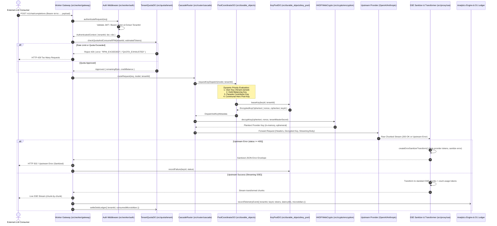
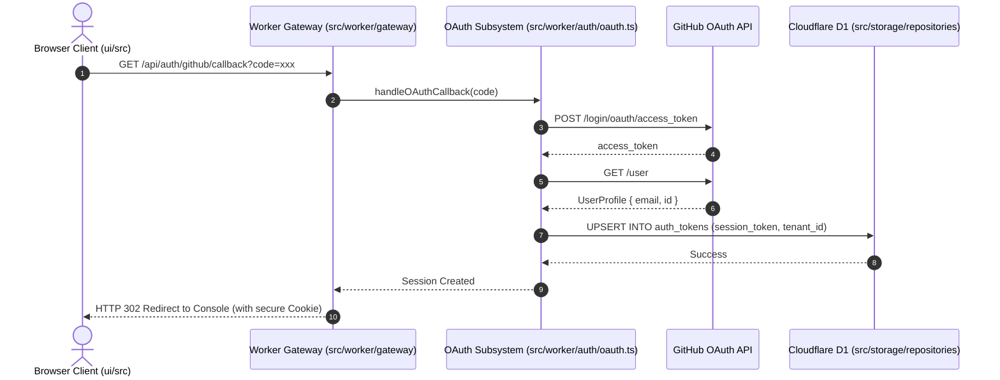
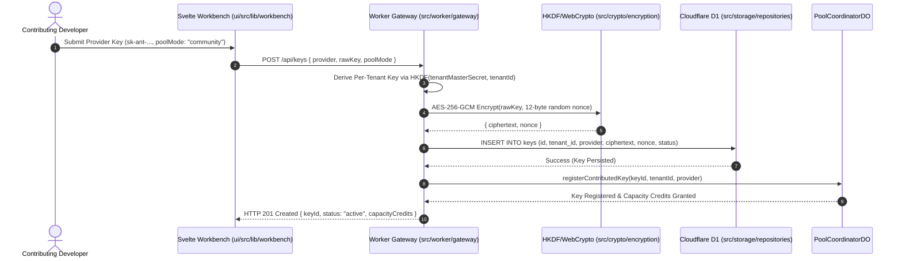

# 🔄 Execution Sequence Flows: Key Collective (v4.0)

This document visualizes the mission-critical runtime execution lifecycles of Key Collective's edge architecture on Cloudflare Workers and Durable Objects.

---

## 1. Proxied LLM Inference Lifecycle

Traces an incoming client chat request from edge authentication, through quota validation, dynamic key dispatch, ephemeral decryption, upstream forwarding, SSE error sanitization, and non-blocking telemetry settlement.

---

## 2. Live OAuth & Session Sync Flow

Traces a user authenticating via GitHub via the new `/api/auth/github/callback` endpoint:

---

## 3. Key Contribution & HKDF Encryption Flow

Traces how a user donates an OpenAI/Anthropic API key to the communal pool:

