# Key Collective v3 — GitHub Actions CI/CD Architecture (Dev & Prod)

> **Status:** Canonical Specification  
> **Target:** Cloudflare Workers & Pages/Assets Dual-Environment Pipeline  
> **Workflow:** Workflow 1: Project Inception v2.0  

---

## 1. Pipeline Overview & Strategy

Key Collective v3 adopts a **Dual-Environment GitOps Architecture** separating ephemeral developer previews and staging from live production (`key-col.axe08.tech`):

```mermaid
flowchart TD
    subgraph DevBranch["Feature / Develop Branch"]
        PR[Developer Opens PR to 'develop' or 'main'] --> PRGate[Stage 1: Fast Quality Gate <10s]
        PRGate -->|make gate: TypeScript + 33 Vitest Suites| DevDeploy[Stage 2: Deploy to Dev Environment]
        DevDeploy -->|wrangler deploy --env dev| DevEdge[https://dev.key-col.axe08.tech]
        DevEdge --> DevSmoke[Stage 3: Automated Smoke Tests on Dev Edge]
    end

    subgraph ProdBranch["Production Tag or Main Branch Merge"]
        Merge[Merge to 'main' or Release Tag 'v3.*.*'] --> ProdGate[Stage 1: Production Quality Gate <10s]
        ProdGate --> D1Migrate[Stage 2: D1 Migration Dry-Run & Apply]
        D1Migrate --> AssetBuild[Stage 3: Svelte 5 UI Build & Hash Assets]
        AssetBuild --> ProdDeploy[Stage 4: Cloudflare Workers Deploy]
        ProdDeploy -->|wrangler deploy| LiveProd[https://key-col.axe08.tech]
        LiveProd --> LiveHealth[Stage 5: Live Canary Health Check /health]
        LiveHealth -- 200 OK --> Notify[Slack / GitHub Release Notification]
        LiveHealth -- Failure --> AutoRollback[Automated Rollback to Previous Version ID]
    end
```



---

## 2. Environment Topology & Secrets Matrix

| Setting | Dev / Staging (`dev`) | Production (`prod`) |
| :--- | :--- | :--- |
| **Custom Domain** | `https://dev.key-col.axe08.tech` | `https://key-col.axe08.tech` |
| **D1 Database** | `key-collective-d1-dev` | `key-collective-d1` |
| **Durable Objects** | `KeyPoolDO` (Dev namespace) | `KeyPoolDO` (Production namespace) |
| **Analytics Engine** | `key_collective_telemetry_dev` | `key_collective_telemetry` |
| **GitHub Secrets Required** | `CLOUDFLARE_API_TOKEN`, `CLOUDFLARE_ACCOUNT_ID`, `KC_MASTER_KEY_DEV` | `CLOUDFLARE_API_TOKEN`, `CLOUDFLARE_ACCOUNT_ID`, `KC_MASTER_KEY` |

---

## 3. GitHub Actions Workflows

### 3.1 Pull Request & Dev Deployment (`.github/workflows/ci-dev.yml`)
```yaml
name: CI & Dev Staging Deployment

on:
  pull_request:
    branches: [main, develop]
  push:
    branches: [develop]

concurrency:
  group: dev-deploy-${{ github.ref }}
  cancel-in-progress: true

jobs:
  quality-gate:
    name: ⚡ Fast Quality Gate (<10s)
    runs-on: ubuntu-latest
    timeout-minutes: 5

    steps:
      - name: Checkout Repository
        uses: actions/checkout@v4

      - name: Setup Node.js (v22)
        uses: actions/setup-node@v4
        with:
          node-version: 22
          cache: 'npm'

      - name: Install Root & UI Dependencies
        run: |
          npm ci
          cd ui && npm ci

      - name: Run Strict Quality Gate (TypeScript + 33 Test Suites)
        run: make gate

      - name: Build UI Static Assets
        run: cd ui && npm run build

  deploy-dev:
    name: 🚀 Deploy Dev Environment
    needs: quality-gate
    if: github.ref == 'refs/heads/develop'
    runs-on: ubuntu-latest
    timeout-minutes: 5

    steps:
      - name: Checkout Repository
        uses: actions/checkout@v4

      - name: Setup Node.js
        uses: actions/setup-node@v4
        with:
          node-version: 22
          cache: 'npm'

      - name: Install Dependencies
        run: |
          npm ci
          cd ui && npm ci && npm run build

      - name: Apply D1 Migrations (Dev)
        run: npx wrangler d1 migrations apply key-collective-d1-dev --remote
        env:
          CLOUDFLARE_API_TOKEN: ${{ secrets.CLOUDFLARE_API_TOKEN }}
          CLOUDFLARE_ACCOUNT_ID: ${{ secrets.CLOUDFLARE_ACCOUNT_ID }}

      - name: Deploy to Cloudflare Workers (Dev)
        run: npx wrangler deploy --env dev
        env:
          CLOUDFLARE_API_TOKEN: ${{ secrets.CLOUDFLARE_API_TOKEN }}
          CLOUDFLARE_ACCOUNT_ID: ${{ secrets.CLOUDFLARE_ACCOUNT_ID }}

      - name: Dev Edge Smoke Test
        run: |
          sleep 3
          curl -f -s https://dev.key-col.axe08.tech/health | grep '"status":"healthy"'
```

---

### 3.2 Production Deployment (`.github/workflows/deploy-prod.yml`)
```yaml
name: Production Deployment & Zero-Downtime Verification

on:
  push:
    branches: [main]
    tags: ['v*.*.*']

jobs:
  gate-and-deploy:
    name: 🛡️ Production Quality Gate & Rollout
    runs-on: ubuntu-latest
    timeout-minutes: 8

    steps:
      - name: Checkout Repository
        uses: actions/checkout@v4

      - name: Setup Node.js (v22)
        uses: actions/setup-node@v4
        with:
          node-version: 22
          cache: 'npm'

      - name: Install Dependencies
        run: |
          npm ci
          cd ui && npm ci

      - name: Verify Strict Quality Gate (make gate)
        run: make gate

      - name: Build Production UI Assets
        run: cd ui && npm run build

      - name: Apply D1 Database Migrations (Prod)
        run: npx wrangler d1 migrations apply key-collective-d1 --remote
        env:
          CLOUDFLARE_API_TOKEN: ${{ secrets.CLOUDFLARE_API_TOKEN }}
          CLOUDFLARE_ACCOUNT_ID: ${{ secrets.CLOUDFLARE_ACCOUNT_ID }}

      - name: Deploy Cloudflare Worker & Assets
        id: deploy
        run: |
          DEPLOY_OUTPUT=$(npx wrangler deploy)
          echo "$DEPLOY_OUTPUT"
          VERSION_ID=$(echo "$DEPLOY_OUTPUT" | grep -o 'Version ID: [a-f0-9-]*' | cut -d ' ' -f 3)
          echo "version_id=$VERSION_ID" >> $GITHUB_OUTPUT
        env:
          CLOUDFLARE_API_TOKEN: ${{ secrets.CLOUDFLARE_API_TOKEN }}
          CLOUDFLARE_ACCOUNT_ID: ${{ secrets.CLOUDFLARE_ACCOUNT_ID }}

      - name: Post-Deploy Canary Health Verification
        run: |
          sleep 4
          HEALTH=$(curl -s -f -m 10 https://key-col.axe08.tech/health)
          echo "Health response: $HEALTH"
          echo "$HEALTH" | grep -q '"status":"healthy"'

      - name: Verify Live Web Dashboard HTML
        run: |
          curl -s -f -m 10 -H "Accept: text/html" https://key-col.axe08.tech/ | grep -q "<title>Key Collective"

      - name: Verify Live Chat Completion Proxy
        run: |
          curl -s -f -m 15 -X POST https://key-col.axe08.tech/v1/chat/completions \
            -H "Authorization: Bearer ${{ secrets.KC_CANARY_TOKEN }}" \
            -H "Content-Type: application/json" \
            -d '{"model": "gemini-2.5-flash", "messages": [{"role": "user", "content": "ping"}], "max_tokens": 5}' | grep -q '"choices"'
```

---

## 4. Rollback Protocol & Zero-Downtime Guarantee
1. **Cloudflare Worker Instant Rollback:** If the Canary verification step fails, GitHub Actions executes:
   ```bash
   npx wrangler rollback --message "Automated Canary Failure Rollback"
   ```
   Cloudflare edge points DNS back to the previous healthy version in `<500ms`.
2. **D1 Backward Compatibility Invariant:** All database migrations must be purely additive (`CREATE TABLE`, `ADD COLUMN`). Never execute `DROP COLUMN` or destructive mutations on live tables until code deprecation completes.
