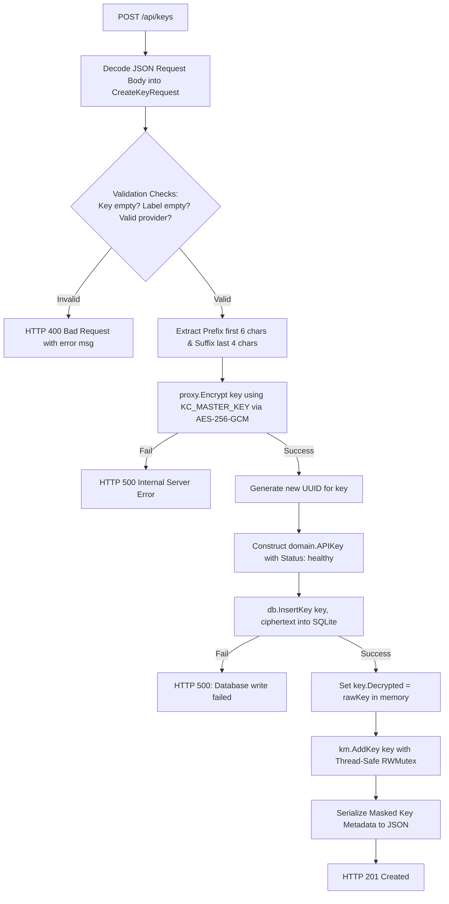
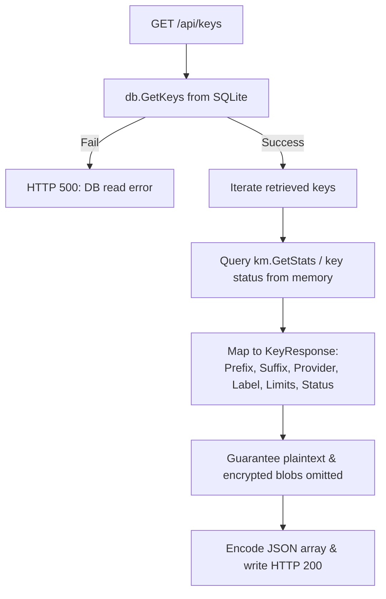

# Codeflow: `APIHandler.HandleCreateKey()` & `HandleGetKeys()`

**Purity Badge:** 🔴 I/O Mutating (HTTP parsing, AES encryption, SQLite insertion, KeyManager mutation)
**Path:** `internal/api/handler.go`

## Control Flow Graph (CFG): Key Creation

## Control Flow Graph (CFG): Key Retrieval

## Def-Use Data Flow Matrix

| Variable | Definition Point | Mutation Points | Usage Sinks | Security / Lifetime Sink |
| :--- | :--- | :--- | :--- | :--- |
| `req.Key` | JSON Unmarshal | None | `proxy.Encrypt()`, `key.Decrypted` | Zeroized from response payload |
| `ciphertext` | `proxy.Encrypt()` | Sealed with nonce | `db.InsertKey()` | Persisted to SQLite BLOB |
| `masterKey` | Env `KC_MASTER_KEY` | None | AES-GCM Key generation | Never logged or returned |
| `key.Decrypted` | `req.Key` string | Cleared on eviction | `km.AddKey()` | Maintained strictly in process RAM |
