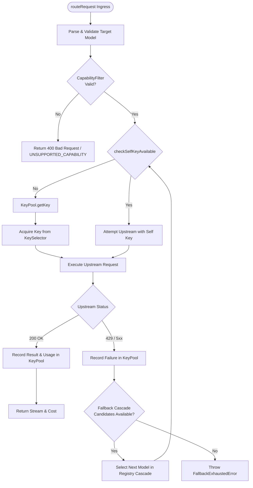

# 🗺️ Codeflow: Cascade Router & Dynamic Key Priority Scheduling

> **Subsystem:** `src/router/cascade/` & `src/router/capability/`  
> **Source Files:** `src/router/cascade/router.ts`, `src/router/cascade/evaluator.ts`, `src/router/cascade/fallback.ts`  
> **Quality Gate:** Strict TypeScript Mode · Zero `any`  

---

## 1. Subsystem Overview
The `CascadeRouter` handles request resolution for incoming LLM inference. It integrates with `CapabilityFilter` to ensure the candidate models support the requested features (e.g. streaming, tool use, vision) and dispatches requests through dynamic priority levels:
1. **Own Key (`OWN_KEY`)**: Contributed by the active tenant, zero debt charged.
2. **Debt Balancing Key (`DEBT_BALANCING`)**: Selected to balance reciprocal consumption.
3. **Parasite Contributor Key (`PARASITE`)**: Keys from users who consume without adequate reciprocal balance.
4. **Hero Communal Pool (`HERO_POOL`)**: High-capacity unconstrained fallback keys.

---

## 2. Control Flow Graph (CFG)

---

## 3. Def-Use Variable Lifecycle Matrix

| Variable | Scope / Type | Def Site | Use Sites | Purity Badge |
|---|---|---|---|---|
| `requestedModel` | `string` | Ingress Request Payload | `CapabilityFilter`, `ModelRegistry.resolve` | 🟢 Pure |
| `tenantContext` | `AuthenticatedContext` | Auth Middleware | `TenantQuotaDO.check`, `KeyPoolDO.leaseKey` | 🟢 Pure |
| `selectedKey` | `DispatchedKeyMetadata` | `leaseKey` / `PoolCoordinatorDO` | `decryptKey`, `upstreamClient.fetch` | 🔴 State Mutating |
| `debtMicrodollars`| `int64` | `sse_transformer` Usage | `TenantQuotaDO.accrueDebt` | 🔴 State Mutating |
| `circuitStatus` | `CircuitBreakerState` | `KeyPoolDO.storage` | `KeySelector.triage` | 🟡 I/O Bound |
