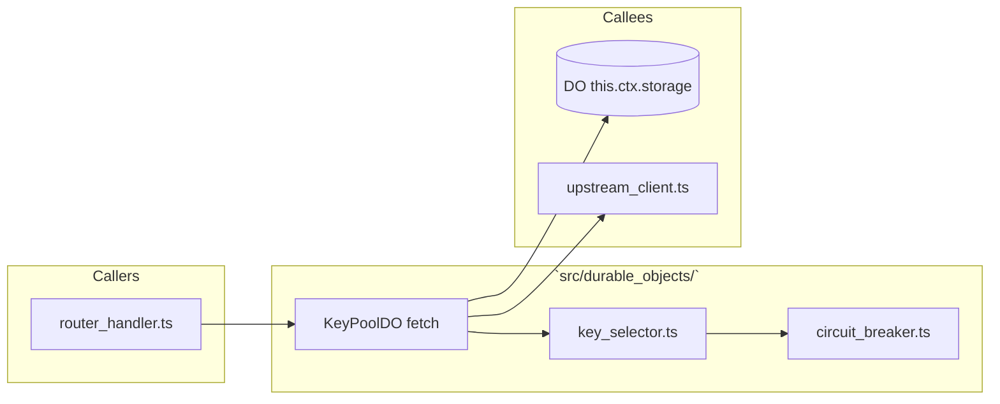
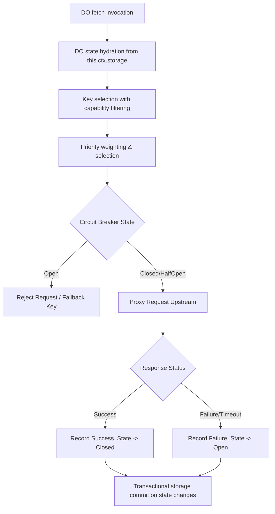

# 📄 Codeflow: `docs/codeflow/durable_object_key_pool_cfg.md`

> **Module Responsibility:** Manages tenant key pools, applies capability filtering and priority weighting, and enforces circuit breaker state transitions in memory and storage.
> **Purity Profile:** `🔴 State Mutating`

---

## 1. 🕸️ Inbound & Outbound Dependency Graph

---

## 2. 🔍 Function Logic & Control Flow Deep Dive

### `def processProxyRequest(req: Request) -> Promise<Response>`
* **Purity:** `🔴 State Mutating`
* **Complexity:** Cyclomatic: `20` | Cognitive: `25`

#### Control Flow Graph (CFG)

#### Def-Use Data Flow Matrix
| Parameter / Variable | Origin | Transformations | Mutation / Sinks |
|---|---|---|---|
| `keys` | DO Storage | Capability filtered, weighted | Used for Upstream proxy auth |
| `cb_state` | DO Memory / Storage | Updated based on error rates | Transactional commit to DO Storage |

#### Edge Cases & Exception Audit
- ⚠️ **Edge Case 1:** High concurrency causing contention on DO storage transactions.
- ⚠️ **Edge Case 2:** Upstream provider total outage causing all keys to trip circuit breaker.

---

## 3. 🛠️ Code Review & Optimization Notes
- **Refactoring:** Isolate circuit breaker transition logic into pure functions.
- **Strengths:** Robust state hydration, transactional integrity for hot state.

## 🔗 Related Workflows & MOC
- [[codebase-scribe-workflow]] — Used in Codebase Scribe & Cartographer
- [[Templates-Index]] — Master Index of Workflows
