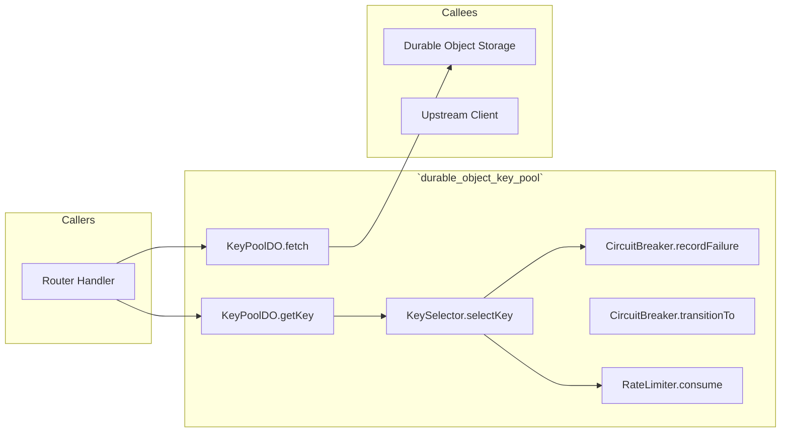
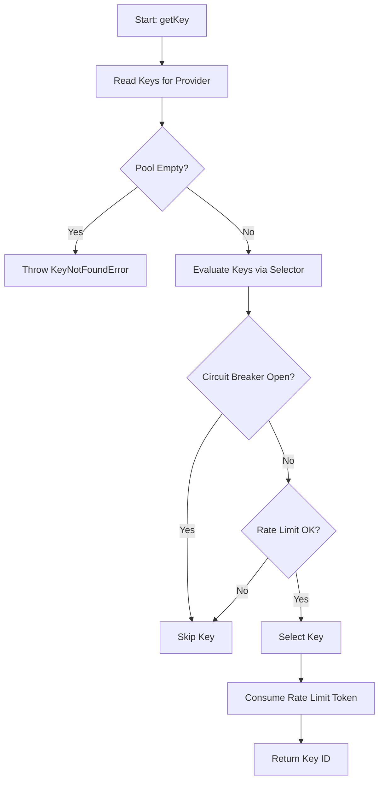
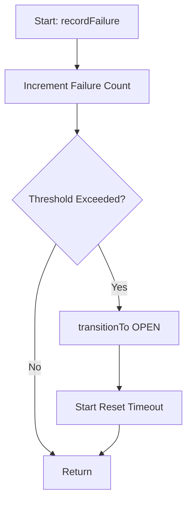

# 📄 Codeflow: `docs/codeflow/durable_object_key_pool_cfg.md`

> **Module Responsibility:** Tenant-isolated Durable Objects for managing API keys, tracking rate limits, and implementing circuit breaking.
> **Purity Profile:** `🔴 State Mutating`

---

## 1. 🕸️ Inbound & Outbound Dependency Graph

---

## 2. 🔍 Function Logic & Control Flow Deep Dive

### `def KeyPoolDO.getKey(provider) -> string`
* **Purity:** `🔴 State Mutating`
* **Complexity:** Cyclomatic: `5` | Cognitive: `6`

#### Control Flow Graph (CFG)

#### Def-Use Data Flow Matrix
| Parameter / Variable | Origin | Transformations | Mutation / Sinks |
|---|---|---|---|
| `provider` | Argument | Mapped to DO key list | Used for storage query |
| `keyId` | DO Storage | Verified | Returned to caller |

#### Edge Cases & Exception Audit
- ⚠️ **Edge Case 1:** All keys for a provider are rate limited or broken.
- ⚠️ **Edge Case 2:** Concurrency spikes causing rate limit race conditions (mitigated by DO single-threaded execution).

---

### `def CircuitBreaker.recordFailure(keyId) -> void`
* **Purity:** `🔴 State Mutating`
* **Complexity:** Cyclomatic: `4` | Cognitive: `4`

#### Control Flow Graph (CFG)

#### Def-Use Data Flow Matrix
| Parameter / Variable | Origin | Transformations | Mutation / Sinks |
|---|---|---|---|
| `keyId` | Argument | Mapped to state | Mutates CB state |

#### Edge Cases & Exception Audit
- ⚠️ **Edge Case 1:** Consecutive failures triggering rapid OPEN state.

---

## 3. 🛠️ Code Review & Optimization Notes
- **Refactoring:** Ensure rate limiter consumption is atomic.
- **Strengths:** Robust isolation using Durable Objects.

## 🔗 Related Workflows & MOC
- [[codebase-scribe-workflow]]
- [[Templates-Index]]
