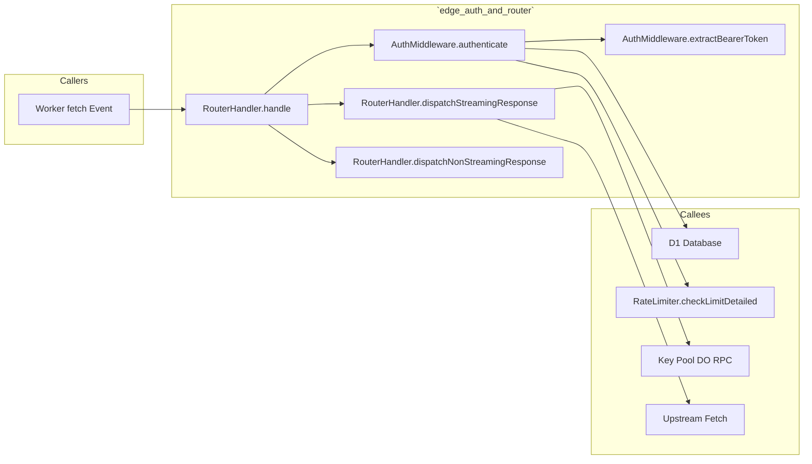
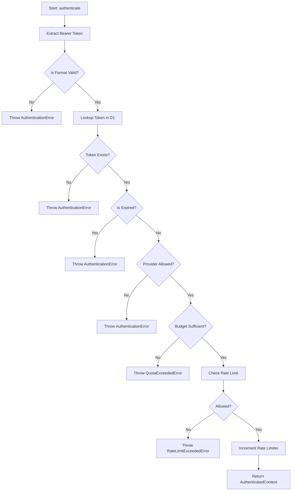
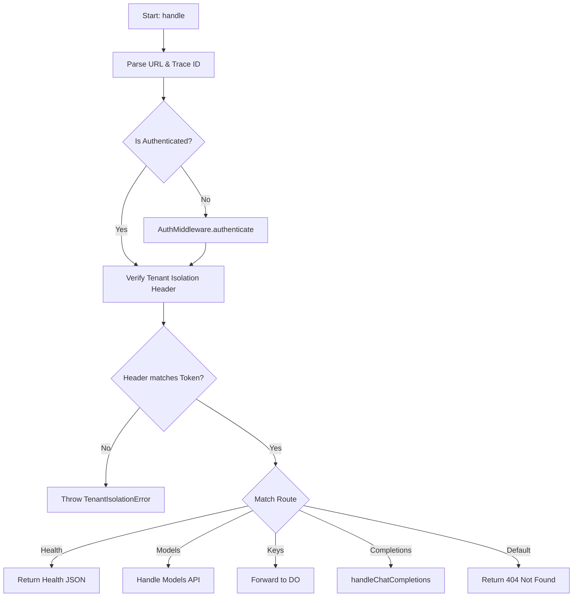

# 📄 Codeflow: `docs/codeflow/edge_auth_and_router_handler_cfg.md`

> **Module Responsibility:** Edge Authentication, Token Validation, RPM Checking & Budget Gating. Model Routing, DO Dispatch, and Streaming Response Passthrough.
> **Purity Profile:** `🟡 I/O Bound`

---

## 1. 🕸️ Inbound & Outbound Dependency Graph

---

## 2. 🔍 Function Logic & Control Flow Deep Dive

### `def AuthMiddleware.authenticate(request, env, options) -> AuthenticatedContext`
* **Purity:** `🟡 I/O Bound`
* **Complexity:** Cyclomatic: `8` | Cognitive: `10`

#### Control Flow Graph (CFG)

#### Def-Use Data Flow Matrix
| Parameter / Variable | Origin | Transformations | Mutation / Sinks |
|---|---|---|---|
| `request` | Argument | Header extracted | N/A |
| `rawToken` | Local | Sanitized & Trimmed | Used for D1 lookup |
| `record` | D1 DB | Validated | Returned in context |

#### Edge Cases & Exception Audit
- ⚠️ **Edge Case 1:** Token missing or malformed header format.
- ⚠️ **Edge Case 2:** Expiration time has passed mid-flight.

---

### `def RouterHandler.handle(request, env, ctx, preAuthCtx) -> Response`
* **Purity:** `🟡 I/O Bound`
* **Complexity:** Cyclomatic: `7` | Cognitive: `8`

#### Control Flow Graph (CFG)

#### Def-Use Data Flow Matrix
| Parameter / Variable | Origin | Transformations | Mutation / Sinks |
|---|---|---|---|
| `request` | Argument | JSON parsed | Forwarded to routes |
| `traceId` | Header/Gen | Used in telemetry | Emitted to telemetry |

#### Edge Cases & Exception Audit
- ⚠️ **Edge Case 1:** Pre-authenticated context vs header mismatch.
- ⚠️ **Edge Case 2:** Malformed JSON in completion body.

---

## 3. 🛠️ Code Review & Optimization Notes
- **Refactoring:** Consider splitting route matching into explicit controller classes for cleaner testing.
- **Strengths:** Strict types, clean encapsulation, distinct error classes.

## 🔗 Related Workflows & MOC
- [[codebase-scribe-workflow]] — Used in Codebase Scribe & Cartographer
- [[Templates-Index]] — Master Index of Workflows
