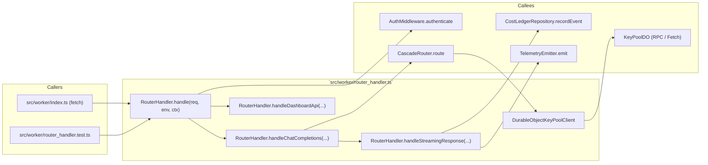
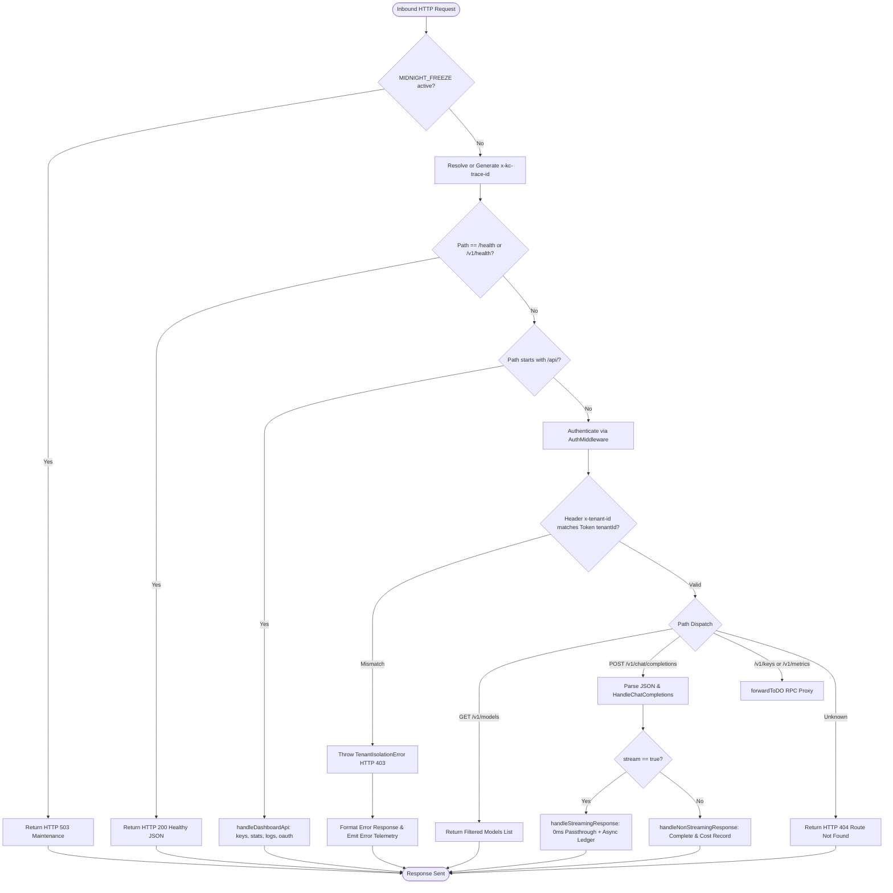

# 📄 Codeflow: `src/worker/router_handler.ts`

> **Module Responsibility:** Cloudflare Worker edge HTTP request router, Per-Tenant Durable Object key-pool dispatch, multi-model cascade resolution, and non-blocking streaming telemetry & cost recording.
> **Purity Profile:** `🟡 I/O Bound` (dispatches edge fetch RPC, coordinates D1 persistence via non-blocking `ctx.waitUntil`, and emits Workers Analytics Engine events).

---

## 1. 🕸️ Inbound & Outbound Dependency Graph

---

## 2. 🔍 Core Function Logic & Control Flow Deep Dive

### `public async handle(request: Request, env: WorkerEnv, ctx?: ExecutionContextLike, preAuthenticatedContext?: AuthenticatedContext): Promise<Response>`
* **Purity:** `🟡 I/O Bound`
* **Complexity:** Cyclomatic: 8 | Cognitive: 7

#### Control Flow Graph (CFG)

#### Def-Use Data Flow Matrix
| Parameter / Variable | Origin | Transformations | Mutation / Sinks |
|---|---|---|---|
| `request` | Edge Fetch Event | Read headers, method, URL, and body stream | Passed to Route Handlers & Auth |
| `traceId` | Inbound Header / `randomUUID()` | Validated / Fallback generated | Forwarded in downstream headers, D1 ledger, Telemetry |
| `authContext` | `AuthMiddleware` | Decoded token, asserted tenant boundary | Invariant guard against cross-tenant state leak |
| `cascadeRes` | `CascadeRouter.route()` | Dynamic model fallback resolution | Returned as stream/body, recorded in cost ledger |
| `ctx` | Cloudflare Worker runtime | Non-blocking execution context | `ctx.waitUntil(finalizeStream)` |

#### Edge Cases & Exception Audit
- ⚠️ **Edge Case 1: Tenant Boundary Breach:** Inbound client passes `x-tenant-id: tenant_b` with a valid Bearer token for `tenant_a`. Trapped immediately with `TenantIsolationError` (HTTP 403) before any Durable Object stub lookup.
- ⚠️ **Edge Case 2: Client Disconnect during SSE Stream:** Cloudflare worker aborts stream reading early; `finalizeStream` still captures accumulated prompt and partial completion tokens and flushes them to D1 without throwing unhandled exceptions.

---

## 3. 🛠️ Code Review & Optimization Notes
- **Strengths:** Zero-blocking hot path using `ctx.waitUntil()`, strictly typed error serialization through `formatRouterError()`, and fixed-point microdollar accounting (`int64` / `bigint`).
- **Optimization:** Dynamic model registry is lazily instantiated to minimize isolate cold-start overhead (<15ms).
