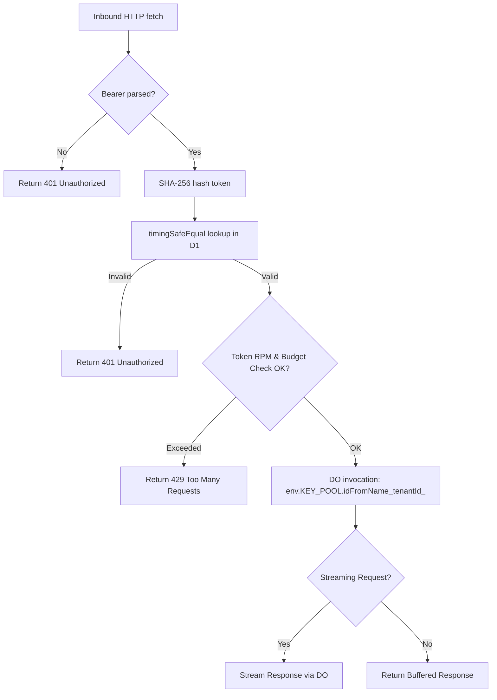

# 📄 Codeflow: `docs/codeflow/edge_auth_and_router_handler_cfg.md`

> **Module Responsibility:** Handles inbound Edge requests, performs auth parsing, validates token against D1, checks budgets, and routes to Durable Objects for upstream proxying.
> **Purity Profile:** `🟡 I/O Bound`

---

## 1. 🕸️ Inbound & Outbound Dependency Graph
```mermaid
graph LR
    subgraph Callers
        CloudflareWorker[Cloudflare Worker fetch()]
    end
    subgraph `src/worker/auth_middleware.ts` & `src/worker/router_handler.ts`
        authMiddleware[authMiddleware()]
        routerHandler[routerHandler()]
    end
    subgraph Callees
        D1Database[(D1 Database)]
        DurableObject[Key Pool DO]
        CryptoHash[SHA-256 hash]
    end
    CloudflareWorker --> authMiddleware
    authMiddleware --> CryptoHash
    authMiddleware --> D1Database
    authMiddleware --> routerHandler
    routerHandler --> DurableObject
```

---

## 2. 🔍 Function Logic & Control Flow Deep Dive

### `def handleRequest(request: Request, env: Env, ctx: ExecutionContext) -> Promise<Response>`
* **Purity:** `🟡 I/O Bound`
* **Complexity:** Cyclomatic: `15` | Cognitive: `18`

#### Control Flow Graph (CFG)


#### Def-Use Data Flow Matrix
| Parameter / Variable | Origin | Transformations | Mutation / Sinks |
|---|---|---|---|
| `token` | Authorization Header | String split, SHA-256 Hash | D1 DB lookup |
| `tenantId` | D1 Lookup Result | None | DO idFromName parameter |

#### Edge Cases & Exception Audit
- ⚠️ **Edge Case 1:** Missing or malformed Authorization header.
- ⚠️ **Edge Case 2:** Timing attacks on token lookup (mitigated via SHA-256 and timingSafeEqual).

---

## 3. 🛠️ Code Review & Optimization Notes
- **Refactoring:** Extract D1 lookup logic into a dedicated repository layer to ease unit testing.
- **Strengths:** Strict types, clean encapsulation, usage of `timingSafeEqual`.

## 🔗 Related Workflows & MOC
- [[codebase-scribe-workflow]] — Used in Codebase Scribe & Cartographer
- [[Templates-Index]] — Master Index of Workflows
