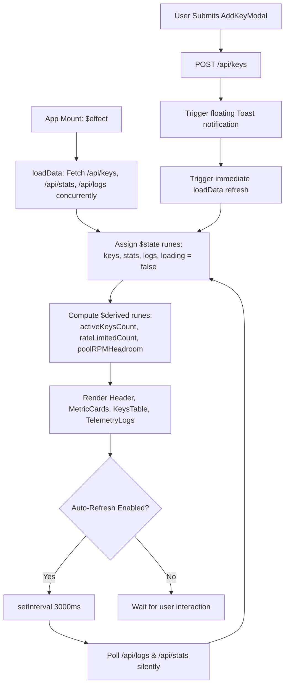

# Codeflow: Svelte 5 Reactive Dashboard Flow

**Purity Badge:** 🟢 Client-Side Reactive State Machine
**Path:** `ui/src/App.svelte`

## Svelte 5 Reactive Architecture

```mermaid
flowchart TD
    Mount[App Mount: $effect] --> FetchInitial[loadData: Fetch /api/keys, /api/stats, /api/logs concurrently]
    FetchInitial --> StateUpdate[Assign $state runes:<br/>keys, stats, logs, loading = false]
    
    StateUpdate --> DerivedComputations[Compute $derived runes:<br/>activeKeysCount, rateLimitedCount, poolRPMHeadroom]
    DerivedComputations --> RenderDOM[Render Header, MetricCards, KeysTable, TelemetryLogs]
    
    RenderDOM --> PollInterval{Auto-Refresh Enabled?}
    PollInterval -- Yes --> Wait3s[setInterval 3000ms] --> PollFetch[Poll /api/logs & /api/stats silently]
    PollFetch --> StateUpdate
    PollInterval -- No --> Idle[Wait for user interaction]
    
    UserAction[User Submits AddKeyModal] --> APICall[POST /api/keys]
    APICall --> Toast[Trigger floating Toast notification]
    Toast --> Reload[Trigger immediate loadData refresh]
    Reload --> StateUpdate
```
