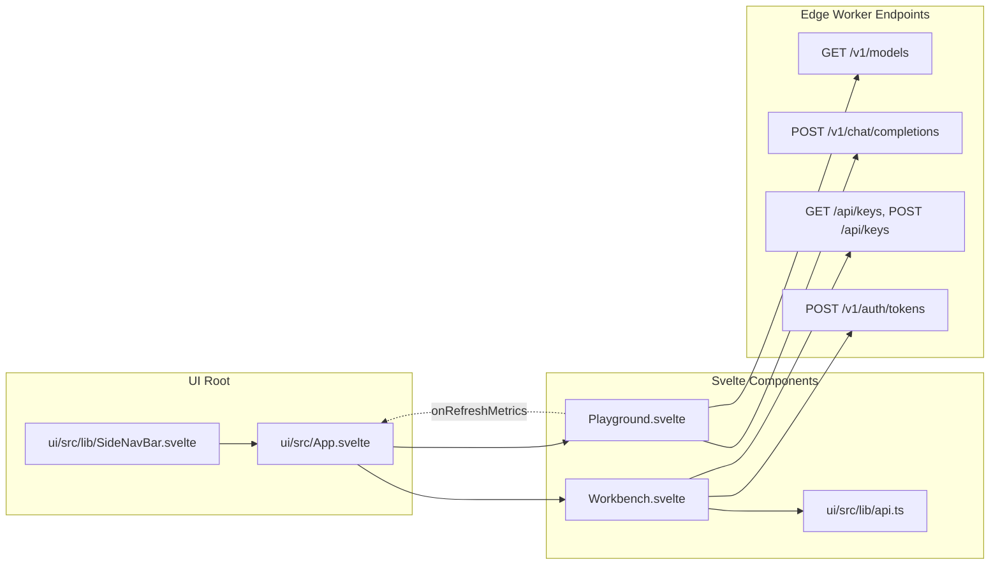
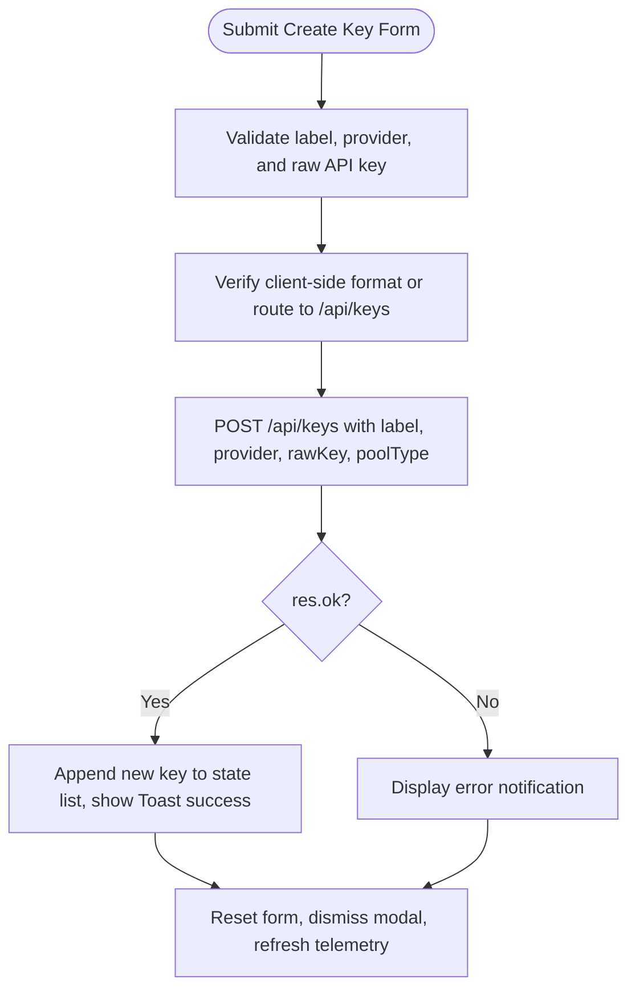

# 📄 Codeflow: `ui/src/lib/Workbench.svelte` & `ui/src/lib/Playground.svelte`

> **Module Responsibility:** Developer Workbench (client virtual key provisioning, multi-project sub-caps, and credential management) and Playground (interactive model testbench, SSE streaming inspection, latency profiling, and real-time microdollar spend feedback).
> **Purity Profile:** `🟡 I/O Bound` (executes client HTTP/SSE fetch operations, manages Svelte 5 reactive runes `$state`, `$derived`, `$props`, and dispatches parent metric updates).

---

## 1. 🕸️ Inbound & Outbound Dependency Graph



---

## 2. 🔍 Core Component Logic & Control Flow Deep Dive

### `Playground.svelte: executeCompletion()`
* **Purity:** `🟡 I/O Bound`
* **Complexity:** Cyclomatic: 6 | Cognitive: 5

#### Control Flow Graph (CFG)
```mermaid
flowchart TD
    Click([Run / Send Request Clicked]) --> InitState[Set isStreaming=true, outputText='', error=null]
    InitState --> BuildPayload[Construct OpenAI-compatible JSON body: model, messages, stream, temp]
    BuildPayload --> StartClock[Record requestStart = performance.now]
    BuildPayload --> FetchExec[fetch POST /v1/chat/completions with AbortController]
    
    FetchExec --> RespCheck{res.ok?}
    RespCheck -->|No| HandleHttpErr[Parse JSON error / status, set errorMessage, isStreaming=false]
    RespCheck -->|Yes: 200 OK| ExtractHeaders[Extract x-request-cost-micros, x-kc-trace-id, x-model-fallback]
    
    ExtractHeaders --> StreamCheck{stream == true?}
    StreamCheck -->|No| ReadBuffered[Read res.json, append content to outputText]
    StreamCheck -->|Yes| StreamInit[Acquire reader = res.body.getReader with TextDecoder]
    
    StreamInit --> ReadLoop{reader.read()}
    ReadLoop -->|done: true| StreamEnd[Calculate final latencyMs, isStreaming=false]
    ReadLoop -->|chunk received| ParseSSE[Split by 'data: ' and parse chunks]
    ParseSSE --> AppendText[Append delta text to outputText in real-time]
    AppendText --> ReadLoop
    
    ReadBuffered --> StreamEnd
    StreamEnd --> CallbackTrigger[Call onRefreshMetrics() to update overview counters]
    HandleHttpErr --> CallbackTrigger
    CallbackTrigger --> Terminate([Idle])
```

#### Def-Use Data Flow Matrix: `executeCompletion`
| Parameter / Variable | Origin | Transformations | Mutation / Sinks |
|---|---|---|---|
| `selectedModel` | User Select Input | Resolved against `/v1/models` | Injected into request body payload |
| `reader` | `res.body.getReader()` | Decoded via `TextDecoder` SSE stream | Emits delta tokens to `outputText` |
| `x-request-cost-micros` | Response Header | Parsed as `Number` | Displays exact microdollars and updates parent |
| `onRefreshMetrics` | Component Prop | Invoked upon stream completion | Triggers `loadData()` in `App.svelte` |

---

### `Workbench.svelte: handleCreateKey()`
* **Purity:** `🟡 I/O Bound`
* **Complexity:** Cyclomatic: 5 | Cognitive: 4

#### Control Flow Graph (CFG)


---

## 3. 🛠️ Code Review & Invariant Verification
- **Zero Mock Metrics Invariant:** All token counts, response times, and costs rendered in Playground are derived exclusively from live response payloads and HTTP headers (`x-request-cost-micros`).
- **Reactive Stream Handling:** Uses native `ReadableStream` reader with backpressure awareness, preventing memory leakage during multi-megabyte LLM streams.
