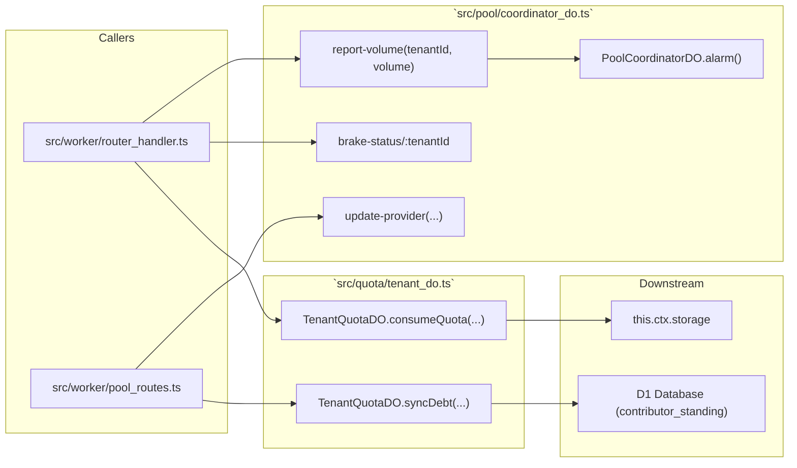
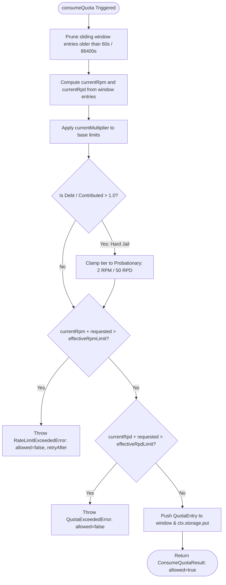

# 📄 Codeflow: `src/pool/coordinator_do.ts` & `src/quota/tenant_do.ts`

> **Module Responsibility:** Global communal pool coordinator Durable Object (`PoolCoordinatorDO`) and Per-Tenant Quota Durable Object (`TenantQuotaDO`). Implements the 35% 5-minute surge emergency brake, communal debt-to-contribution ratio tracking, and sliding-window RPM/RPD multi-project enforcement.
> **Purity Profile:** `🔴 State Mutating` (manages persistent transactional state inside Durable Object memory and `this.ctx.storage`).

---

## 1. 🕸️ Inbound & Outbound Dependency Graph



---

## 2. 🔍 Core Function Logic & Control Flow Deep Dive

### `PoolCoordinatorDO.fetch(req: Request): Promise<Response>` (Emergency Brake & Health)
* **Purity:** `🔴 State Mutating`
* **Complexity:** Cyclomatic: 7 | Cognitive: 6

#### Control Flow Graph (CFG)
```mermaid
flowchart TD
    Req([Inbound POST /coordinator/report-volume]) --> Parse[Extract tenantId & request volume]
    Parse --> WindowPrune[Filter tenantVolumes to last 5 minutes: now - 300s]
    WindowPrune --> SumTenant[Compute tenantTotal = sum volumes for tenant]
    SumTenant --> SumPool[Compute poolTotal = sum volumes across all tenants]
    SumPool --> SurgeCheck{tenantTotal > 0.35 * poolTotal AND poolTotal > 0?}
    SurgeCheck -->|Yes: Surge Detected| SetBrake[activeBrakes.set tenantId, now + 60s<br/>brakeApplied = true]
    SurgeCheck -->|No| Normal[brakeApplied = false]
    SetBrake --> Res[Return Response JSON { brakeApplied }]
    Normal --> Res
    Res --> End([Exit])
```

#### Def-Use Data Flow Matrix: `report-volume`
| Parameter / Variable | Origin | Transformations | Mutation / Sinks |
|---|---|---|---|
| `body.tenantId` | HTTP JSON Body | String validation | Key in `tenantVolumes` and `activeBrakes` maps |
| `body.volume` | HTTP JSON Body | Cast to number | Appended to `tenantVolumes` history list |
| `poolTotal` | Aggregation Loop | Sum of 5-minute active windows | Evaluated against 35% threshold |
| `brakeApplied` | Conditional Assertion | Boolean flag | Stored in `activeBrakes`, returned to proxy |

---

### `TenantQuotaDO.consumeQuota(request: ConsumeQuotaRequest): Promise<ConsumeQuotaResult>`
* **Purity:** `🔴 State Mutating`
* **Complexity:** Cyclomatic: 9 | Cognitive: 8

#### Control Flow Graph (CFG)


#### Def-Use Data Flow Matrix: `consumeQuota`
| Parameter / Variable | Origin | Transformations | Mutation / Sinks |
|---|---|---|---|
| `costMicrodollars` | `toMicrodollars(cost)` | Converted to `bigint` | Accrued in `totalCostMicrodollars` string in DO storage |
| `entries` | In-memory array | Filtered by timestamp > `now - window` | Persisted to `this.ctx.storage` |
| `communityDebtMicroCu` | Synced from D1 | Integer Micro-CU | Evaluated for Jail Clamping & Multiplier Reduction |

---

## 3. 🛠️ Code Review & Invariant Verification
- **Surge Protection Invariant:** `0.35 * poolTotal` threshold dynamically prevents single rogue tenants from exhausting global communal provider capacity.
- **Microdollar Zero Floating-Point Math:** All currency and compute units are strictly stored and computed as `bigint` microdollars.
