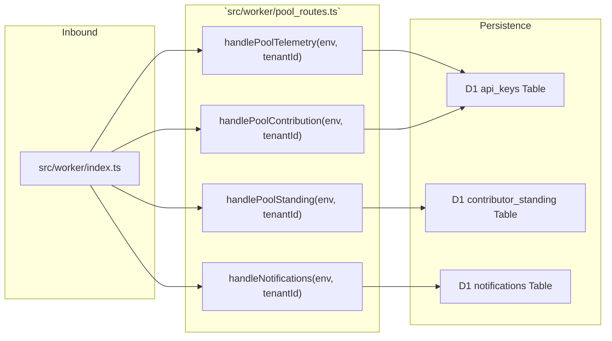
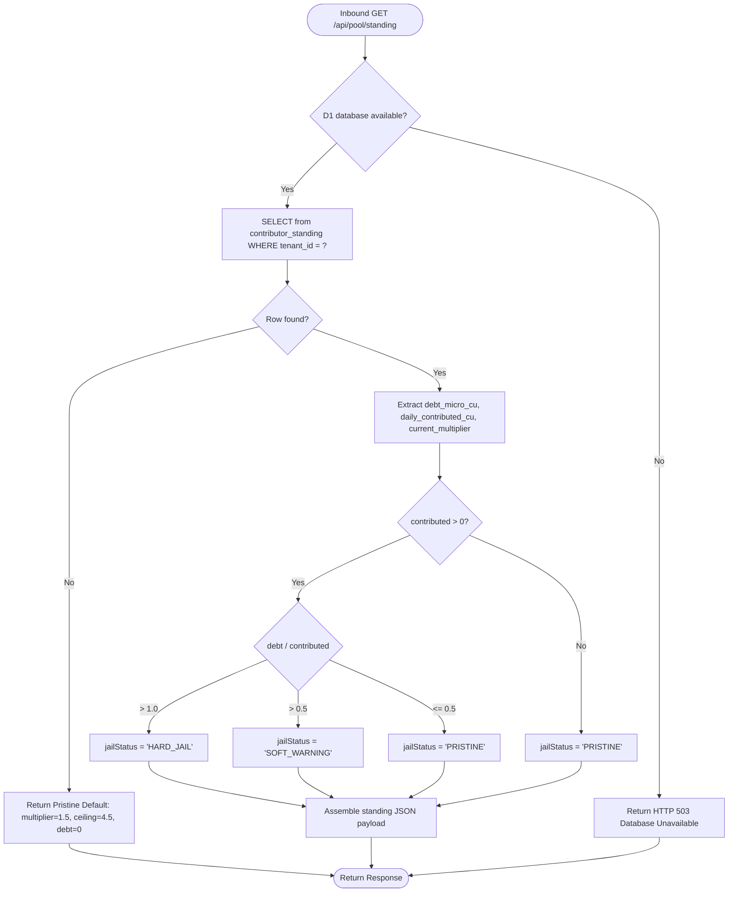

# 📄 Codeflow: `src/worker/pool_routes.ts`

> **Module Responsibility:** Cloudflare Worker edge routes for community pool analytics, contributor standing, capacity multiplier computation, and jail status enforcement.
> **Purity Profile:** `🟡 I/O Bound` (executes D1 relational queries and returns snapshot telemetry).

---

## 1. 🕸️ Inbound & Outbound Dependency Graph

---

## 2. 🔍 Core Function Logic & Control Flow Deep Dive

### `handlePoolStanding(env: WorkerEnv, tenantId: string): Promise<Response>`
* **Purity:** `🟡 I/O Bound`
* **Complexity:** Cyclomatic: 5 | Cognitive: 4

#### Control Flow Graph (CFG)

#### Def-Use Data Flow Matrix: `handlePoolStanding`
| Parameter / Variable | Origin | Transformations | Mutation / Sinks |
|---|---|---|---|
| `tenantId` | Authenticated Context | Validated string | Bound to SQL query parameter |
| `row.community_debt_micro_cu` | D1 Database | Micro-Compute Units | Ratio computed against `daily_contributed_cu` |
| `jailStatus` | Conditional Evaluation | `'PRISTINE' \| 'SOFT_WARNING' \| 'HARD_JAIL'` | Emitted in JSON payload for frontend badge display |

---

## 3. 🛠️ Code Review & Invariant Verification
- **Strict Ratio Enforcement:** When `community_debt_micro_cu / daily_contributed_cu > 1.0`, the system automatically flags `HARD_JAIL`, causing downstream DO quota evaluation to restrict the tenant to probationary limits (2 RPM / 50 RPD).
