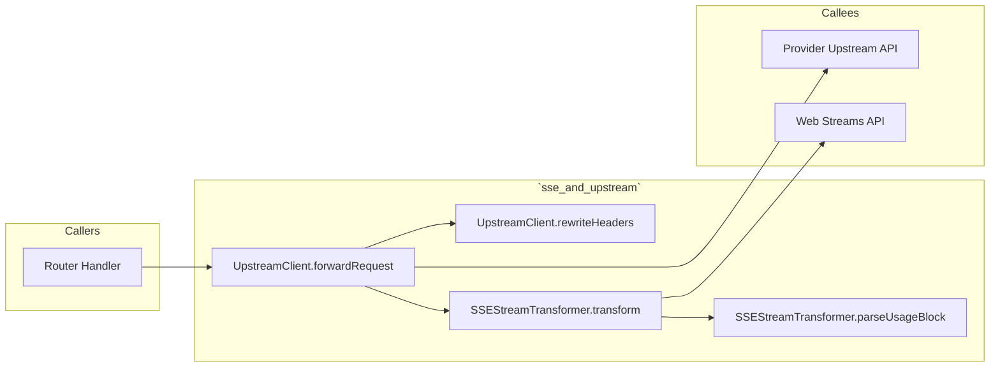
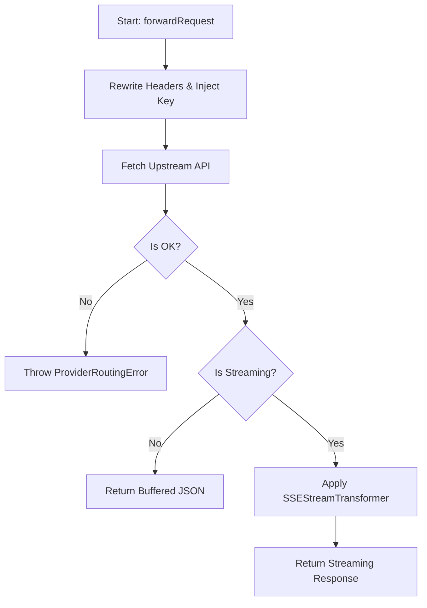
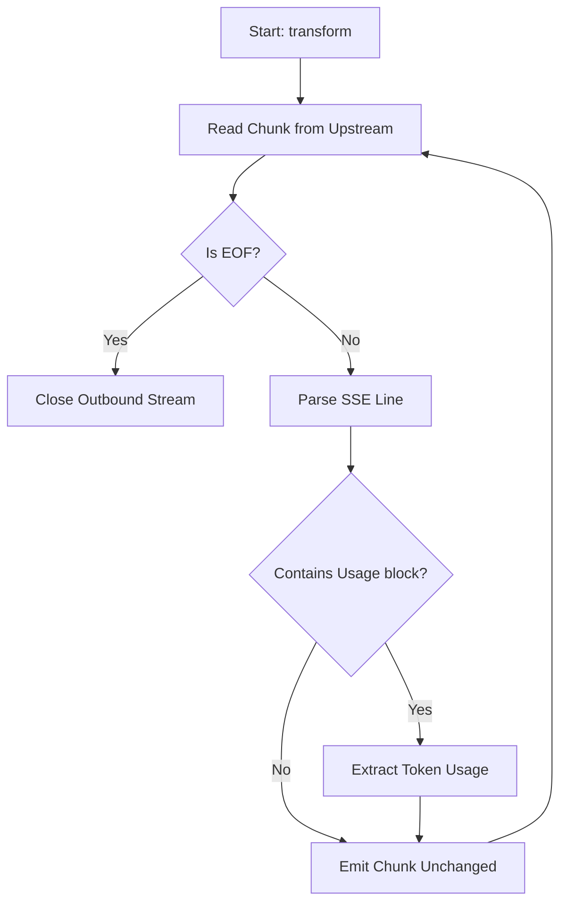

# 📄 Codeflow: `docs/codeflow/sse_transformer_and_upstream_client_cfg.md`

> **Module Responsibility:** Passthrough streaming transformation, usage tracking, and upstream proxy requests.
> **Purity Profile:** `🟡 I/O Bound`

---

## 1. 🕸️ Inbound & Outbound Dependency Graph

---

## 2. 🔍 Function Logic & Control Flow Deep Dive

### `def UpstreamClient.forwardRequest(req, key, provider) -> Response`
* **Purity:** `🟡 I/O Bound`
* **Complexity:** Cyclomatic: `4` | Cognitive: `5`

#### Control Flow Graph (CFG)

#### Def-Use Data Flow Matrix
| Parameter / Variable | Origin | Transformations | Mutation / Sinks |
|---|---|---|---|
| `req` | Argument | Body cloned, Headers modified | Sent via fetch |
| `key` | Argument | Injected into Auth header | Sent via fetch |

#### Edge Cases & Exception Audit
- ⚠️ **Edge Case 1:** Upstream timeout or connection reset.
- ⚠️ **Edge Case 2:** Malformed upstream SSE payload.

---

### `def SSEStreamTransformer.transform(stream) -> ReadableStream`
* **Purity:** `🟡 I/O Bound`
* **Complexity:** Cyclomatic: `6` | Cognitive: `6`

#### Control Flow Graph (CFG)

#### Def-Use Data Flow Matrix
| Parameter / Variable | Origin | Transformations | Mutation / Sinks |
|---|---|---|---|
| `stream` | Argument | Read chunk-by-chunk | Piped to new stream |
| `usage` | Local | Parsed from JSON | Yielded to usage callback |

#### Edge Cases & Exception Audit
- ⚠️ **Edge Case 1:** Split chunks where usage block is broken across TCP packets.

---

## 3. 🛠️ Code Review & Optimization Notes
- **Refactoring:** Use TextDecoderStream for cleaner chunk processing.
- **Strengths:** 0ms latency added for streaming text.

## 🔗 Related Workflows & MOC
- [[codebase-scribe-workflow]]
- [[Templates-Index]]
