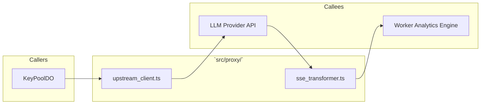
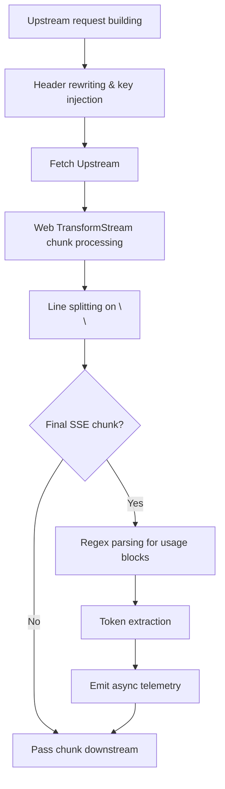

# 📄 Codeflow: `docs/codeflow/sse_transformer_and_upstream_client_cfg.md`

> **Module Responsibility:** Manages upstream connections, modifies headers, and streams SSE chunks while extracting token usage telemetry.
> **Purity Profile:** `🟡 I/O Bound`

---

## 1. 🕸️ Inbound & Outbound Dependency Graph

---

## 2. 🔍 Function Logic & Control Flow Deep Dive

### `def streamAndTransform(res: Response) -> ReadableStream`
* **Purity:** `🟡 I/O Bound`
* **Complexity:** Cyclomatic: `12` | Cognitive: `15`

#### Control Flow Graph (CFG)

#### Def-Use Data Flow Matrix
| Parameter / Variable | Origin | Transformations | Mutation / Sinks |
|---|---|---|---|
| `chunk` | Upstream Response | Decoded, line split | Sent to client, Regex parsed |
| `usage_stats` | Final chunk regex match | Parsed to integers | Emitted to telemetry |

#### Edge Cases & Exception Audit
- ⚠️ **Edge Case 1:** Fragmented SSE chunks splitting across network boundaries.
- ⚠️ **Edge Case 2:** Malformed `usage` block from provider bypassing regex.

---

## 3. 🛠️ Code Review & Optimization Notes
- **Refactoring:** Pre-compile regexes and ensure `TransformStream` memory efficiency.
- **Strengths:** Non-blocking telemetry emission, standard Web Streams API.

## 🔗 Related Workflows & MOC
- [[codebase-scribe-workflow]] — Used in Codebase Scribe & Cartographer
- [[Templates-Index]] — Master Index of Workflows
