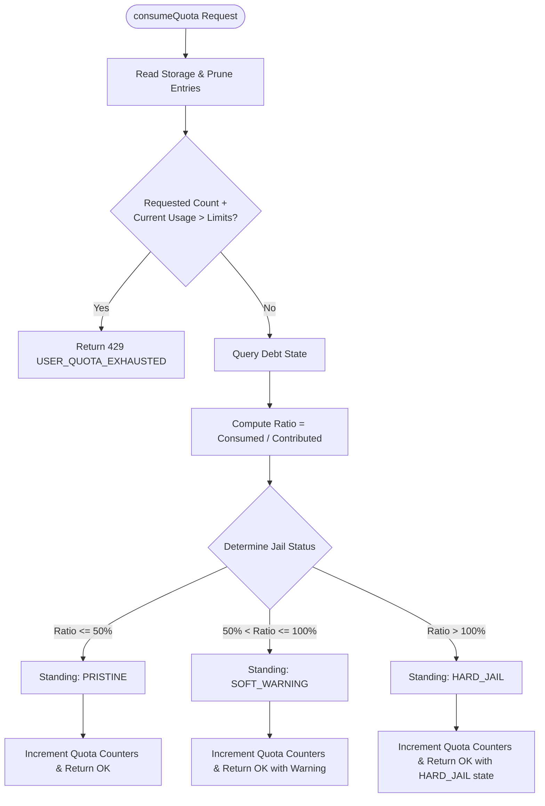

# 🗺️ Codeflow: TenantQuotaDO & Reciprocal Debt Ledger

> **Subsystem:** `src/quota/tenant/` & `src/constants/financial.ts`  
> **Source Files:** `src/quota/tenant/tenant_do.ts`, `src/quota/tenant/debt.ts`, `src/quota/tenant/evaluator.ts`  
> **Financial Invariant:** Fixed-point microdollars (`int64`, 1 USD = 1,000,000 u$) · Zero floating point  

---

## 1. Subsystem Overview
`TenantQuotaDO` enforces per-tenant isolation for compute rate limiting and communal resource reciprocity:
- **Sliding-Window RPM Counter:** Millisecond-accurate request consumption tracking.
- **Microdollar Debt Ledger:** Records consumed communal compute units vs contributed capacity.
- **Reciprocal Standing State Machine:** `PRISTINE` -> `SOFT_WARNING` (at 1.0x debt ratio) -> `HARD_JAIL` (at 1.5x debt ratio).

---

## 2. Control Flow Graph (CFG)

---

## 3. Def-Use Variable Lifecycle Matrix

| Variable | Scope / Type | Def Site | Use Sites | Purity Badge |
|---|---|---|---|---|
| `windowBuckets` | `Array<{timestamp, count}>`| In-memory sliding buffer | `pruneWindow`, `sumWindowRPM` | 🔴 State Mutating |
| `debtMicrodollars`| `int64` | `settleDebt` RPC Call | `calcRatio`, `evalJailState` | 🔴 State Mutating |
| `contributedCredits`| `int64` | Contribution events | `calcRatio` denominator | 🔴 State Mutating |
| `debtRatio` | `number` | `calcRatio` | Threshold comparator | 🟢 Pure |
