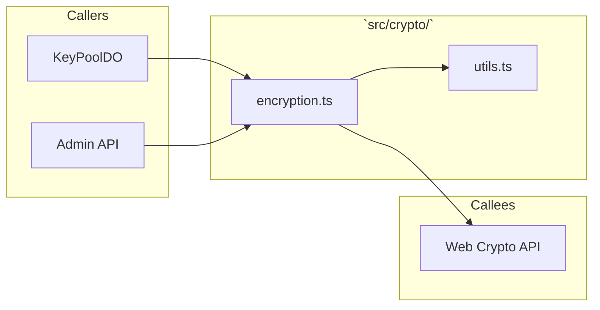
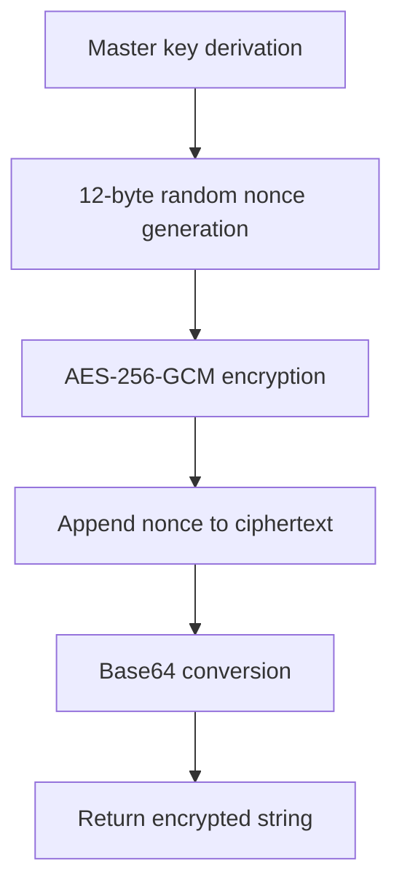
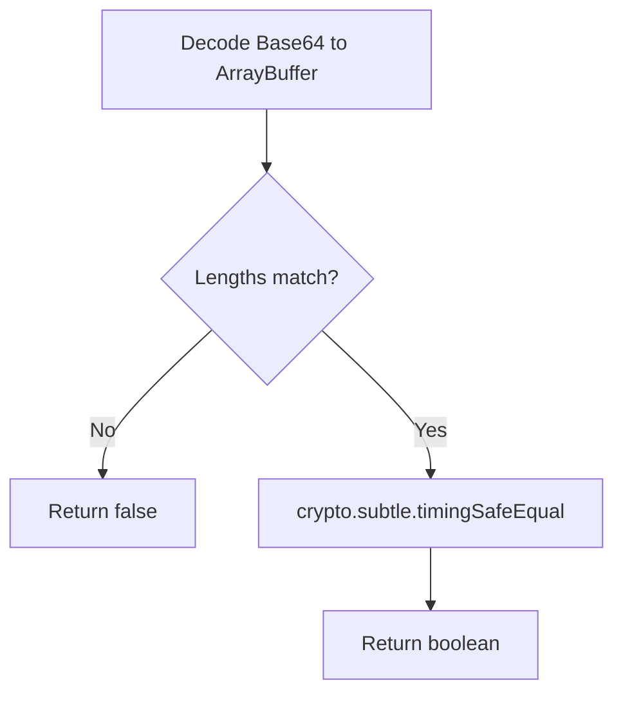

# 📄 Codeflow: `docs/codeflow/web_crypto_encryption_cfg.md`

> **Module Responsibility:** Handles high-performance encryption/decryption of keys using AES-256-GCM via Web Crypto API with strict nonce management.
> **Purity Profile:** `🟢 Pure`

---

## 1. 🕸️ Inbound & Outbound Dependency Graph

---

## 2. 🔍 Function Logic & Control Flow Deep Dive

### `def encryptKey(plaintext: string, masterKey: CryptoKey) -> Promise<string>`
* **Purity:** `🟢 Pure`
* **Complexity:** Cyclomatic: `4` | Cognitive: `4`

#### Control Flow Graph (CFG)

### `def compareHashes(a: string, b: string) -> boolean`
#### Control Flow Graph (CFG)

#### Def-Use Data Flow Matrix
| Parameter / Variable | Origin | Transformations | Mutation / Sinks |
|---|---|---|---|
| `plaintext_key` | Input | Encoded to Uint8Array | Web Crypto encrypt |
| `nonce` | crypto.getRandomValues | Appended | Returned in payload |

#### Edge Cases & Exception Audit
- ⚠️ **Edge Case 1:** Nonce reuse (prevented by strict 12-byte random generation per operation).
- ⚠️ **Edge Case 2:** Timing attacks during comparison (prevented by `timingSafeEqual`).

---

## 3. 🛠️ Code Review & Optimization Notes
- **Refactoring:** Ensure `masterKey` caching avoids re-derivation overhead per request.
- **Strengths:** Strict adherence to Web Crypto AES-256-GCM standards, zero plaintext leaks.

## 🔗 Related Workflows & MOC
- [[codebase-scribe-workflow]] — Used in Codebase Scribe & Cartographer
- [[Templates-Index]] — Master Index of Workflows
