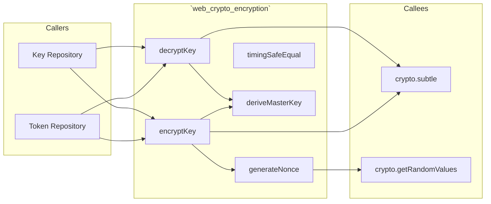
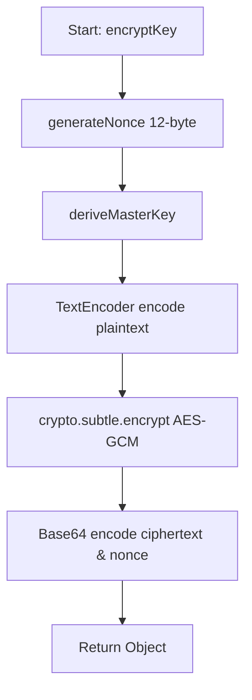
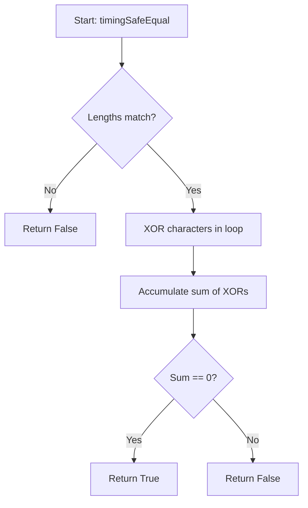

# 📄 Codeflow: `docs/codeflow/web_crypto_encryption_cfg.md`

> **Module Responsibility:** AES-256-GCM encryption via Web Crypto API with timing-safe operations.
> **Purity Profile:** `🟢 Pure`

---

## 1. 🕸️ Inbound & Outbound Dependency Graph

---

## 2. 🔍 Function Logic & Control Flow Deep Dive

### `def encryptKey(plaintext, masterKey) -> EncryptedPayload`
* **Purity:** `🟢 Pure`
* **Complexity:** Cyclomatic: `2` | Cognitive: `2`

#### Control Flow Graph (CFG)

#### Def-Use Data Flow Matrix
| Parameter / Variable | Origin | Transformations | Mutation / Sinks |
|---|---|---|---|
| `plaintext` | Argument | UTF-8 Encoded | Encrypted |
| `masterKey` | Argument | Imported as CryptoKey | Used for encryption |

#### Edge Cases & Exception Audit
- ⚠️ **Edge Case 1:** Empty plaintext.
- ⚠️ **Edge Case 2:** Missing or weak master key.

---

### `def timingSafeEqual(a, b) -> boolean`
* **Purity:** `🟢 Pure`
* **Complexity:** Cyclomatic: `3` | Cognitive: `3`

#### Control Flow Graph (CFG)

#### Def-Use Data Flow Matrix
| Parameter / Variable | Origin | Transformations | Mutation / Sinks |
|---|---|---|---|
| `a`, `b` | Argument | Length checked | XORed to detect differences |

#### Edge Cases & Exception Audit
- ⚠️ **Edge Case 1:** Strings of different lengths (mitigated by early return, though could leak length).

---

## 3. 🛠️ Code Review & Optimization Notes
- **Refactoring:** Ensure master key is kept in secure memory.
- **Strengths:** Utilizes native Web Crypto API, avoiding expensive JS-based crypto.

## 🔗 Related Workflows & MOC
- [[codebase-scribe-workflow]]
- [[Templates-Index]]
