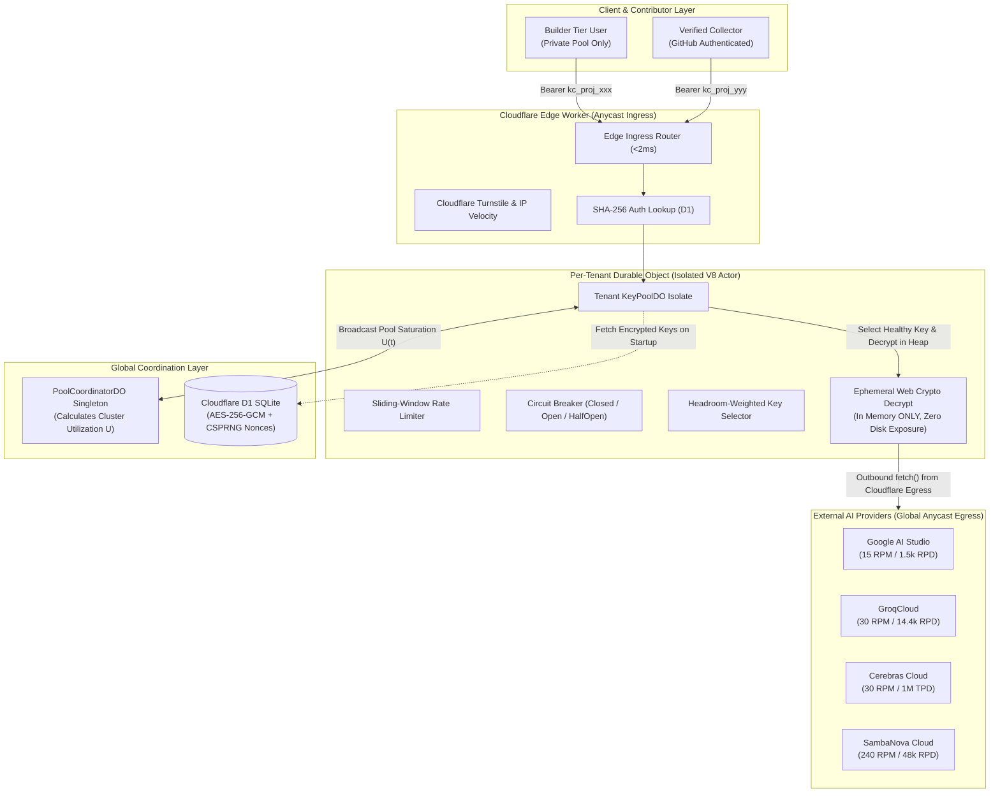

# Key Collective: System Architecture & Technical-Legal Brief
## Edge-Native Free-Tier LLM Multiplexing & Reciprocal Pooling Commons

> **Document Type:** System Architecture Specification & Legal Defense Brief  
> **Target System:** Key Collective v2.x / v3.0  
> **Effective Date:** September 2026  
> **Status:** Approved Baseline  
> **Companion Document:** `provider_tos_legal_dossier.md`

---

## 1. Executive Summary & Core Mission

Key Collective is an open-source, edge-native reverse proxy, rate-limit multiplexer, and key pooling engine deployed globally across Cloudflare Workers and Durable Objects.

### The Problem It Solves
Frontier AI providers (Google AI Studio, GroqCloud, Cerebras, SambaNova, Cloudflare Workers AI) offer cardless, zero-cost free tiers to developers. However, these free quotas are guarded by strict per-project rate limits (e.g. 15 requests/min for Gemini Flash, 30 requests/min for Groq). 

Key Collective multiplexes traffic across pools of free-tier keys with in-memory sliding-window concurrency control and sub-50ms HTTP 429 failover, transforming fragmented rate limits into a continuous, high-throughput OpenAI-compatible endpoint (`/v1/chat/completions`).

### The Expansion: Reciprocal Commons
The community tier introduces a cooperative reciprocal commons:
* Authenticated developers can voluntarily contribute their own free-tier API keys to a communal pool.
* In return, contributors receive **dynamically amplified access ($X\times$)** to the combined pool.
* The system guarantees a **hard lower bound of $1.0\times$**: a contributor can never receive less throughput than what their own keys provide.

---

## 2. Architecture Overview

### Non-Negotiable Invariants:
1. **Zero Plaintext Keys at Rest:** Keys are encrypted using AES-256-GCM via the Web Crypto API. Unique 12-byte CSPRNG nonces are stored alongside ciphertext in Cloudflare D1. Decryption occurs strictly in ephemeral V8 isolate heap memory milliseconds before upstream dispatch.
2. **Zero Key Exposure to Clients:** Clients and contributors never receive, see, or download other users' API keys. The proxy acts as a blind executor.
3. **Per-Tenant Durable Object Isolation:** `env.KEY_POOL.idFromName(tenantId)` allocates a dedicated, single-threaded V8 isolate per tenant. Zero cross-tenant state leakage.
4. **Fixed-Point Financial Mathematics:** All token usage and commercial equivalence values are tracked in 64-bit integer microdollars (`int64` microdollars: $1.00 = 1,000,000 µ$). Actual spend is strictly $0.00.

---

## 3. Tier Hierarchy & Access Boundaries

The system strictly enforces four distinct tiers to prevent free-riding:

| Tier Name | Target Persona | Access Rights | Communal Pool Access |
| :--- | :--- | :--- | :--- |
| **1. Builder** | Solo developers, self-hosters | Multiplexes personal keys via Key Manager UI | **Zero Access.** Operates strictly as a private key multiplexer. |
| **2. Verified Collector** | GitHub-authenticated community contributors | Contributes keys to the collective; earns $X\times$ dynamic quota | **Full Access.** Unlocked via GitHub maturity gate ($\ge 30$ days, $\ge 5$ commits). |
| **3. Ultra** | Power contributors & sponsors | Elevated dynamic multiplier and priority slots | **Full Access.** Discretionary promotion by project maintainer. |
| **4. Admin** | Maintainers & operators | Full system control and health monitoring | **Full Access.** Discretionary assignment. |

> [!NOTE]
> The **Builder Tier** never touches the communal pool. A standard user who registers simply gets an edge proxy for their own keys. They cannot consume a single token of the communal pool unless they verify their GitHub identity and contribute working keys.

---

## 4. The Incentive Multiplier & Quota Economics

### 4.1 Dynamic Quota Multiplier Equation
When a verified user contributes keys with total capacity $C_{\text{contributed}}$ (measured in normalized Credit Units, $\text{CU}$), their permitted consumption is governed by an effective multiplier $X_{\text{eff}}$:

$$\text{Entitlement} = X_{\text{eff}} \times C_{\text{contributed}}$$

Where $X_{\text{eff}}$ is evaluated dynamically inside the user's `KeyPoolDO`:

$$X_{\text{eff}}(t) = X_{\text{base}} + \Delta X_{\text{dynamic}} \times \left(1.0 - U_{\text{pool}}(t)\right)$$

* $X_{\text{base}} = 2.0\times$ (Guaranteed baseline for Verified Contributors)
* $\Delta X_{\text{dynamic}} = 1.0\times$ to $2.5\times$ (Dynamic bonus available during low pool utilization)
* $U_{\text{pool}}(t)$: Current cluster utilization (0.0 to 1.0), updated every 5 seconds by `PoolCoordinatorDO`.

### 4.2 The Hard Floor Invariant (Anti-Starvation)
$$\text{Guaranteed Floor} = 1.0 \times C_{\text{contributed}}$$

If the communal pool is under heavy load ($U_{\text{pool}} \ge 85\%$) or upstream providers experience rate limits:
1. Dynamic bonuses drop to zero ($\Delta X \to 0$).
2. The router enforces **Strict Affinity Routing**: a contributor's requests are dispatched directly to their own contributed keys first.
3. **Result:** A contributor never receives less quota or availability than if they had operated their keys independently.

### 4.3 Normalized Credit Units (CU)
To prevent contributors from gaming the pool by submitting dead or low-volume keys, contributions are valued via a standardized formula:

$$\text{CU} = \text{RPM} + \left(\frac{\text{RPD}}{100}\right) + \left(\frac{\text{TPM}}{10,000}\right)$$

| Provider / Model | RPM | RPD | TPM | CU Score | Relative Weight |
| :--- | :--- | :--- | :--- | :--- | :--- |
| **Google Gemini 2.5 Flash** | 15 | 1,500 | 1,000,000 | **130 CU** | 1.0x (Benchmark) |
| **GroqCloud (Qwen 3.6)** | 30 | 14,400 | 20,000 | **176 CU** | 1.35x |
| **SambaNova (Llama 3.3 70B)** | 240 | 48,000 | 500,000 | **770 CU** | 5.92x |
| **Cerebras (Llama 3.3 70B)** | 30 | 14,400 | 90,000 | **183 CU** | 1.41x |

Keys are continuously probed with 1-token canary health checks every 15 minutes. Failed keys are instantly deducted from the user's CU balance. Multipliers apply to a **7-day rolling EWMA** of verified active CU to eliminate flash-contribution attacks.

---

## 5. Network Egress & Upstream Visibility

### 5.1 Cloudflare Egress IP Behavior
* Cloudflare Workers do not use static egress IPs.
* All outbound HTTP requests (`fetch()`) route through Cloudflare’s global Anycast mesh across 330+ datacenters.
* Egress occurs from dynamically allocated IP addresses within Cloudflare's public Autonomous System Number (ASN 13335).
* Thousands of enterprise SaaS platforms and developer gateways share these exact same egress blocks.
* Upstream API gateways (Google, Groq, Cerebras) cannot block or rate-limit Cloudflare egress IPs without breaking legitimate third-party applications.

### 5.2 The Bring-Your-Own-Key (BYOK) Precedent
* Hundreds of applications operate on this exact network model (Cursor, Continue.dev, Cline, Roo Code, LibreChat, TypingMind, Open WebUI).
* In all these systems, end users input their personal API keys into a centralized or edge-hosted service.
* The service's backend issues outbound requests to Google and Groq from shared cloud IP addresses.
* Providers actively support and document BYOK patterns because it drives model utilization while isolating financial liability to individual account owners.

### 5.3 Behavioral Camouflage (Protecting Contributor Keys)
1. **The 80% Soft Demotion:** When a Gemini key reaches 80% of its daily quota (1,200 requests), it is placed at the lowest priority. It is preserved for emergency overflow and avoids hitting the daily ceiling.
2. **Request Cadence Jitter:** Random micro-jitter (50ms to 250ms) is introduced in dispatch to eliminate machine-like metronomic intervals.
3. **Regional Edge Affinity:** Requests preferentially route through keys registered in the caller's geographic region using `request.cf.continent`.
4. **Header Sanitization:** Internal routing headers (`CF-*`, `X-Key-*`) are stripped; requests use standard client SDK user agents.

---

## 6. Legal Insulation & Risk Mitigation

Key Collective relies on four foundational operational pillars:

1. **Absolute Non-Monetization:** Key Collective charges $0.00. There are no subscriptions, paywalls, credit cards, or token purchases. Upstream access is not resold.
2. **Technical Agency & Clickwrap:** Contributors explicitly appoint Key Collective as a technical routing agent to execute requests on their behalf.
3. **AI Studio Sandbox Project Isolation:** Users are instructed and required to contribute keys created in dedicated, isolated Google AI Studio sandbox projects, ensuring zero blast radius to personal Gmail or production cloud workloads.
4. **Instant Runtime Kill-Switch:** A single environment flag (`COMMUNAL_GEMINI_ENABLED = false`) allows maintainers to instantly disable communal Gemini routing in under 60 seconds, reverting to private BYOK mode without downtime.
