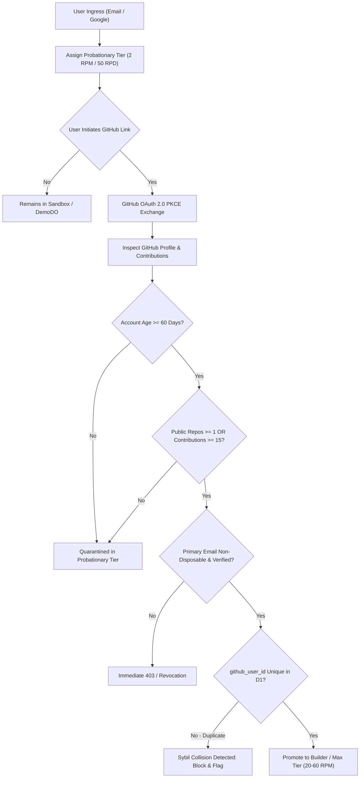

# Competitive Intelligence & Systems Research: Identity, Governance & Admin Landscape
## Key Collective v3.5: Two-Phase Authentication, Hidden Tiers & Edge Gateway Surveillance

> **Document Status:** Complete & Verified  
> **Target System:** Key Collective v3.5 (Identity & Governance Overhaul)  
> **Authors:** Competitive Intel Analyst & Systems Architect  
> **Workflow:** Workflow 1: Project Inception v2.0  
> **Date:** September 2026  
> **Canonical Target:** `docs/research/identity_governance_and_admin_landscape.md`

---

## 1. Executive Summary & Strategic Rationale

Key Collective multiplexes upstream free-tier AI API keys (Google Gemini Flash, Groq LLaMA 3.3, Cerebras, DeepSeek) through an edge-native Cloudflare Workers and Durable Object (DO) mesh with sub-millisecond cold starts, zero plaintext storage (AES-256-GCM), and fixed-point microdollar accounting ($1.00 = 1,000,000 µ$).

Because Key Collective delivers high-throughput LLM compute without requiring credit cards, **it represents an extremely lucrative honeypot for botnets, automated scrapers, and black-hat API resellers**. A cluster of 50 automated accounts could harvest upwards of 300,000 daily LLM requests, quickly exhausting upstream quotas and degrading service for legitimate developers.

To establish enterprise-grade identity integrity without turning away authentic developers, Key Collective v3.5 introduces an integrated Governance and Identity Overhaul built on three foundational pillars:
1. **Two-Phase Authentication & Progressive Tier Promotion:** Frictionless email/Google ingress into a sandboxed probationary tier, elevated to developer capacity only upon cryptographic proof of an aged, active GitHub identity.
2. **Hidden Tiers & Privilege Isolation:** Complete exclusion of unlimited/internal tiers (`ultra`, `admin`) from public schemas, API responses, and client code, paired with strict least-privilege role separation and zero self-upgrade paths.
3. **Modern Edge Admin Surveillance & Safe Bootstrapping:** High-velocity per-tenant observability, global emergency circuit breaker overrides, upstream key pool telemetry, and an air-gapped admin account bootstrap flow.

---

## 2. Two-Phase Authentication & Progressive Tier Promotion

### 2.1 The Ingress Dilemma: Anti-Sybil Defense vs. Developer Friction

| Ingress Strategy | Bot / Sybil Resistance | Developer Friction | Conversion / Drop-off Impact |
| :--- | :--- | :--- | :--- |
| **Email / Password / Magic Link Only** | 🔴 **Near Zero:** Botnets automate disposable email creation at negligible cost (<$0.005/inbox). | 🟢 **Minimal:** Instant signup, universal familiarity. | 95%+ conversion; catastrophic Sybil vulnerability. |
| **Mandatory GitHub OAuth upfront with strict age & contribution gate** | 🟢 **Near Impenetrable:** Bots cannot programmatically forge 90-day-old active commit histories at scale. | 🔴 **High:** Blocks evaluators, mobile devs, enterprise engineers without active public GitHub profiles. | Up to 65% drop-off during initial evaluation. |
| **Credit Card Pre-Authorization (Fly.io model)** | 🟢 **High:** Financial identity verification eliminates automated swarms. | 🔴 **Severe:** Contradicts zero-friction open developer platform premise; Stripe transaction fees. | 80%+ drop-off for free-tier users. |
| **Two-Phase Tier Progression (Key Collective v3.5)** | 🟢 **Maximum Defense-in-Depth:** Disposable accounts are quarantined in an ephemeral sandbox; real quotas require aged GitHub identity. | 🟢 **Frictionless Evaluation:** Anyone can test the proxy in seconds; builders unlock full quotas with 1 click. | High trial adoption + zero free-tier quota drain. |

---

### 2.2 Phase 1: Ingress Sandbox (Probationary / Ephemeral Tier)

When a developer registers via Email, Google OAuth, or a fresh GitHub account, they are assigned to the **Probationary Tier** (or instantiated into an isolated `DemoDO` session):
- **Rate Ceiling:** 2 RPM, burst limit of 1 request, 50 RPD total.
- **Model Whitelist:** Strictly restricted to lowest-cost flash models (e.g. `gemini-1.5-flash`, `llama-3.1-8b-instant`). Reasoning models (`deepseek-r1`, `o1`) are disabled.
- **Microdollar Lifetime Budget:** Hard ceiling of 50,000 µ$ ($0.05 USD). Once consumed, requests return `HTTP 429 QuotaExceeded` until identity elevation.
- **Edge Bot Deterrent:** Mandatory Cloudflare Turnstile managed challenge validated on ingress before token issuance.
- **Subnet Velocity Limit:** Cloudflare Worker edge enforces a hard maximum of 1 registration per `/24` IPv4 subnet (or `/48` IPv6) per 30-day sliding window.

---

### 2.3 Phase 2: Identity Elevation Gate (Developer / Builder / Max Tier)

To unlock the full **Builder Tier** (20 RPM, 2,000 RPD, multi-project hierarchy) or **Max Tier** (60 RPM, 10,000 RPD), the user must complete a **GitHub OAuth PKCE Verification Flow**.

The backend worker queries the GitHub REST API (`https://api.github.com/user` and `https://api.github.com/user/emails`) and executes a 5-point deterministic verification algorithm:



#### Verification Criteria & Scoring:
1. **Account Maturity (`created_at`):** Must be $\ge 60$ days old (configurable up to 90 days). Destroys just-in-time bot creation.
2. **Activity & Contribution Graph:** User profile must have $\ge 1$ non-fork public repository or $\ge 15$ contributions in the preceding 12 months.
3. **Email Verification:** Primary GitHub email must be `verified: true` and checked against Key Collective's 3,000+ disposable domain blocklist (`DISPOSABLE_EMAIL_DOMAINS`).
4. **1-to-1 Identity Binding:** D1 database enforces `UNIQUE(github_id)` on the `users` table. If an attacker logs in with 20 distinct Google accounts, all 20 accounts will fail to elevate unless linked to 20 distinct, aged, active GitHub profiles.

---

### 2.4 Comparative Platform Benchmark: Auth & Tier Progression

| Dimension | Cursor | Modal | OpenRouter | Supabase | Key Collective v3.5 |
| :--- | :--- | :--- | :--- | :--- | :--- |
| **Primary Ingress** | Google OAuth / GitHub / Email | GitHub OAuth or Work Email | Google OAuth / Crypto Wallet | GitHub / Google / Email | Google / Email (Phase 1) + GitHub PKCE (Phase 2) |
| **Unverified Tier** | Limited slow requests; fast requests depleted quickly | Restricted compute sandbox; manual review queue | Pay-as-you-go credit required for priority | 2 free projects; pause after 1 week inactivity | **Probationary Tier:** 2 RPM, 50 RPD, 50k µ$ budget |
| **Elevation Gate** | Paid Stripe Subscription ($20/mo) | Phone verification + Credit card or manual review | Stripe / Crypto deposit | Email verification + Credit card for scale | **GitHub Identity Proof:** Age $\ge 60$d, $\ge 15$ commits, 1:1 ID binding |
| **Anti-Sybil Defense** | Machine UUID hardware hashing + Cloudflare Turnstile | Manual enterprise triage; card pre-auth | Payment friction | Captcha + project limits | Turnstile + Subnet rate limits + GitHub maturity score |
| **Cost to Attacker** | High ($20/seat or botting hardware IDs) | High (Credit card per account) | High (Direct financial cost) | Moderate (Credit card required for scaling) | **Prohibitive:** Requires purchasing aged, active GitHub accounts ($1.50–$3.50 each) |

---

## 3. Hidden Tiers & Security through Obscurity / Privilege Isolation

### 3.1 Why High-Capacity & Internal Tiers Must Be Hidden

Key Collective's contract definitions specify seven tiers:
`admin` (Tier 7), `ultra` (Tier 6 / Developer VIP), `max` (Tier 5), `builder` (Tier 4), `telemetry_viewer` (Tier 3), `probationary` (Tier 2), `demo` (Tier 1).

**Both `admin` and `ultra` grant `rpmLimit: Infinity` and `rpdLimit: Infinity` across the upstream key pool.**

Publishing or advertising `ultra` or `admin` in public API documentation or client UI bundles introduces severe security risks:

1. **Attack Surface Reduction & Enumeration Deterrence:**
   - If an attacker sees that a tier called `ultra` exists, they immediately focus reconnaissance on tier escalation vectors:
     - JSON request parameter tampering during registration or update: `{"tier": "ultra"}`.
     - JWT claim manipulation: forging `{"tier": "ultra"}` or attacking weak HMAC secrets.
     - Prototype pollution in client/server body parsers.
     - IDOR (Insecure Direct Object Reference) on `/api/tenants/:id/tier`.
2. **Social Engineering & Support Queue Exhaustion:**
   - Displaying an "Ultra (Unlimited RPM)" tier with a disabled button or "Contact Sales" invites automated form spam, fraudulent partnership requests, and spear-phishing targeting platform admins.
3. **Economic Honeypot Protection:**
   - Because upstream LLM keys have finite rate limits (e.g. Gemini 15 RPM per key, Groq 30 RPM), an unmetered account can exhaust an entire pool in minutes. Keeping high tiers unadvertised ensures that external adversaries model Key Collective as a strictly bounded 60 RPM gateway.

---

### 3.2 Principles of Privilege Isolation & Zero Self-Upgrade Paths

```mermaid
graph TD
    subgraph Public Internet
        Client["Browser SPA / CLI Client"]
    end

    subgraph Edge Worker Layer
        Worker["Cloudflare Edge Worker"]
        PublicFilter["Schema & Response Scrubber"]
    end

    subgraph Internal Isolated Boundary
        AdminRPC["Internal Admin Router (/admin/*)"]
        D1["D1 Database (Encrypted)"]
        DO["Tenant Durable Object (KeyPoolDO)"]
    end

    Client -->|Public Ingress| Worker
    Worker --> PublicFilter
    PublicFilter -->|Filtered Tier Schema: [probationary, builder, max]| Client
    Client -.->|Attempts tier='ultra'| Worker
    Worker -->|Strict Schema Rejection 400/403| Client

    AdminRPC -->|Signed Worker-to-Worker Call| DO
    AdminRPC -->|Direct Write| D1
```

#### Non-Negotiable Invariants:
1. **Complete Mediation (Saltzer & Schroeder):**
   - The edge proxy strips `ultra` and `admin` from all public metadata responses (`GET /v1/tiers`, `GET /v1/user/profile`, `GET /v1/models`). The client SPA only receives knowledge of `{ probationary, builder, max }`.
2. **Zero Self-Upgrade Execution:**
   - No public endpoint accepts a `tier` parameter. Any inbound request containing `tier` or `role` in the body is either rejected with `HTTP 400 Bad Request` or stripped by strict schema validation.
3. **Cryptographically Signed Elevation:**
   - Tier elevation to `ultra` or `admin` can only occur through:
     - An authenticated call to `/admin/v1/tenants/:id/tier` protected by Cloudflare Access and mutual worker authorization.
     - Direct out-of-band CLI execution via `wrangler d1 execute`.
4. **Deterministic Quota Clamping in Durable Objects:**
   - Even if a tenant admin attempts to create a project with `maxRpmSubCap: 500`, the underlying `KeyPoolDO` clamps the project quota to `min(requestedCap, tierLimits[tenant.tier].rpmLimit)`. An unprivileged tenant cannot exceed their account ceiling regardless of project configuration.

---

## 4. Modern Admin Surveillance & Edge Management Panels

### 4.1 Required Edge Gateway Metrics & Control Primitives

An administrative management panel for an edge-native LLM gateway running on Cloudflare Workers and Durable Objects must operate within strict edge computing constraints: <50ms CPU execution limits, asynchronous non-blocking logging, and zero-allocation hot paths.

#### Core Surveillance Metrics:
1. **Per-Tenant Request & Token Velocity:**
   - Real-time sliding-window RPM and TPM consumption per tenant.
   - Anomaly detection: Tenants running at >90% of quota capacity for >15 consecutive minutes are flagged for potential bot scraper activity.
   - Fixed-point microdollar spend rate ($1 = 1,000,000 µ$) tracking cost velocity.
2. **Upstream Key Pool Matrix:**
   - Real-time health badges for all AES-256-GCM encrypted keys: Healthy (200 OK), Rate Limited (429 Backoff), or Revoked (401/403 Invalid).
   - Rotation fairness score: Ensures the sliding-window key selector evenly distributes load across all valid upstream credentials.
3. **Emergency Circuit Breaker Overrides:**
   - **Global Kill Switch (`KILL_SWITCH_ALL`):** Instantly terminates all outbound upstream proxy calls edge-wide, returning `503 Service Temporarily Unavailable`.
   - **Per-Provider Circuit Breaker:** Manually trip an upstream provider (e.g. Gemini) when an outage is detected, causing the proxy to cascade immediately to Groq/Cerebras without incurring upstream timeout latency.
4. **Abuse Quarantine & Ban Hammer:**
   - **1-Click Tenant Quarantine:** Flips `is_quarantined = 1` in D1 and issues an edge DO call to immediately evict the tenant's active sliding-window counters from memory.
   - **Subnet / ASN Blocking:** Generates Cloudflare WAF-compatible IP Access Rules to block repeat offender bot subnets at Cloudflare Layer 4/7.

---

### 4.2 Safe Admin Account Bootstrapping Patterns

1. **Primary Pattern (Environment Allowlist):** `ADMIN_EMAILS` defined in Cloudflare Worker secrets (`wrangler secret put ADMIN_EMAILS`). When a user logs in via GitHub or Google, the auth middleware checks if their verified email matches. If matched, `tier` is set to `admin`.
2. **Genesis Pattern (D1 Migration CLI):** Local operator seeds the initial admin account via `wrangler d1 execute key-collective-db --command="UPDATE users SET tier='admin' WHERE email='...'"`.
3. **Admin Panel Defense:** Admin routes (`/admin/*`) and chunk assets are quarantined at the edge; requests without verified admin claims receive `404 Not Found` (zero existence leakage).
