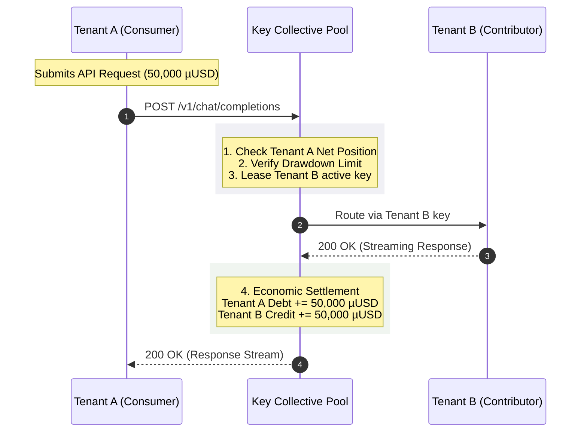

# Chapter 2.1: Reciprocal Exchange and Pool Economics


## 1. Introduction


The foundational premise of the Key Collective is rooted not in technology, but in economics.
Specifically, it addresses a pervasive inefficiency in the modern API economy: the phenomenon of **stranded API capacity**. 


As organizations and individual developers purchase tiered subscriptions or prepay for API credits (such as OpenAI's tier limits or Anthropic's provisioned throughput), a significant portion of this capacity remains unutilized during off-peak hours.
Simultaneously, other actors in the ecosystem experience rate limits and throttling because their localized demand exceeds their allocated capacity. 


This chapter formalizes the economic model of the Key Collective, outlining the philosophy of reciprocal communal exchange, the mathematical equilibrium governing credit and debt, and the game-theoretic defenses implemented to prevent the tragedy of the commons.


## 2. The Problem of Stranded API Capacity


### 2.1 The Inefficiency of Provisioned Silos


In a standard API consumption model, capacity is provisioned in silos.
Let \(C_i(t)\) represent the provisioned capacity for tenant \(i\) at time \(t\), and \(D_i(t)\) represent their demand.

In a purely isolated system, the utilized capacity \(U_i(t)\) is bounded:

$$U_i(t) = \min(C_i(t), D_i(t))$$

The **stranded capacity** \(S_i(t)\) for tenant \(i\) is:

$$S_i(t) = \max(0, C_i(t) - D_i(t))$$

The **unmet demand** (throttled requests) \(L_i(t)\) is:

$$L_i(t) = \max(0, D_i(t) - C_i(t))$$

Across a population of \(N\) tenants, the macroscopic inefficiency is the simultaneous existence of \(\sum S_i(t) > 0\) and \(\sum L_i(t) > 0\).
The Key Collective exists to create a liquid routing market where \(S_i(t)\) can be seamlessly reallocated to satisfy \(L_j(t)\) for \(i \neq j\).

### 2.2 The Temporal Misalignment of Workloads

API workloads are rarely uniform.
They exhibit high variance and burstiness.
- **Batch processors** run massive overnight jobs, causing massive demand spikes.
- **Interactive applications** experience diurnal cycles aligned with human working hours.
- **CI/CD pipelines** trigger unpredictable integration tests.

By pooling keys, the Key Collective relies on the statistical multiplexing of uncorrelated workloads to flatten the aggregate demand curve, dramatically increasing the overall utilization rate of the pooled API keys.

## 3. Reciprocal Communal Exchange Philosophy

The Key Collective operates on a philosophy of **reciprocal exchange** rather than a traditional fiat-currency marketplace.
It is a barter system for compute power.

### 3.1 The Core Tenets
1. **Contribution precedes consumption:** A tenant must inject value (API keys with available capacity) into the pool to draw value from it.
2. **Equivalence of value:** 1 token generated via Tenant A's key must be economically equivalent to 1 token generated via Tenant B's key, normalized by model pricing.
3. **Decentralized ownership:** The collective does not own the keys; it merely facilitates the algorithmic routing of requests across them.

### 3.2 The Microdollar Standard

To normalize value across disparate API providers (OpenAI, Anthropic, Google) and diverse model tiers (e.g., GPT-4 vs.
Claude 3 Haiku), all capacity is converted into a universal internal unit of account: the **microdollar (`µ$`)**.

$$1 \text{ USD} = 1,000,000\text{ µUSD} = 1,000,000\text{ µ\$}$$

This ensures integer-based, fixed-point arithmetic for all financial transactions within the system, eliminating floating-point errors (a strict architectural invariant).

## 4. The Credit and Debt Equilibrium Equation

To maintain fairness and ensure the pool remains solvent, the system continuously tracks the net economic position of every tenant.

### 4.1 Credit Generation
A tenant \(i\) generates credit when another tenant \(j\) successfully routes a request through a key owned by tenant \(i\).
Let \(\text{Cost}(R)\) be the cost of request \(R\) in microdollars.

$$\text{Credit}_i = \sum_{R \in \text{Requests routed through } i\text{'s keys by others}} \text{Cost}(R)$$

### 4.2 Debt Accumulation
A tenant \(i\) accumulates debt when they route a request through a key owned by another tenant \(j\).

$$\text{Debt}_i = \sum_{R \in \text{Requests routed by } i \text{ through others' keys}} \text{Cost}(R)$$

### 4.3 Net Position and The Equilibrium Function
The Net Position (\(\text{NP}_i\)) of tenant \(i\) is defined as:

$$\text{NP}_i = \text{Credit}_i - \text{Debt}_i$$

For the system to be in perfect equilibrium, the sum of all net positions must exactly equal zero at all times:

$$\sum_{i=1}^{N} \text{NP}_i \equiv 0$$

This zero-sum invariant is continuously audited by the PoolCoordinatorDO.


## 5. Preventing the Free-Rider Problem


A critical vulnerability in any communal resource pool is the **free-rider problem**—actors who consume resources without contributing their fair share, leading to a **tragedy of the commons** where the pool is drained of capacity.


### 5.1 The Threat Model
1. **The Hit-and-Run:** A tenant adds a depleted or revoked key, immediately queues a massive batch of requests, and drains pool capacity before the system detects the invalid key.
2. **The Asymmetric Consumer:** A tenant adds a low-tier key (e.g., GPT-3.5) but exclusively requests high-tier models (e.g., GPT-4), extracting disproportionate value.
3. **The Sybil Attack:** An actor spins up multiple tenant accounts with fake keys to extract introductory or baseline capacities.


### 5.2 Game-Theoretic Defenses


To mathematically guarantee the solvency of the pool, the Key Collective implements strict game-theoretic constraints.


#### Defense 1: The Trust Score Algorithm
Every key undergoes continuous validation.
A tenant's capacity to draw from the pool is throttled by their Trust Score (\(\text{TS}_i\)), which is a function of their historical key reliability.

$$\text{TS}_i \in [0, 1]$$

#### Defense 2: The Hard Quota Ceiling
A tenant cannot accrue infinite debt.
Their maximum allowable debt (Drawdown Limit, \(\text{DL}_i\)) is strictly bounded by the validated capacity of the keys they have contributed, multiplied by their Trust Score.

$$\text{DL}_i = \left( \sum_{k \in \text{Keys}(i)} \text{ValidatedCapacity}(k) \right) \times \text{TS}_i \times \alpha$$

Where \(\alpha < 1\) is the systemic risk buffer (e.g., 0.8).
If \(\text{Debt}_i \ge \text{DL}_i\), the routing engine will `HTTP 429 Too Many Requests` all subsequent requests until their net position improves.

#### Defense 3: Like-for-Like Liquidity Tiers
The pool is segmented into liquidity tiers.
A tenant contributing only Tier 3 capacity (cheap, fast models) is heavily throttled or completely blocked from drawing Tier 1 capacity (expensive, reasoning models) if their Net Position is negative.

### 5.3 The Slashing Protocol
If a key is detected as maliciously revoked (e.g., the tenant deletes the key in the provider dashboard while actively drawing from the pool), a **slashing condition** is triggered.
1. The tenant's \(\text{TS}_i\) is immediately zeroed.
2. All inflight requests for the tenant are terminated.
3. The tenant's API access to the Key Collective is cryptographically banned at the edge.


## 6. Visualizing the Economic Loop





## 7. Conclusion


The reciprocal exchange mechanics of the Key Collective transform isolated API keys into a highly liquid, highly utilized communal asset.
By rigorously enforcing the Credit/Debt Equilibrium and deploying automated defenses against free-riders, the system guarantees that contributing tenants are always rewarded, and parasitic behavior is algorithmically neutralized.


In the next chapter, we will examine the physical execution of these economic rules across a globally distributed network using the Actor Model topology.


```typescript
// Credit and debt equilibrium check
export function canBorrowCommunalKey(
  currentDebtMicrodollars: bigint,
  overdraftLimitMicrodollars: bigint
): boolean {
  return currentDebtMicrodollars < overdraftLimitMicrodollars;
}
```
