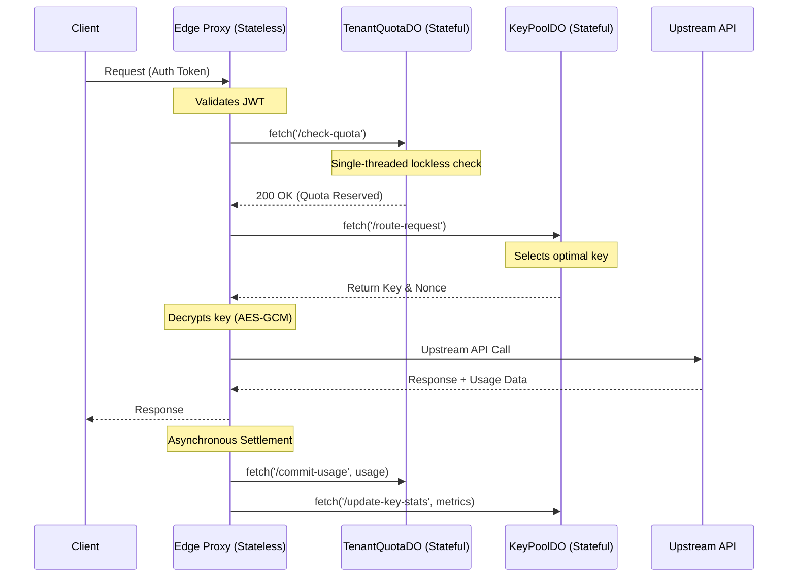

# Chapter 2.2: Distributed Actor Topology


## 1. Introduction


Operating a highly liquid API exchange requires extreme performance.
Requests must be routed, rate-limited, and economically settled in single-digit milliseconds.
When deploying this system globally across edge networks (like Cloudflare's 300+ Points of Presence), classical centralized architectures buckle under the speed of light, and traditional distributed systems introduce unacceptable complexity and latency.


This chapter details the architectural shift from stateless workers backed by distributed locks to a rigorous implementation of the **Actor Model** utilizing Cloudflare Durable Objects. 


## 2. The Failure of Distributed Locks at the Edge


### 2.1 The Distributed Concurrency Problem
Imagine two requests arrive simultaneously at two different edge PoPs (e.g., Tokyo and Frankfurt) from the same tenant.
Both requests need to decrement the tenant's remaining quota and route through the same shared API key.


If the edge workers are stateless, they must coordinate to prevent race conditions.


### 2.2 Why Redis Fails Here
A common approach is to use a distributed cache like Redis (or a globally distributed KV store) with distributed locks (e.g., Redlock algorithm) to serialize access to the quota and the key state.


**The fatal flaws of Redis at the Edge:**
1. **Latency:** Acquiring a distributed lock requires multiple network round trips.
If the Redis primary is in US-East, the Tokyo worker incurs 150ms+ of latency just to acquire the lock, completely violating our <15ms routing budget.
2. **Thundering Herd:** If a lock is held, other edge workers must poll or wait, tying up connections and compute.
3. **Split-Brain and Stale Reads:** Globally distributed KV stores often rely on eventual consistency.
If Tokyo reads a stale quota, it might allow a request that pushes the tenant over their Drawdown Limit, breaking the economic invariant.


We need a system that provides **strong consistency** without the latency overhead of distributed locking.


## 3. The Actor Model and Cloudflare Durable Objects


The solution is the **Actor Model**.
Instead of bringing the lock to the data, we bring the execution to the data.


### 3.1 What is a Durable Object?
A Cloudflare Durable Object (DO) is a stateful compute instance that is guaranteed to be globally unique.
For a given ID, exactly one instance of the DO exists anywhere in the world at any given time.
- All requests sent to a specific DO ID are routed to that exact same instance.
- The DO maintains state in memory, allowing for microsecond-level reads and writes.
- It provides a strongly consistent, transactional storage API (`this.ctx.storage`) backed by SSDs, ensuring state survives eviction or crashes.


### 3.2 Single-Threaded Consistency
Durable Objects execute Javascript in a single thread (using V8 isolates).
This is a profound architectural advantage: **it eliminates race conditions by design.**


Because execution is single-threaded, if 100 requests arrive at a DO simultaneously, they are processed sequentially.
There is no need for mutexes, semaphores, or Redis locks.
The runtime itself serializes the operations, guaranteeing strict serializability for state mutations.


## 4. The 3-Actor Topology


The Key Collective architecture relies on three specialized Durable Objects, each with a strict domain of responsibility.


### 4.1 TenantQuotaDO
**Responsibility:** Manages the lifecycle, quotas, and economic state of a single tenant.
**Isolation Boundary:** One TenantQuotaDO per Tenant ID (`env.TENANT_QUOTA.idFromName(tenantId)`).


**Functions:**
- Tracks the tenant's Credit/Debt equilibrium in real-time.
- Enforces the Drawdown Limit.
- Aggregates telemetry for billing.


**Why it's an Actor:** If a tenant launches 1,000 parallel requests, all 1,000 route to the exact same TenantQuotaDO.
The single thread decrements the quota safely 1,000 times without ever double-spending.


### 4.2 KeyPoolDO
**Responsibility:** Manages the state, rate limits, and health of a specific pool of API keys (e.g., the `gpt-4-pool` or the `claude-3-pool`).
**Isolation Boundary:** One KeyPoolDO per Model Family/Tier.


**Functions:**
- Maintains the in-memory queue of available keys.
- Implements the routing algorithms (Round Robin, Least Utilized).
- Tracks provider-side rate limits (RPM/TPM) to prevent HTTP 429s from OpenAI/Anthropic.
- Temporarily suspends keys that return 5xx errors.


**Why it's an Actor:** It acts as the ultimate gatekeeper for physical keys.
By serializing access, it ensures we never push a key past its physical TPM limits.


### 4.3 PoolCoordinatorDO
**Responsibility:** The macroeconomic auditor and configuration manager.
**Isolation Boundary:** A singleton DO per deployment region.


**Functions:**
- Periodically audits the sum of all TenantQuotaDO Net Positions to verify the \(\sum_{i=1}^{N} \text{NP}_i \equiv 0\) equilibrium invariant.
- Distributes dynamic configuration updates (e.g., changes to the microdollar pricing model) to the other actors.
- Mediates dispute resolution protocols.

## 5. Transactional Storage: The Hot State Survival Mechanism

While Durable Objects keep state in memory for blistering speed, they are ephemeral.
The platform can evict them during low traffic or migrate them to a different continent if the traffic center of gravity shifts.

To survive this, DOs utilize `this.ctx.storage`.

### 5.1 The In-Memory Circuit Breaker
When a request hits the KeyPoolDO:
1. The DO checks an in-memory variable (e.g., `this.keyStats[keyId].rpm`).
2. This read takes `< 1 microsecond`.
3. If the request is routed, the memory variable is incremented.


### 5.2 Transactional Syncing
The DO does not block the request while writing to the SSD.
It uses write-coalescing and transactional batching.
```javascript
// Example of non-blocking transactional sync
this.ctx.storage.transaction(async (txn) => {
    let currentDebt = await txn.get("debt") || 0;
    await txn.put("debt", currentDebt + requestCost);
});
```
Because the `transaction` method in Cloudflare DOs provides strict serializability, if the DO crashes before the write completes, the memory state is rebuilt exactly from the last committed transaction upon reboot. 


## 6. The Actor Interaction Flow





## 7. Conclusion


By discarding distributed locks in favor of the Actor Model, the Key Collective achieves microsecond-level state mutations with strong consistency.
The strict isolation boundaries (One DO per Tenant, One DO per Pool) ensure that state is heavily partitioned, allowing the system to scale horizontally to millions of tenants while maintaining rigorous economic guarantees.


In the next chapter, we will define the Non-Negotiable Architectural Invariants that govern the code written within these actors.
