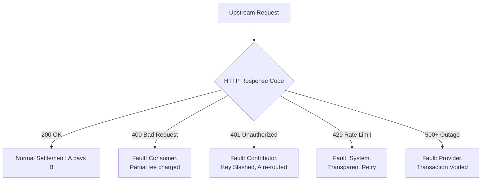

# Chapter 2.4: Legal Compliance, ToS, and Mediation


## 1. Introduction


Operating a communal pool of API keys is not merely a technical challenge; it is a complex legal and compliance operation.
Large Language Model (LLM) providers like OpenAI, Anthropic, and Google strictly govern how their APIs can be accessed, shared, and resold through their Terms of Service (ToS).


The Key Collective is structurally designed to comply with these terms by acting as a **cooperative proxy** rather than an unauthorized reseller.
This chapter outlines the legal architecture, the attestation contracts required from clients, liability firewalls, and the automated mediation protocols used to resolve disputes.


## 2. Navigating Provider Terms of Service (ToS)


### 2.1 The Anti-Resale Clauses
Most upstream providers explicitly prohibit the unauthorized resale of their API access.
If Tenant A buys an OpenAI key and sells access to Tenant B at a markup, Tenant A violates the ToS.


**The Key Collective Solution:** The Key Collective does not sell API access.
It operates a zero-markup, barter-based reciprocal exchange.
Tenants are essentially "loaning" capacity to one another.
The platform facilitates the routing and accounting but does not extract a profit margin on the underlying token generation. 


### 2.2 Data Privacy and Training Restrictions
Enterprise ToS agreements (e.g., OpenAI's Zero Data Retention policies) stipulate that API data is not used to train upstream models. 


**The Key Collective Solution:** The Key Collective architecture enforces strict pass-through encryption for payloads.
The proxy workers do not log, store, or analyze the contents of the `messages` array in any request.
Telemetry is restricted entirely to metadata (token counts, latency, status codes, model names).


## 3. Client Attestation Contracts (C1-C3 & K1-K2)


To enforce compliance at the edge, every tenant joining the collective must cryptographically sign attestation contracts.
These are enforced via JWT claims.


### 3.1 Consumer Contracts (C1-C3)
When a tenant consumes from the pool, they attest to:
- **C1 (Acceptable Use):** The tenant will not use the pooled keys to generate illegal content, CSAM, or violate the upstream provider's Acceptable Use Policy (AUP).
- **C2 (Non-Extraction):** The tenant will not use the pooled output to train competing foundation models (a common restriction in Anthropic and OpenAI ToS).
- **C3 (Auditability):** The tenant agrees that their metadata usage patterns can be audited by the PoolCoordinatorDO to detect Sybil attacks or free-riding.


### 3.2 Contributor Contracts (K1-K2)
When a tenant contributes a key to the pool, they attest to:
- **K1 (Authorized Ownership):** The tenant is the legal owner or authorized administrator of the API key provided.
- **K2 (Revocation Notice):** The tenant agrees to gracefully deprecate their key in the Key Collective dashboard prior to deleting it in the upstream provider's portal, preventing sudden 401 Unauthorized errors in the pool.


## 4. Liability Firewalls


In a distributed system handling third-party credentials, establishing clear liability boundaries is critical.


### 4.1 The Platform Firewall
The Key Collective operates as a "dumb pipe" with smart routing.
By adhering to Invariant 1 (No Plaintext Keys) and Invariant 5 (Non-blocking telemetry without payload inspection), the platform establishes a liability firewall.
The platform has zero knowledge of the prompts being sent, shielding it from copyright or AUP violations committed by a tenant.


### 4.2 The Inter-Tenant Firewall
If Tenant A routes a malicious prompt through Tenant B's API key, Tenant B's account with the upstream provider is at risk of suspension. 
To mitigate this, the Key Collective injects a traceable `headers['Key-Collective-Trace-ID']` and `headers['X-Forwarded-For-Tenant']` into the upstream request (where provider APIs support metadata tagging).
If Tenant B's key is suspended, the Collective can definitively prove to the upstream provider that the malicious payload originated from Tenant A, protecting the innocent key contributor.


## 5. Automated Dispute Mediation Protocol


When a request fails, the system must deterministically assign fault to maintain the economic equilibrium.
If a request fails, who pays?


### 5.1 Fault Scenarios
1. **HTTP 400 (Bad Request):** The client (Tenant A) sent an invalid payload. **Fault:** Tenant A.
Debt is accrued for the routing overhead, but not token generation.
2. **HTTP 401 (Unauthorized):** The contributed key (Tenant B) was revoked or invalid. **Fault:** Tenant B.
Tenant B's Trust Score is slashed.
Tenant A is immediately re-routed to a healthy key at no extra cost.
3. **HTTP 429 (Too Many Requests - Upstream):** The KeyPoolDO miscalculated the rate limits of Tenant B's key. **Fault:** The Platform.
Neither tenant is penalized; the request is transparently retried on another key.
4. **HTTP 5xx (Upstream Provider Outage):** OpenAI/Anthropic is down. **Fault:** Upstream.
The request is aborted, an error is returned to Tenant A, and no economic settlement occurs.


### 5.2 The Mediation Flow
The `PoolCoordinatorDO` acts as the automated arbiter.
1.
The Edge Proxy traps the HTTP response from the upstream provider.
2.
The proxy evaluates the status code against the Mediation Matrix.
3.
The proxy asynchronously dispatches a `SettleTransaction` command to the respective `TenantQuotaDO`s.
4.
If fault requires slashing (e.g., Scenario 2), the proxy dispatches a `SlashKey` command to the `KeyPoolDO`.





## 6. Conclusion


The Key Collective's legal and compliance architecture is intrinsically linked to its code.
By enforcing C1-C3 and K1-K2 attestations, maintaining strict liability firewalls through payload ignorance, and deploying an automated dispute mediation protocol, the platform ensures safe, compliant, and fair operation within the strict boundaries of Big-Tech Terms of Service.


```typescript
// Attestation schema verification
export interface ClientAttestation {
  tenantId: string;
  keyHash: string;
  c1Attested: boolean; // Direct authorization from provider account
  c2Attested: boolean; // Not reselling or sublicensing
  signature: string;
}

export function verifyAttestation(att: ClientAttestation): boolean {
  return att.c1Attested && att.c2Attested && att.signature.length > 0;
}
```
