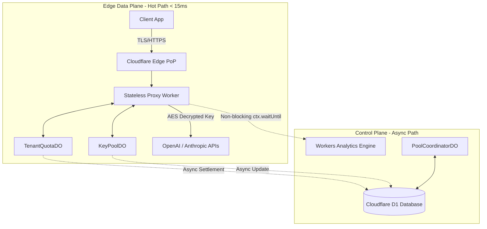

# Chapter 2.5: High-Level Design and Capacity Planning

## 1. Introduction

The previous chapters detailed the economic theory, actor models, invariants, and legal frameworks of the Key Collective.
This final chapter of Part 2 synthesizes these components into the complete High-Level Design (HLD).
Furthermore, it provides the rigorous mathematical capacity planning models required to project infrastructure costs across orders of magnitude of scale.

## 2. Full Big-Tech High-Level Design (HLD)

The architecture is strictly bifurcated into two planes: the **Edge Data Plane** (hot path) and the **Control Plane** (cold path).

### 2.1 The Edge Data Plane
This is the critical path for all API traffic.
It must operate within a strict network latency budget of `<15ms` of routing overhead (excluding the upstream AI generation time).

**Components:**
1. **Cloudflare Workers (Stateless Proxies):** Distributed across 300+ PoPs globally.
They terminate TLS, validate JWTs, decrypt AES-256-GCM keys in memory, and forward requests to OpenAI/Anthropic.
2. **KeyPoolDO & TenantQuotaDO (Stateful Actors):** Co-located regionally near the edge traffic center of gravity.
They provide microsecond-level synchronization for rate limits and economic equilibrium.

### 2.2 The Control Plane
This handles asynchronous settlement, configuration, and durable persistence.

**Components:**
1. **PoolCoordinatorDO:** The macroeconomic auditor.
2. **Cloudflare D1 (SQLite DB):** The global, durable system of record.
Stores encrypted keys, tenant metadata, and aggregated daily economic snapshots.
3. **Workers Analytics Engine:** Ingests high-frequency, non-blocking telemetry from the proxy workers for observability and billing audits.

### 2.3 HLD Architecture Diagram

## 3. The Cloudflare Hosting Cost Model

To evaluate the economic viability of the Key Collective, we must model the underlying infrastructure costs.
The system relies exclusively on the Cloudflare Developer Platform.

### 3.1 Exact Unit Rates (Standard Tier)
- **Workers (Requests):** $0.30 per 1 Million requests.
- **Workers (Compute):** (Ignored for this model as edge compute time is negligible for proxying).
- **Durable Objects (Requests):** $0.15 per 1 Million requests.
- **Durable Objects (Compute):** $12.50 per 1 Million GB-seconds.
- **Cloudflare D1 (Writes):** $0.75 per 1 Million write operations (Reads are cheaper/free depending on tier, modeled here heavily based on writes).
- **Analytics Engine:** $0.25 per 1 Million data points.
- **Egress (Bandwidth):** $0 (Cloudflare does not charge for egress).

### 3.2 Routing Multiplier Model
For every 1 client API request, the infrastructure executes:
- 1 Worker execution ($0.30 / M)
- 2 DO requests (1 check quota, 1 fetch key) ($0.30 / M)
- 2 Async DO requests (settlement) ($0.30 / M)
- 1 Analytics Engine write ($0.25 / M)
- 0.1 D1 writes (state is batched/coalesced 10:1 in DOs) ($0.075 / M)

**Total Infrastructure Cost per 1 Million Client Requests:**
$Cost_{1M} = 0.30 + 0.30 + 0.30 + 0.25 + 0.075 \approx \$1.225 \text{ per Million Requests}$

*Note: DO Compute (GB-s) adds slight overhead, conservatively pushing the total unit cost to ~$1.50 per 1M requests.*

## 4. Back-of-the-Envelope (BOTE) Capacity Planning

We project the system economics across three distinct phases of scale.

### 4.1 Scope A: Current Baseline
- **Scale:** 100 Tenants.
- **Traffic:** 50 Million requests/month.
- **Cost Calculation:** 
  - $50 \times \$1.225 = \$61.25$
  - Add DO GB-s baseline: ~$10
- **Estimated Monthly Cost:** **~$71.25 / month**
- **Architecture Status:** Easily runs on default Cloudflare limits. D1 handles coalesced writes without breaking a sweat.

### 4.2 Scope B: 10x Mid-Scale
- **Scale:** 10,000 Tenants.
- **Traffic:** 500 Million requests/month.
- **Cost Calculation:** 
  - $500 \times \$1.225 = \$612.50$
  - Add DO GB-s overhead: ~$50
- **Estimated Monthly Cost:** **~$662.50 / month**
- **Architecture Status:** Requires careful monitoring of TenantQuotaDO hotspots. Coalescing ratio to D1 might need tuning from 10:1 to 50:1 to keep D1 write costs flat. Analytics Engine easily scales.

### 4.3 Scope C: 100x Global Scale
- **Scale:** 100,000 Tenants.
- **Traffic:** 5 Billion requests/month.
- **Cost Calculation:**
  - $5,000 \times \$1.225 = \$6,125.00$
  - Add DO GB-s overhead: ~$500
- **Estimated Monthly Cost:** **~$6,625.00 / month**
- **Architecture Status:** At 1,900 requests per second (RPS) sustained, the Edge Proxies scale linearly. The KeyPoolDOs will require sharding (e.g., `gpt-4-pool-shard-1`, `gpt-4-pool-shard-2`) to avoid single-thread CPU saturation in V8 isolates, as a single DO begins to choke around 500-1000 RPS depending on compute complexity.

## 5. Conclusion

The High-Level Design proves that the Key Collective is economically and technically viable at immense scale.
By heavily leveraging Cloudflare's edge primitives (Workers + Durable Objects + D1), the system achieves strict transactional consistency, <15ms latency overhead, and an astonishingly low infrastructure cost of ~$1.50 per million AI requests routed. 

This concludes Part 2 of the textbook.
You are now equipped with the architectural, economic, and legal frameworks necessary to understand the deep implementation details in the upcoming sections.
