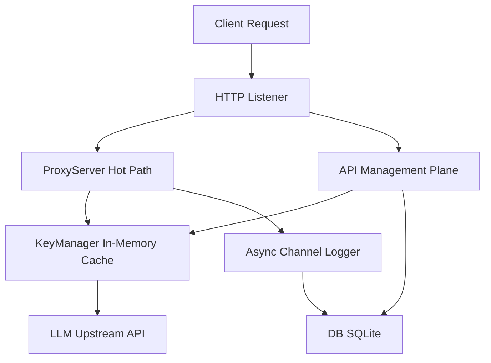

# Chapter 2: Architecture and Whys

## System Topology and Single-Binary Design

Key Collective operates as a self-contained entity. 
We ship a single static binary. 
It embeds a Svelte UI and operates the core Go application logic alongside an embedded database. 
You do not need a complex orchestrator. 
You do not need an external caching layer.
The system is designed to be operational immediately upon execution.



The `ProxyServer` handles the hot path. 
The management plane handles configuration. 
Both coexist in the same process. 
They communicate through the shared `KeyManager` state and the `DB` interface.
This shared memory model eliminates network boundaries between configuration and execution.

## Separation of Concerns: Hot Path vs Management Plane

The architecture splits responsibilities cleanly into a proxy hot path and a management plane. 
The hot path requires single-digit millisecond latency overhead. 
The management plane handles administrative operations that can tolerate higher latencies.

### The Hot Path (`ProxyServer`)

When an application routes an inference request through Key Collective, it hits the `ProxyServer`.
This path avoids disk I/O entirely. 
The `KeyManager` holds an active, mutex-guarded memory cache of available API keys. 
The `ProxyServer` retrieves the best key based on the requested model and routing rules.
It strips our internal authorization headers.
It attaches the upstream provider's `APIKey`.
Finally, it streams the response back via the standard library's `httputil.ReverseProxy`.

Logging happens asynchronously. 
The proxy pushes a `RequestLog` struct to a buffered channel.
It immediately releases the HTTP handler, ensuring the client receives the response without waiting for disk writes.

### The Management Plane (`APIServer`)

The management plane provides REST endpoints for the embedded Svelte UI. 
It handles CRUD operations for API keys, usage statistics, and user management. 
When an administrator adds a new key, the API layer encrypts it.
It writes the encrypted ciphertext to the `DB`.
It then updates the `KeyManager` cache in memory. 
This design ensures that management operations never block proxy throughput.
The hot path continues to route traffic using the existing cache state while the database transaction commits.

## Architectural Trade-offs and the "Whys"

Every architectural decision in Key Collective stems from balancing operational simplicity with high throughput. 
We favor local, robust primitives over distributed complexity.
We avoid adding external dependencies unless absolutely necessary.

### SQLite WAL Mode vs External Postgres

We use SQLite configured with Write-Ahead Logging (WAL) mode rather than requiring an external PostgreSQL instance.

PostgreSQL offers unparalleled concurrent write performance and distributed scalability. 
However, it requires network calls, dedicated administrative overhead, and complex deployment manifests. 
Key Collective prioritizes zero-friction deployment. 
You run the binary, and the database initializes locally.

SQLite WAL mode provides concurrent read capabilities.
It serializes writes efficiently enough to handle thousands of requests per minute. 
By eliminating network round-trips to an external database, our `DB` implementation writes `RequestLog` entries extremely fast. 

We set specific PRAGMAs to optimize for this workload:
- `PRAGMA journal_mode=WAL;`
- `PRAGMA synchronous=NORMAL;`
- `PRAGMA busy_timeout=5000;`

```sql
-- SQLite Schema Optimization for Request Logging
CREATE TABLE request_logs (
    id TEXT PRIMARY KEY,
    key_id TEXT NOT NULL,
    model TEXT NOT NULL,
    tokens_used INTEGER,
    status_code INTEGER,
    created_at DATETIME DEFAULT CURRENT_TIMESTAMP
);
CREATE INDEX idx_logs_key_time ON request_logs(key_id, created_at);
```

This ensures that administrative queries from the UI do not block the asynchronous logging worker inserting new records.
The indexes optimize the specific access patterns used by the dashboard for rendering charts.

### AES-256-GCM Encryption at Rest

Storing sensitive provider credentials in plaintext poses massive security risks. 
We encrypt the `APIKey` payload at rest using AES-256-GCM.

Why AES-256-GCM? 
It provides authenticated encryption. 
It guarantees both confidentiality and integrity. 
If the SQLite database file leaks, the API keys remain opaque blobs without the encryption passphrase. 
The `DB` reads the encrypted blob, decrypts it in memory, and populates the `KeyManager`.

Plaintext storage is simple but indefensible for infrastructure handling billing-linked secrets. 
Envelope encryption with GCM prevents tampering. 
An attacker modifying a single byte in the database will trigger an authentication tag verification failure upon decryption.
This prevents the system from loading or using a compromised key.

### Buffered Channel Asynchronous Logging

In a high-throughput proxy, blocking the HTTP response on a database write destroys latency. 
The `ProxyServer` uses a buffered channel for telemetry and logging.

When a request finishes, the proxy constructs a `RequestLog` struct.
It sends it to the channel. 
A background goroutine reads from this channel.
It aggregates logs into batches and executes a bulk insert via the `DB` interface.

Synchronous DB writes provide immediate durability guarantees. 
If the process crashes mid-request, you lose no logs. 
However, the cost is paying the disk I/O penalty on the critical path.

Buffered channels shift the cost. 
The proxy returns the 200 OK to the client instantly. 
If the process OOMs or receives a SIGKILL, the logs remaining in the channel buffer vanish. 
We trade absolute log durability for millisecond-latency inference proxying. 
For LLM usage tracking, eventually consistent batched writes offer the optimal balance.

## The `APIKey` Lifecycle 

The system treats `APIKey` structs as mutable state machines tracked by the `KeyManager`.
They transition between healthy, exhausted, and rate-limited states. 

The `ProxyServer` relies on these states to implement load balancing and fallback routing without querying the `DB`. 
Memory access takes nanoseconds.
Database queries take milliseconds.

By keeping the state in memory, we achieve high throughput. 
By synchronizing state changes through the management plane, we maintain administrative control without breaking the hot path execution flow.
This lifecycle management is central to the system's ability to heal itself when upstream providers fail.
