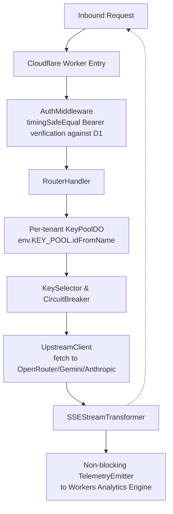

# 02 Architecture and Whys

Welcome to the architectural deep dive of Key Collective v2. If you are reading this, you are stepping into a system built to solve a very specific set of problems: managing large language model (LLM) API keys securely, routing requests intelligently across multiple providers, tracking costs down to the microscopic level of microdollars, and ensuring high availability when upstream providers inevitably experience downtime.

Let's break down how all these pieces fit together, the reasoning behind the structural decisions, and the tradeoffs we accepted along the way.

## High-Level Mental Model

At its core, Key Collective v2 is an AI gateway built natively on Cloudflare's edge infrastructure. It leverages Cloudflare Workers to handle incoming HTTP requests as close to the end user as physically possible, and Durable Objects (DOs) to maintain strongly consistent state for each individual tenant.

When a request arrives from a client, the edge worker acts as the initial entry point. Its primary job is relatively lightweight: authenticate the request, determine which tenant the request belongs to, and then hand off the heavy lifting to that tenant's dedicated Durable Object. 

This brings us to the most critical aspect of the entire architecture: **strict per-tenant isolation**. By using `env.KEY_POOL.idFromName(tenantId)`, we guarantee that one tenant's state, their API keys, and their rate limit counters are completely, cryptographically siloed from another's. There is absolutely no shared memory pool where a stray pointer or a logic bug could leak keys across tenant boundaries. Every tenant lives in their own isolated compute sandbox.



## Repository Anatomy

The codebase is meticulously organized to enforce strict boundaries between different concerns. The goal is that when you need to change how routing works, you don't accidentally break cryptographic operations. Let's look at the folder structure under `src/`:

### 1. `src/contracts/`
This is where our Pydantic-style schemas and Zod validators live. Data contracts for requests, responses, and internal models are defined here to ensure strict typing. If a piece of data goes over the wire or into storage, its shape must be defined in `contracts/`. This prevents "any" type sprawl. It defines shapes like `StreamMetadata`, `StreamUsage`, and error structures.

### 2. `src/crypto/`
Houses the Web Crypto AES-256-GCM authenticated encryption and decryption pipelines for our zero-plaintext security posture. It guarantees that every API credential stored in D1 remains ciphered at rest with 12-byte CSPRNG nonces, emerging as plaintext strictly within tenant isolate memory during outbound requests.

### 3. `src/durable_objects/`
The stateful core of the application. Here you will find `KeyPoolDO` maintaining in-memory state for rate limits, circuit breakers, and key triage for a given tenant. It holds instances of `CircuitBreaker` and `RateLimiter`.

### 4. `src/proxy/`
Houses outbound HTTP proxying logic, header rewriting, key injection, and `SSEStreamTransformer` for parsing streaming chunk responses without blocking the client.

### 5. `src/router/`
The brains of the intelligent routing operation. The `CascadeRouter` and `ModelRegistry` live here, deciding which upstream provider to hit based on model availability, cost constraints, and the real-time circuit breaker status.

### 6. `src/storage/`
Interfaces with Cloudflare D1 (SQLite). This layer abstracts away the raw SQL queries into clean, domain-specific repositories for tenants, keys, and cost ledgers.

### 7. `src/worker/`
The edge entry point. The `index.ts` file here defines the Cloudflare Worker, sets up the `RouterHandler`, and wires in the `AuthMiddleware` and `TelemetryEmitter`.

## Architectural Whys: The Hard Choices

Architecture is fundamentally about making trade-offs and living with the consequences. Let's examine the foundational choices we made and why we chose them over the alternatives.

### Why Cloudflare Durable Objects over Redis?

When building a stateful API gateway, Redis is the traditional, battle-tested choice for tracking rate limits and circuit breaker state. However, Redis introduces a mandatory network hop and is typically centralized in a specific region, defeating the purpose of an "edge" deployment. 

Durable Objects allow us to keep state *physically close* to the computation. When a tenant's DO wakes up, it loads its state from its local transactional storage (`this.ctx.storage`). Subsequent requests to that DO are served entirely from memory. This gives us single-digit millisecond latency for state reads. Furthermore, DOs are strongly consistent, making them perfect for precise rate limiting (`RateLimiter`) and circuit breaking (`CircuitBreaker`) without the race conditions common in distributed Redis setups.

```typescript
// Conceptual example of DO state hydration to avoid D1 reads on hot paths
export class KeyPoolDO {
  state: DurableObjectState;
  
  constructor(state: DurableObjectState, env: Env) {
    this.state = state;
    // Block incoming requests until state is fully loaded into memory
    this.state.blockConcurrencyWhile(async () => {
      // Hydrate state from local transactional storage
      const data = await this.state.storage.get("poolState");
      this.initializeState(data);
    });
  }
}
```

### Why AES-256-GCM over Plaintext Keys?

It is immensely tempting to just store API keys as plain strings in the database. It is easy to query, easy to debug, and simple to implement. But it is also a massive security liability. If a read-only token to our D1 database leaked, or an accidental SQL injection vulnerability was introduced, every single API key in the system would be compromised instantly.

We mandate the use of the Web Crypto API to encrypt keys before they hit D1 using AES-256-GCM. We generate a cryptographically secure, unique 12-byte nonce for every single encryption operation. This ensures that even if two tenants store the exact same OpenAI key, the ciphertexts in D1 will look completely different. The decryption happens inside the `KeyPoolDO` precisely when the `UpstreamClient` needs to make the `fetch` call.

```typescript
// Enforcing the Web Crypto API boundary
async function encryptKey(plaintext: string, masterKey: CryptoKey): Promise<{ ciphertext: string, nonce: string }> {
  // 12 bytes is the recommended nonce length for AES-GCM
  const nonce = crypto.getRandomValues(new Uint8Array(12));
  const encoded = new TextEncoder().encode(plaintext);
  
  const encryptedBuf = await crypto.subtle.encrypt(
    { name: "AES-GCM", iv: nonce },
    masterKey,
    encoded
  );
  
  return {
    ciphertext: Buffer.from(encryptedBuf).toString('base64'),
    nonce: Buffer.from(nonce).toString('base64')
  };
}
```

### Why Fixed-Point Integer Microdollars over IEEE-754 Floats?

Floating point math is notorious for rounding errors. The equation `0.1 + 0.2 === 0.30000000000000004` is a classic JavaScript trap. When you are aggregating millions of API calls that cost fractions of a cent, these tiny errors compound into real, missing money. Over time, your ledger drifts from reality.

We mandate that all financial calculations happen in microdollars, represented as `int64` integers. One US Dollar is exactly 1,000,000 microdollars. If an API call costs $0.0015, we store it as 1500 microdollars. All addition and subtraction use integer math, completely eliminating float drift and ensuring our billing ledgers are perfectly, mathematically accurate.

## Detailed Look at the Actors

To wrap up this overview, here is an extended summary of the key actors we've discussed, which you will encounter throughout the codebase:

1. **`AuthMiddleware`**: Verifies incoming Bearer tokens. Uses `timingSafeEqual` to prevent timing attacks where an attacker could guess a token character-by-character based on response times. This is the first line of defense against unauthorized access.
2. **`RouterHandler`**: The entry point that parses the request and figures out which DO to wake up. It acts as the grand orchestrator for incoming traffic.
3. **`KeyPoolDO`**: The isolated universe for a single tenant's operations. Everything for a tenant happens inside this boundary. It holds all memory-resident context for limits and usage.
4. **`KeySelector`**: The algorithm inside the DO that picks the best available API key, considering rate limits and remaining balance. It performs round-robin or least-utilized selection.
5. **`CircuitBreaker`**: Monitors upstream health. If an upstream provider starts throwing 500s, this trips and prevents further requests from being sent to a dead service, saving time and money. It transitions between OPEN, CLOSED, and HALF_OPEN states.
6. **`CascadeRouter`**: Works hand-in-hand with the CircuitBreaker to failover to a different model or provider when the primary choice is down. It defines the mapping from a requested abstract model to concrete fallbacks.
7. **`UpstreamClient`**: The actual HTTP client making the outbound `fetch` call to the AI provider. It handles injecting the Authorization header with the decrypted key.
8. **`SSEStreamTransformer`**: The mechanism that parses Server-Sent Events on the fly, extracting usage metadata while simultaneously streaming the response back to the client with minimal buffering. It intercepts the chunks and looks for the special `[DONE]` marker or embedded usage JSON.
9. **`TelemetryEmitter`**: Fires off non-blocking logs to Workers Analytics Engine using `ctx.waitUntil()`, ensuring our observability doesn't slow down the critical proxy path. This captures latency, token counts, and cost metrics asynchronously.
10. **`ModelRegistry`**: The definitive source of truth for model capabilities, routing configurations, and pricing parameters. It stores the microdollar cost per input and output token.
11. **`RateLimiter`**: Enforces Requests-Per-Minute (RPM) and Tokens-Per-Minute (TPM) limits to protect upstream accounts from being banned due to accidental abuse. It tracks token expenditure over rolling windows.

### A Closer Look at Rate Limiting
The `RateLimiter` implements a sophisticated sliding-window or token-bucket algorithm, taking full advantage of the strongly consistent storage within the Durable Object.

```typescript
// RateLimiter conceptually
export class RateLimiter {
  constructor(private capacity: number, private refillRate: number) {}
  
  consume(tokens: number): boolean {
    // If not enough tokens in the bucket, reject.
    // If enough, deduct and proceed.
    // In DO context, this is inherently thread-safe because execution is single-threaded per DO.
    return true; 
  }
}
```

### The Cryptography Lifecycle in D1

Beyond the in-memory boundaries, we must consider how D1 stores these keys. The schema strictly enforces that nonces and ciphertexts are stored together.

We never store a `raw_key` column. Instead, the `api_keys` table looks like this:
- `id` (UUID)
- `tenant_id` (UUID)
- `provider` (String, e.g., 'openai')
- `encrypted_key` (Base64 String)
- `encryption_nonce` (Base64 String)
- `created_at` (Timestamp)
- `updated_at` (Timestamp)

This structure ensures that rotating the master tenant key will immediately invalidate all associated `encrypted_key` records, causing the `KeyPoolDO` to fail safely instead of leaking data or attempting to use corrupted credentials.

### Final Thoughts on Architecture

The architectural choices made in Key Collective v2 were not made lightly. Every layer of isolation, every custom stream parser, and every cryptographic boundary was designed to solve real-world problems encountered in high-scale AI proxy deployments. The resulting system is resilient, secure, and rigorously observable.
