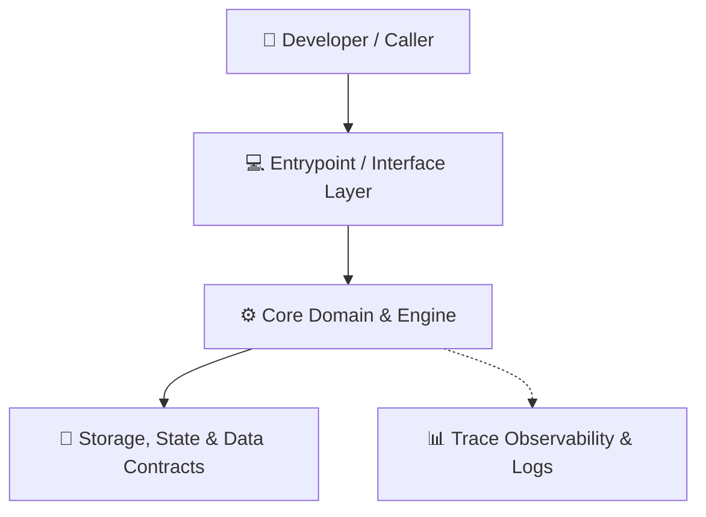

# Part 2: Architecture Blueprint, Mental Models & The "Whys"

> **Architectural Philosophy:** Separation of Concerns, Deterministic Execution, Trace Observability.

---

## 🏛️ High-Level System Architecture



### Why is the project structured this way?
1. **Separation of Control:** The user interface / CLI parsing is strictly isolated from core computational algorithms.
2. **Defensive Boundaries:** Data entering the core engine is validated against strict schemas.
3. **Pluggable Architecture:** Subsystems can be tested in isolation using mock inputs and deterministic fixtures.

---

## 📂 Repository Anatomy

```
key-collective/
├── src/ / core/          # Primary implementation packages
├── tests/                # Unit, integration & golden benchmark suites
├── docs/                 # Architecture Decision Records (ADRs) and guides
└── pyproject.toml        # Manifest declaration and dependencies
```

---

[← Previous: Part 1 — Language 101](01_language_primitives_and_idioms_101.md) | [Next: Part 3 — Guided Subsystem Tours →](03_subsystem_tours/README.md)
