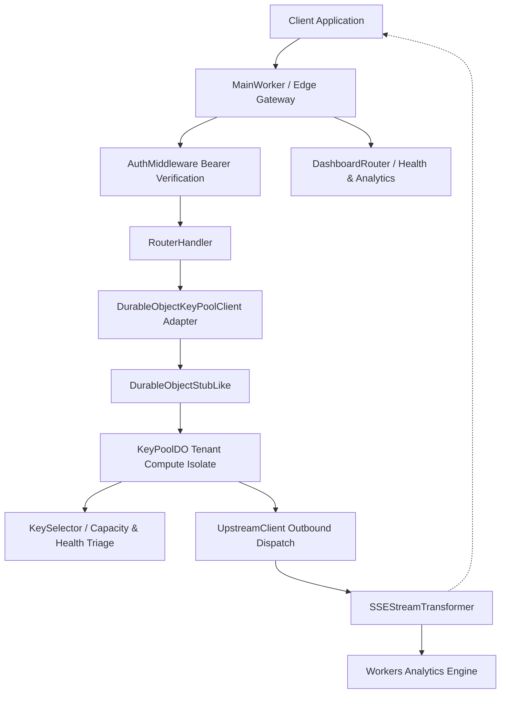

# 02: Architecture and Architectural Whys

Welcome to the architectural deep dive of Key Collective. This document provides a rigorous examination of the system's distributed actor topology, execution guarantees, cryptographic boundaries, and the technical rationale underlying its design decisions.

Key Collective operates as a high-throughput, multi-tenant AI gateway deployed on Cloudflare Workers and Durable Objects. It manages upstream LLM API credentials securely, enforces per-tenant financial quotas using fixed-point microdollars, dynamically routes inference requests across model providers, and streams responses without blocking the hot path.

---

## 1. High-Level Mental Model & Actor Topology

The system separates ephemeral edge routing from stateful, consistent tenant compute:


```mermaid
flowchart TD
    Client[Client Application] --> Gateway[MainWorker / Edge Gateway]
    Gateway --> Auth[AuthMiddleware Bearer Verification]
    Gateway --> DashboardRouter[DashboardRouter / Health & Analytics]
    Auth --> Handler[RouterHandler]
    Handler --> DOClient[DurableObjectKeyPoolClient Adapter]
    DOClient --> DOStub[DurableObjectStubLike]
    DOStub --> KeyPool[KeyPoolDO Tenant Compute Isolate]
    KeyPool --> Selector[KeySelector / Capacity & Health Triage]
    KeyPool --> Upstream[UpstreamClient Outbound Dispatch]
    Upstream --> Transformer[SSEStreamTransformer]
    Transformer --> Analytics[Workers Analytics Engine]
    Transformer -.-> Client
```

### 1.1 The Edge Worker Gateway

The edge worker is lightweight and globally distributed. It executes within `MainWorker`, configured via `WorkerOptions`:

```typescript
// src/worker/gateway/types.ts
export interface WorkerOptions extends RouterHandlerOptions {
  routerHandler?: RouterHandler;
  authMiddleware?: AuthMiddleware;
  telemetryEmitter?: TelemetryEmitter;
  cors?: boolean;
  verifyAdmin?: (token: string, request: Request, env: WorkerEnv) => Promise<boolean> | boolean;
  adminTokens?: string[];
}
```

The gateway parses incoming HTTP requests, determines the target edge subdomain (`api.keycollective.org`, `dashboard.keycollective.org`, or `docs.keycollective.org`), authenticates Bearer tokens, and routes traffic via `DashboardRouter` or `RouterHandler`.

### 1.2 Per-Tenant Compute Isolation

The cornerstone invariant of Key Collective is strict per-tenant isolation:
$$\text{DO\_ID} = \text{env.KEY\_POOL.idFromName}(\text{tenantId})$$

Every tenant executes within an isolated Durable Object container (`KeyPoolDO`, `TenantQuotaDO`, or `DemoDO`). No tenant can inspect, mutate, or access another tenant's in-memory counters, unencrypted API credentials, or circuit breaker states.

---

## 2. Durable Object Actor Architecture & Client Adapters

To decouple edge routing from Cloudflare's runtime types and allow unit testing without Miniflare, Key Collective introduces structural interfaces for Durable Objects.

### 2.1 Structural Type Contracts

```typescript
// src/worker/router/types.ts & src/durable_objects/key_pool/types.ts
export interface DurableObjectStubLike {
  id?: { toString(): string; name?: string };
  fetch(input: RequestInfo | URL, init?: RequestInit): Promise<Response>;
  getKey?(provider: string): Promise<string>;
  recordUsage?(keyId: string, costMicrodollars: bigint): Promise<void>;
  recordResult?(keyId: string, success: boolean): Promise<void>;
  getKeyMetrics?(keyId: string): Promise<KeyMetrics>;
  getCapacitySummary?(provider?: string): Promise<CapacitySummary>;
}

export interface DurableObjectNamespaceLike {
  idFromName(name: string): DurableObjectId;
  get(id: DurableObjectId): DurableObjectStubLike;
}

export interface DurableObjectStorageLike {
  get<T = unknown>(key: string): Promise<T | undefined>;
  put<T = unknown>(key: string, value: T): Promise<void>;
  delete(key: string): Promise<boolean>;
  transaction<T>(closure: (txn: unknown) => Promise<T>): Promise<T>;
}

export interface DurableObjectStateLike {
  readonly id: { toString(): string; readonly name?: string };
  readonly storage: DurableObjectStorageLike;
  waitUntil(promise: Promise<unknown>): void;
  blockConcurrencyWhile?<T>(callback: () => Promise<T>): Promise<T>;
}
```

### 2.2 The DurableObjectKeyPoolClient Adapter

Edge routers interface with tenant Durable Objects using `DurableObjectKeyPoolClient`:

```typescript
// src/worker/router/do_client.ts
export class DurableObjectKeyPoolClient implements KeyPoolContract {
  public readonly tenantId: string;
  private readonly stub: DurableObjectStubLike;

  constructor(stub: DurableObjectStubLike, tenantId: string) {
    if (!tenantId || tenantId.trim().length === 0) {
      throw new TenantIsolationError("DurableObjectKeyPoolClient requires a non-empty tenantId");
    }
    this.stub = stub;
    this.tenantId = tenantId;
  }

  public async getKey(provider: string): Promise<string> {
    if (!provider || provider.trim().length === 0) {
      throw new InvalidKeyError("Provider parameter is required to acquire key");
    }
    // Dispatches via typed RPC method or falls back to internal HTTP route
    if (typeof this.stub.getKey === "function") {
      return this.stub.getKey(provider);
    }
    const response = await this.stub.fetch(`http://do/keys/${provider}`);
    const data = await response.json();
    return data.key;
  }
}
```

---

## 3. Core Actors: KeyPoolDO, TenantQuotaDO & PoolCoordinatorDO

Key Collective divides stateful responsibilities into three distinct Durable Object classes:

1. **`KeyPoolDO`:**
   Configured via `KeyPoolDOEnv` and `KeyPoolDOOptions`, this actor manages in-memory key state, circuit breakers, and rate limiters for a single tenant's registered API keys.
2. **`TenantQuotaDO`:**
   Enforces financial budgets, debt ratios, and mutual exchange standing. It implements the reciprocal quota engine, transitioning delinquent tenants from normal operation into `SOFT_WARNING` or `HARD_JAIL`.
3. **`PoolCoordinatorDO`:**
   Aggregates cross-tenant provider health and volume metrics. It calculates aggregate provider weights \(W_{\text{provider}}\) and triggers emergency load braking across the cluster.
4. **`DemoDO`:**
   Provides sandboxed, temporary evaluation tokens for prospective developers without requiring upfront API key registration.

---

## 4. Intelligent Key Selection and Capacity Triage

Inside `KeyPoolDO`, incoming requests are evaluated by `KeySelector`, configured with `KeySelectorOptions`:

```typescript
// src/durable_objects/key_selector/types.ts
export interface SelectableKey {
  id: string;
  provider: string;
  tenantId?: string;
  priority?: number;
  status?: string;
  rpmLimit?: number;
  circuitOpenUntil?: string | null;
  lastUsedAt?: string | number | null;
}

export interface SelectKeyOptions<TKey extends SelectableKey = SelectableKey> {
  strategy?: KeySelectionStrategy;
  costMicrodollars?: bigint;
  throwOnExhausted?: boolean;
  fallbackToAnyProvider?: boolean;
  candidateKeys?: TKey[];
}

export interface CapacitySummary {
  provider?: string;
  totalKeys: number;
  healthyKeys: number;
  totalRpmLimit: number;
  currentRpm: number;
  remainingRpm: number;
  utilizationPercent: number;
}
```

### 4.1 Triage Results and Key Health

Before dispatching an inference call, `KeySelector.triageKeys()` inspects all keys for a target provider:

```typescript
// src/durable_objects/key_selector/types.ts
export interface KeyTriageItem<TKey extends SelectableKey = SelectableKey> {
  key: TKey;
  healthy: boolean;
  reason?: "healthy" | "disabled" | "invalid" | "exhausted" | "circuit_breaker_open" | "rate_limit_exceeded" | "budget_exceeded";
  retryAfterSeconds?: number;
  currentRpm?: number;
  remainingRpm?: number;
}

export interface KeyTriageResult<TKey extends SelectableKey = SelectableKey> {
  provider?: string;
  totalKeys: number;
  healthyKeys: TKey[];
  unhealthyKeys: KeyTriageItem<TKey>[];
  rateLimitedKeys: KeyTriageItem<TKey>[];
  circuitBrokenKeys: KeyTriageItem<TKey>[];
  minRetryAfterSeconds: number;
}
```

### 4.2 Key Routing Policies

Tenants configure routing policies using `KeyRoutingConfig`, choosing between strategies defined in `RoutingStrategy`:
- `"cost-optimal"`: Routes to the cheapest healthy model candidate.
- `"lowest-latency"`: Routes to the provider with lowest EWMA response latency.
- `"round-robin"`: Distributes load uniformly across identical keys.
- `"priority"`: Strictly consumes highest-priority keys first.
- `"cascade"`: Automatically falls back down a designated fallback chain.

---

## 5. Architectural Whys: The Hard Decisions

Every architecture is defined by the constraints it accepts. Here are the core tradeoffs made in Key Collective:

### Why Durable Objects instead of Redis?
Centralized Redis clusters introduce cross-datacenter WAN hops (often 40-120ms) from Cloudflare edge locations. Durable Objects colocate state with the worker compute, executing transactions in single-digit milliseconds directly on the edge fabric while providing linearizable consistency.

### Why AES-256-GCM with 12-byte Nonces?
Storing plaintext provider keys in SQLite/D1 exposes the entire network to catastrophic credential compromise if a SQL injection or snapshot backup leaks. Encrypting with unique 12-byte nonces ensures that identical API keys produce distinct ciphertexts, thwarting replay and rainbow-table attacks.

### Why Fixed-Point Microdollars?
Floating-point IEEE-754 arithmetic suffers from precision loss (e.g. `0.1 + 0.2 === 0.30000000000000004`). When processing millions of fractional-cent completions, rounding errors compound into severe financial discrepancies. All budgets, costs, and ledgers in Key Collective are strictly computed in 64-bit integer microdollars (1 USD = 1,000,000 `µ$`).
