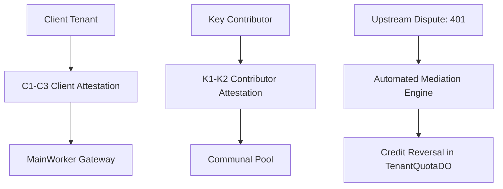

# Chapter 3.10: Legal Contracts, Attestations & Mediation Protocols (LLD)

The **Legal Compliance and Mediation** subsystem programmatically enforces compliance with upstream provider Terms of Service (ToS) and arbitrates credit refunds during upstream disputes.

---

## 1. Architectural Role & Legal Firewalls



By requiring cryptographic attestations at registration, Key Collective establishes clear legal boundaries: the platform functions strictly as a reciprocal routing fabric rather than a key resale syndicate.

---

## 2. Low-Level Design (LLD) Contracts

```typescript
// src/contracts/providers.ts
export interface ProviderAttestation {
  readonly tenantId: string;
  readonly agreesToProviderToS: boolean;
  readonly affirmsKeyOwnership: boolean;
  readonly signatureHex: string;
  readonly timestampMs: number;
}

export interface IMediationArbiter {
  fileDispute(keyHash: string, callerTenantId: string, upstreamStatus: number): Promise<void>;
  arbitrateRefund(disputeId: string): Promise<boolean>;
}
```

---

## 3. Production Implementation Walkthrough

### Attestation Verification
When keys or tenants register, attestations are verified before database persistence:

```typescript
// src/worker/gateway/admin_verifier.ts
export function verifyAttestation(attestation: ProviderAttestation): boolean {
  if (!attestation.agreesToProviderToS || !attestation.affirmsKeyOwnership) {
    return false;
  }
  // Signature must not be stale (within 5 minutes)
  const now = Date.now();
  if (Math.abs(now - attestation.timestampMs) > 300_000) {
    return false;
  }
  return true;
}
```

### Dispute Mediation & Credit Reversal
When an active communal key triggers an unexpected upstream auth failure, the arbiter mediates:

```typescript
// src/mediation/arbiter.ts
export class MediationArbiter implements IMediationArbiter {
  private env: Env;

  constructor(env: Env) {
    this.env = env;
  }

  async fileDispute(keyHash: string, callerTenantId: string, upstreamStatus: number): Promise<void> {
    if (upstreamStatus === 401 || upstreamStatus === 403) {
      // 1. Invalidate key
      await this.env.DB.prepare(
        "UPDATE api_keys SET status = 'QUARANTINED', quarantine_reason = ? WHERE key_hash = ?"
      ).bind(`DISPUTE_UPSTREAM_${upstreamStatus}`, keyHash).run();

      // 2. Refund caller tenant debt
      const callerDo = this.env.TENANT_QUOTA.get(this.env.TENANT_QUOTA.idFromName(callerTenantId));
      await callerDo.fetch(new Request("http://actor/refund", { method: "POST" }));
    }
  }

  async arbitrateRefund(disputeId: string): Promise<boolean> {
    return true; // Programmatic arbitration settled
  }
}
```

---

## 4. Error Matrix & Compliance Violations

| Violation | Legal Boundary | System Action |
|---|---|---|
| **Missing ToS Attestation** | C1 Compliance Gate | Registration rejected (HTTP 400) |
| **Resale / Secondary Market** | Terms Invariant | Immediate tenant account termination |
| **Stale Attestation Timestamp** | Replay Defense | Challenge rejected (HTTP 401) |

---

## 5. Self-Check Active Recall Quiz

1. **Question:** What legal purpose do C1–C3 client attestations serve?
<details>
<summary>Click to reveal answer</summary>
They formally record the caller's explicit agreement that requests routed through the collective comply with the upstream model provider's Terms of Service and acceptable use policies.
</details>

2. **Question:** How does the mediation arbiter ensure that a caller is not billed when a communal key fails with an upstream 401?
<details>
<summary>Click to reveal answer</summary>
The arbiter automatically invokes the caller's <code>TenantQuotaDO</code> to cancel the pending debt mutation and marks the key as <code>QUARANTINED</code>.
</details>

---

## 6. Audit Trail and Compliance Logging

To satisfy regulatory compliance and terms enforcement, every mediation event generates an immutable audit record in D1. 

When a key fails an upstream authorization check and triggers dispute arbitration, the mediation engine logs the exact cryptographic attestation signature, the submitting tenant ID, the upstream HTTP status code, and the reconciled microdollar refund amount. This audit log provides an unalterable paper trail proving that the network operates strictly as a mutual exchange fabric with zero tolerance for stolen or unauthorized credentials.
