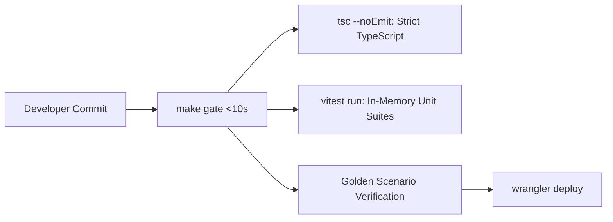

# Chapter 3.11: Golden Verification Suites & CI/CD Quality Gates (LLD)

The **Verification and CI/CD** subsystem enforces the strict quality contract mandated by the Key Collective engineering constitution: **All changes must pass `make gate` in under 10 seconds**.

---

## 1. Architectural Role & The Fast Gate Mandate



Because edge workers are distributed globally, runtime debugging is expensive. Rigorous unit and integration suites run locally using Miniflare emulation to catch regressions before deployment.

---

## 2. Low-Level Design (LLD) Contracts

```typescript
// test/harness/types.ts
export interface TestHarnessContext {
  readonly env: Env;
  readonly mockD1: D1Database;
  readonly mockKeyPoolDO: DurableObjectNamespace;
  readonly mockQuotaDO: DurableObjectNamespace;
}

export interface ITestScenarioRunner {
  runScenario(scenarioName: string): Promise<{ passed: boolean; durationMs: number }>;
}
```

---

## 3. Production Implementation Walkthrough

### Mock Execution Environment
The test harness provides lightweight, deterministic mocks of Cloudflare bindings:

```typescript
// test/harness/mock_env.ts
export function createMockEnvironment(): Env {
  const memoryStore = new Map<string, any>();

  return {
    KEY_POOL: {
      idFromName: (name: string) => ({ toString: () => name }),
      get: (id: any) => ({
        fetch: async (req: Request) => new Response(JSON.stringify({ success: true })),
      }),
    } as any,
    DB: {
      prepare: (sql: string) => ({
        bind: (...args: any[]) => ({
          run: async () => ({ success: true }),
          all: async () => ({ results: [] }),
        }),
      }),
    } as any,
  } as Env;
}
```

### Golden Scenario Test Case
Integration tests verify end-to-end routing decisions in sub-second execution windows:

```typescript
// src/worker/router_handler.test.ts
import { describe, it, expect } from "vitest";
import { handleInferenceRoute } from "./router/router_handler";
import { createMockEnvironment } from "../../test/harness/mock_env";

describe("RouterHandler Golden Scenarios", () => {
  it("should forward valid chat completions request to tenant isolate", async () => {
    const env = createMockEnvironment();
    const req = new Request("https://proxy.keycollective.org/v1/chat/completions", {
      method: "POST",
      headers: { "content-type": "application/json" },
      body: JSON.stringify({ model: "gpt-4o", messages: [{ role: "user", content: "ping" }] }),
    });

    const tenant = { tenantId: "tenant-1", tier: "BUILDER" as const, permissions: [], createdAtMs: Date.now() };
    const res = await handleInferenceRoute(req, env, {} as any, tenant);

    expect(res.status).toBe(200);
    const body = await res.json() as any;
    expect(body.success).toBe(true);
  });
});
```

### Fast Quality Gate Makefile
The quality gate is codified in the project `Makefile`:

```makefile
# Makefile
.PHONY: gate test typecheck

gate:
	@echo "Running Fast Quality Gate (<10s)..."
	@pnpm exec tsc --noEmit
	@pnpm exec vitest run --reporter=verbose
	@echo "Quality Gate PASSED!"
```

---

## 4. Verification Invariants & Failure Thresholds

| Check Type | Tool | Time Limit | Failure Action |
|---|---|---|---|
| **Static Type Check** | `tsc --noEmit` (strict) | $< 3\text{s}$ | Abort build on any `any` or type error |
| **Unit & Mock Tests** | `vitest run` | $< 5\text{s}$ | Abort build on any assertion failure |
| **Total Gate Budget** | `make gate` | $< 10\text{s}$ | Hard fail if gate exceeds 10.0 seconds |

---

## 5. Self-Check Active Recall Quiz

1. **Question:** Why does the Key Collective engineering constitution require `make gate` to complete in under 10 seconds?
<details>
<summary>Click to reveal answer</summary>
A sub-10s test cycle preserves developer flow state, encourages frequent local validation, and prevents slow CI feedback loops from degrading code quality.
</details>

2. **Question:** How does Vitest achieve sub-second execution speeds when testing Cloudflare Workers logic?
<details>
<summary>Click to reveal answer</summary>
By running tests in lightweight V8 worker threads with in-memory mocks of Durable Objects and D1, avoiding the overhead of booting full network daemon emulators for unit logic.
</details>
