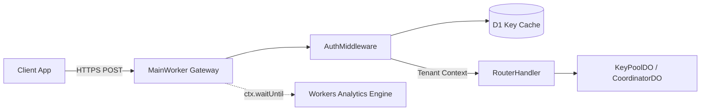

# Chapter 3.1: Ingress Gateway & Edge Auth Middleware (LLD)

The **Ingress Gateway and Auth Middleware** constitute the front door of Key Collective. Intercepting every HTTP request at the closest Cloudflare Point of Presence (PoP), this subsystem authenticates callers, establishes tenant context, and routes payloads to downstream actors with sub-millisecond execution budgets.

---

## 1. Architectural Role & Context



The gateway acts as a stateless V8 isolate filter. It rejects unauthenticated, malformed, or unauthorized requests before any Durable Object RPC invocation, protecting edge CPU memory and isolating compute costs.

---

## 2. Low-Level Design (LLD) Contracts

```typescript
// src/worker/auth/types.ts
export interface TenantContext {
  readonly tenantId: string;
  readonly tier: "BUILDER" | "PROBATIONARY" | "ENTERPRISE";
  readonly permissions: ReadonlyArray<string>;
  readonly createdAtMs: number;
}

export interface IAuthMiddleware {
  authenticate(request: Request, env: Env): Promise<TenantContext>;
}
```

---

## 3. Production Implementation Walkthrough

### Token Extraction & Bearer Validation
The middleware inspects the incoming `Authorization` header, extracts the bearer token, and validates it against SHA-256 hashed tokens stored in edge-cached D1 tables:

```typescript
// src/worker/auth/middleware.ts
export async function authenticateRequest(request: Request, env: Env): Promise<TenantContext> {
  const authHeader = request.headers.get("Authorization");
  if (!authHeader || !authHeader.startsWith("Bearer ")) {
    throw new DomainError("AUTH_MISSING_BEARER", "Missing or invalid Authorization header", 401);
  }

  const token = authHeader.substring(7).trim();
  const tokenHash = await sha256Hex(token);

  // Fast lookup against edge-cached repository
  const tenant = await env.AUTH_TOKENS_REPO.lookupByHash(tokenHash);
  if (!tenant || tenant.status === "REVOKED") {
    throw new DomainError("AUTH_UNAUTHORIZED", "Invalid or revoked tenant token", 401);
  }

  return {
    tenantId: tenant.tenantId,
    tier: tenant.tier,
    permissions: tenant.permissions,
    createdAtMs: tenant.createdAtMs,
  };
}
```

### Core Request Dispatcher
Once authenticated, `RouterHandler` determines the request path and dispatches execution:

```typescript
// src/worker/router/router_handler.ts
export async function handleInferenceRoute(
  request: Request,
  env: Env,
  ctx: ExecutionContext,
  tenant: TenantContext
): Promise<Response> {
  const url = new URL(request.url);
  if (url.pathname !== "/v1/chat/completions") {
    return new Response(JSON.stringify({ error: "Endpoint not found" }), { status: 404 });
  }

  const body = await request.json() as ModelRequest;
  const trace = extractOrGenerateTrace(request);

  // Route to tenant isolate
  const doId = env.KEY_POOL.idFromName(tenant.tenantId);
  const doStub = env.KEY_POOL.get(doId);

  return doStub.fetch(new Request("http://actor/dispatch", {
    method: "POST",
    headers: {
      "content-type": "application/json",
      "x-kc-trace-id": trace.traceId,
      "x-kc-tenant-id": tenant.tenantId,
    },
    body: JSON.stringify(body),
  }));
}
```

---

## 4. Error Matrix & Deterministic Failure Modes

| Error Code | HTTP Status | Cause | Action |
|---|---|---|---|
| `AUTH_MISSING_BEARER` | 401 Unauthorized | Missing or malformed header | Immediate rejection |
| `AUTH_UNAUTHORIZED` | 401 Unauthorized | Token hash not found or revoked | Immediate rejection |
| `RATE_LIMIT_EXCEEDED`| 429 Too Many Requests | Gateway ingress bucket full | Return Retry-After header |
| `PAYLOAD_TOO_LARGE` | 413 Payload Too Large | Body exceeds 10MB limit | Reject before buffering |

---

## 5. Self-Check Active Recall Quiz

1. **Question:** Why does `authenticateRequest` hash incoming Bearer tokens with SHA-256 before looking them up in D1?
<details>
<summary>Click to reveal answer</summary>
To prevent database compromise from revealing plaintext authentication tokens. The database stores only one-way cryptographic hashes.
</details>

2. **Question:** What is the latency impact of executing authentication at the stateless Worker layer before contacting a Durable Object?
<details>
<summary>Click to reveal answer</summary>
It eliminates unnecessary Durable Object invocations for unauthenticated traffic, reducing edge actor load to zero for unauthorized requests.
</details>
