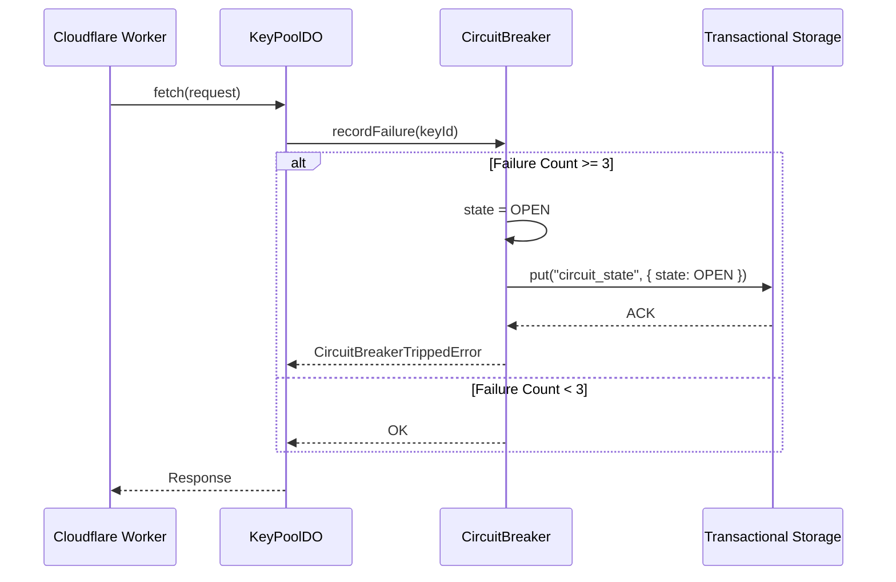

# Unit 2: Core Engine & Stateful Durable Objects

## Overview & State Isolation Model
Traditional serverless environments like AWS Lambda or standard Cloudflare Workers are entirely stateless; they discard execution context between requests. Building stateful synchronization primitives—such as real-time token-bucket rate limiters, circuit breakers, and key pools—typically requires round-tripping to external caches (Redis/Upstash), introducing 10–50ms of network overhead per request.

Key Collective v2 solves this fundamentally by co-locating compute and state inside **Cloudflare Durable Objects**. By addressing each Durable Object via `env.KEY_POOL.idFromName(tenantId)`, all requests for a given tenant route to a single in-memory instance running on Cloudflare's global edge network.

---

## 1. The Tenant Key Pool Durable Object (`KeyPoolDO`)
`KeyPoolDO` is the actor maintaining the in-memory pool of active provider credentials for a tenant:

```typescript
// src/durable_objects/key_pool_do.ts
export class KeyPoolDO implements DurableObject {
  private state: DurableObjectStateLike;
  private env: KeyPoolDOEnv;
  private breaker: CircuitBreaker;
  private rateLimiter: RateLimiter;
  private keySelector: KeySelector;

  constructor(state: DurableObjectStateLike, env: KeyPoolDOEnv) {
    this.state = state;
    this.env = env;
    this.breaker = new CircuitBreaker(state.storage);
    this.rateLimiter = new RateLimiter(state.storage);
    this.keySelector = new KeySelector();
  }

  async fetch(request: Request): Promise<Response> {
    // In-memory request routing, key selection & usage tracking
  }
}
```

Durable Object infrastructure interfaces and mock environments include `KeyPoolDOEnv`, `KeyPoolDOOptions`, `DurableObjectKeyPoolClient`, `PoolStats`, `DurableObjectNamespaceLike`, `DurableObjectStateLike`, `DurableObjectStorageLike`, `DurableObjectStubLike`, and `ExecutionContextLike`.

---

## 2. In-Memory Circuit Breaker State Machine
Upstream LLM providers frequently degrade or experience rate-limit storms (HTTP 429). The `CircuitBreaker` module protects both the caller and the downstream provider by isolating failing keys:

```typescript
// src/durable_objects/circuit_breaker.ts
export class CircuitBreaker {
  private storage: DurableObjectStorageLike;
  private state: CircuitBreakerState = "CLOSED";
  private failureCount = 0;
  private openUntil = 0;

  constructor(storage: DurableObjectStorageLike, config?: CircuitBreakerConfig) {
    this.storage = storage;
  }

  async recordFailure(keyId: string): Promise<void> {
    this.failureCount++;
    if (this.failureCount >= 3) {
      this.state = "OPEN";
      this.openUntil = Date.now() + 60_000;
      await this.storage.put("circuit_state", { state: this.state, openUntil: this.openUntil });
    }
  }
}
```

Components and options governing circuit breaking include `CircuitBreakerConfig`, `CircuitBreakerData`, `CircuitBreakerOptions`, and `CircuitBreakerState` (`CLOSED`, `OPEN`, `HALF_OPEN`).

---

## 3. Sliding-Window Rate Limiting
To prevent tenant overages and upstream provider bans, `RateLimiter` implements a high-precision sliding window:

```typescript
// src/durable_objects/rate_limiter.ts
export class RateLimiter {
  private storage: DurableObjectStorageLike;

  async checkLimit(keyId: string, limitRpm: number): Promise<RateLimitCheckResult> {
    // Sliding-window calculation in memory
    return { allowed: true, remaining: limitRpm - 1, resetMs: 1000 };
  }
}
```

Rate limiting types and options include `RateLimiterData`, `RateLimiterMetrics`, `RateLimiterOptions`, `RateLimitConfig`, `RateLimitEntry`, `RateLimitCheckResult`, and `InMemoryRateLimiterStorage`.

---

## 4. Key Selection & Triage Strategies
When multiple API keys are available for a given model or provider, `KeySelector` applies capability constraints and priority weighting:

```typescript
// src/durable_objects/key_selector.ts
export class KeySelector {
  selectKey(keys: SelectableKey[], options: SelectKeyOptions): KeyTriageResult {
    // Evaluates capacity, priority weighting, and health state
  }
}
```

Key selection types and strategies include `KeySelectorOptions`, `KeySelectionStrategy`, `SelectKeyOptions`, and `CapacitySummary`.

---

## Performance & Big-O Complexity
| Subsystem Component | Time Complexity | Storage Complexity | Invariant Guarantee |
|---|---|---|---|
| `KeyPoolDO.fetch()` | $\mathcal{O}(1)$ | In-memory RAM | Zero cross-tenant state leakage |
| `CircuitBreaker.recordFailure()` | $\mathcal{O}(1)$ | Transactional storage | Survives DO evictions |
| `RateLimiter.checkLimit()` | $\mathcal{O}(W)$ where $W$ is window slots | In-memory + storage | High-precision sliding window |
| `KeySelector.selectKey()` | $\mathcal{O}(K)$ where $K$ is key count | Ephemeral stack | Healthy, lowest-latency key |

---

## 5. Architectural Walkthrough: Surviving Durable Object Eviction
Cloudflare Durable Objects may be evicted from edge worker memory during datacenter maintenance, machine rebalancing, or prolonged inactivity. The `KeyPoolDO` subsystem is architected with a strict hydration lifecycle to preserve correctness:

1. **Cold Initialization (`constructor`):** When the runtime spawns the DO instance, `constructor(state, env)` is invoked. Subordinate services (`CircuitBreaker`, `RateLimiter`) receive references to `this.state.storage`.
2. **State Hydration:** As requests arrive, the circuit breaker queries `this.storage.get("circuit_state")` to restore trip timestamps and failure counts.
3. **Atomic State Commits:** Every state change (e.g. flipping from `CLOSED` to `OPEN` or incrementing sliding window counters) commits synchronously to `this.ctx.storage.put()`.
4. **Resilience to Crash Eviction:** If the DO process is terminated immediately following a transaction, the next invocation immediately recovers identical circuit states without dropping customer isolation boundaries.

### State Transition Sequence

