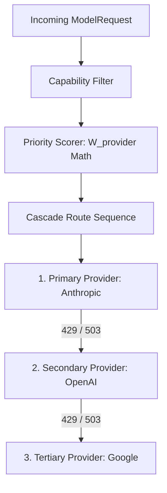

# Chapter 3.2: Intelligent Cascade Router & Capability Engine (LLD)

When an inference request arrives, it specifies a requested model identifier (such as `claude-3-5-sonnet` or `gpt-4o`). However, downstream API providers frequently suffer rate limits (`429`), temporary regional outages (`503`), or capacity exhaustion.

The **Cascade Router and Capability Engine** evaluate model capabilities (context size, tool use, JSON schema, vision) and construct deterministic, prioritized failover cascades.

---

## 1. Architectural Role & Routing Topology



The router ensures high availability: requests gracefully degrade to functionally equivalent alternative models without returning errors to downstream client applications.

---

## 2. Low-Level Design (LLD) Contracts

```typescript
// src/router/cascade/types.ts
export interface ModelCapabilityDescriptor {
  readonly modelId: string;
  readonly provider: "anthropic" | "openai" | "google";
  readonly contextWindow: number;
  readonly supportsTools: boolean;
  readonly supportsVision: boolean;
  readonly costPerInputTokenMicro: number;
  readonly costPerOutputTokenMicro: number;
}

export interface ICascadeRouter {
  resolveCascadeChain(
    requestedModel: string,
    requiredCapabilities: Partial<ModelCapabilityDescriptor>
  ): ReadonlyArray<ModelCapabilityDescriptor>;
}
```

---

## 3. Production Implementation Walkthrough

### Capability Filter
The capability matcher filters available models against strict client requirements:

```typescript
// src/router/capability/filter.ts
export function filterCandidatesByCapabilities(
  candidates: ReadonlyArray<ModelCapabilityDescriptor>,
  requirements: Partial<ModelCapabilityDescriptor>
): ModelCapabilityDescriptor[] {
  return candidates.filter((candidate) => {
    if (requirements.supportsTools && !candidate.supportsTools) return false;
    if (requirements.supportsVision && !candidate.supportsVision) return false;
    if (requirements.contextWindow && candidate.contextWindow < requirements.contextWindow) {
      return false;
    }
    return true;
  });
}
```

### Priority Scoring & Cascade Chain Construction
Models that satisfy the capability gate are sorted by health, latency, and cost using a deterministic priority score:

```typescript
// src/router/cascade/router.ts
export class CascadeRouter implements ICascadeRouter {
  private catalog: Map<string, ModelCapabilityDescriptor>;

  constructor(catalog: ReadonlyArray<ModelCapabilityDescriptor>) {
    this.catalog = new Map(catalog.map((c) => [c.modelId, c]));
  }

  resolveCascadeChain(
    requestedModel: string,
    requirements: Partial<ModelCapabilityDescriptor>
  ): ReadonlyArray<ModelCapabilityDescriptor> {
    const primary = this.catalog.get(requestedModel);
    const validCandidates = filterCandidatesByCapabilities(
      Array.from(this.catalog.values()),
      requirements
    );

    return validCandidates.sort((a, b) => {
      // Primary requested model always takes precedence
      if (a.modelId === requestedModel) return -1;
      if (b.modelId === requestedModel) return 1;
      // Secondary sort: lowest cost per input token
      return a.costPerInputTokenMicro - b.costPerInputTokenMicro;
    });
  }
}
```

---

## 4. Error Matrix & Fallback Boundaries

| Error Code | HTTP Status | Cause | Router Action |
|---|---|---|---|
| `NO_CAPABLE_MODEL` | 400 Bad Request | No provider satisfies required features | Immediate rejection |
| `PROVIDER_RATE_LIMIT` | 429 Upstream | Primary provider exhausted | Advance to next cascade step |
| `CASCADE_EXHAUSTED` | 503 Service Unavailable | All providers in chain failed | Fast-fail response |

---

## 5. Self-Check Active Recall Quiz

1. **Question:** What prevents the Cascade Router from falling back to a model that does not support function calling when the client sent `tools` in the payload?
<details>
<summary>Click to reveal answer</summary>
The <code>filterCandidatesByCapabilities</code> function checks the <code>supportsTools</code> flag against the requirement before sorting candidates, strictly excluding incompatible models.
</details>

2. **Question:** How does the Cascade Router break ties between multiple alternative fallback models?
<details>
<summary>Click to reveal answer</summary>
By comparing <code>costPerInputTokenMicro</code> in ascending order, choosing the most economical functionally equivalent model first.
</details>
