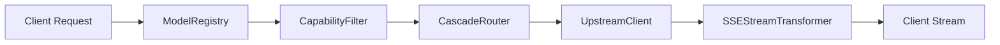

# Unit 3: Interfaces, Adapters & External Gateways

## Overview & The Multi-Vendor Gateway Challenge
An enterprise LLM router must interface with heterogeneous upstream providers (Anthropic, OpenAI, Google Gemini, Groq, Mistral), each presenting disparate authentication headers, error envelopes, and streaming response formats.

Unit 3 explores the gateway layer of Key Collective v2: the model registry, capability filter, cascade fallback router, streaming SSE parser, and the HTTP upstream client.

---

## 1. The Dynamic Model Registry (`ModelRegistry`)
`ModelRegistry` provides in-memory indexing of upstream model capabilities, context windows, and fixed-point pricing:

```typescript
// src/router/model_registry.ts
export class ModelRegistry implements IModelRegistry {
  private models = new Map<string, ModelDef>();
  private aliases = new Map<string, string>();

  constructor(options?: ModelRegistryOptions) {
    this.registerDefaults();
  }

  resolveModel(aliasOrId: string): ModelDef {
    const canonical = this.aliases.get(aliasOrId) || aliasOrId;
    const model = this.models.get(canonical);
    if (!model) throw new ModelNotFoundError({ modelId: aliasOrId });
    return model;
  }
}
```

Key interfaces and options include `ModelRegistry`, `ModelRegistryOptions`, and `IModelRegistry`.

---

## 2. Capability Filtering (`CapabilityFilter`)
Before candidate models are evaluated for cost, they must be validated against client request constraints:

```typescript
// src/router/capability_filter.ts
export class CapabilityFilter implements ModelCapabilitiesFilter {
  filter(models: ModelDef[], requirements: CapabilityRequirements): CapabilityCheckResult {
    // Validates context window size, tool use, vision, and schema constraints
  }

  validateContext(promptTokens: number, contextLimit: number): ContextValidationResult {
    return { valid: promptTokens <= contextLimit, promptTokens, contextLimit };
  }
}
```

Components and parameter structures include `CapabilityFilter`, `ModelCapabilitiesFilter`, `CapabilityCheckResult`, `CapabilityRequirements`, and `ContextValidationResult`.

---

## 3. The Cascade Router (`CascadeRouter`)
When a client requests a completion, `CascadeRouter` determines the cost-optimal model and coordinates escalation if an upstream provider fails:

```typescript
// src/router/cascade_router.ts
export class CascadeRouter implements RouterContract {
  constructor(private registry: IModelRegistry, private options?: CascadeRouterOptions) {}

  async resolveRoute(req: CascadeRouteRequest): Promise<CascadeRouteResponse> {
    // Selects cheapest capable candidate; provides escalation fallback list
  }
}
```

Routing data structures and lifecycle options include:
- `CascadeRouteRequest`, `CascadeRouteResponse`, `CascadeRouter`, `CascadeRouterOptions`.
- `RouteRequest`, `RouteResponse`, `RouterDecision`, `RoutingStrategy`, `KeyRoutingConfig`.
- Fallback management: `FallbackAttempt`, `FallbackConfig`, `FallbackTrigger`, `RequirementExtractionOptions`.

---

## 4. Web Streams & SSE Usage Extraction (`SSEStreamTransformer`)
Streaming LLM responses deliver text tokens incrementally. However, critical token usage blocks are frequently delivered only in the final terminal chunk:

```typescript
// src/proxy/sse_transformer.ts
export class SSEStreamTransformer {
  createTransformStream(options?: SSEStreamTransformerOptions): TransformStream<Uint8Array, Uint8Array> {
    // Zero-copy byte forwarding with terminal regex token inspection
  }
}
```

Streaming primitives and metadata types include `SSEEvent`, `SSEStreamTransformer`, `SSEStreamTransformerOptions`, `StreamMetadata`, `StreamUsage`, and `TokenUsage`.

---

## 5. Upstream Provider Client (`UpstreamClient`)
`UpstreamClient` encapsulates HTTP transport, header rewriting, key injection, and error redaction:

```typescript
// src/proxy/upstream_client.ts
export class UpstreamClient {
  constructor(private options?: UpstreamClientOptions) {}

  async forward(req: UpstreamRequest): Promise<UpstreamResponse> {
    // Dispatches HTTP fetch to OpenAI/Anthropic/Gemini with sanitized headers
  }
}
```

Transport models include `UpstreamClient`, `UpstreamClientOptions`, `UpstreamRequest`, `UpstreamResponse`, `UpstreamChatRequest`, `UpstreamChatResponse`, and `Provider`.

---

## Structural Pipeline & Invariants


| Component | I/O Profile | Primary SLA Target | Invariant Enforced |
|---|---|---|---|
| `ModelRegistry` | In-memory lookup | < 0.1ms | Microdollar pricing validation |
| `CapabilityFilter` | Pure deterministic | < 0.2ms | Immediate 400 on context overflow |
| `CascadeRouter` | Pure deterministic | < 0.5ms | Cost-optimal candidate selection |
| `SSEStreamTransformer` | Web Streams passthrough | 0ms added latency | Authoritative terminal usage extraction |
| `UpstreamClient` | Edge HTTP fetch | Excluded from proxy SLA | Plaintext key header isolation |
