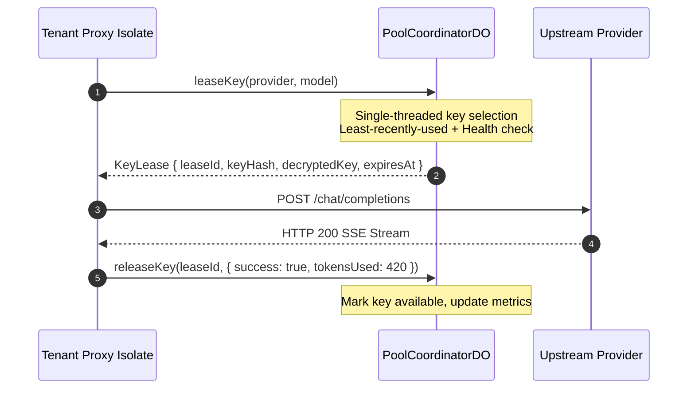

# Chapter 3.3: Communal Pool Engine & Coordinator Actor (LLD)

The **Communal Pool Engine** is the core reciprocal liquidity hub of Key Collective. When a tenant exhausts their private API keys, they request a communal key lease from the global `PoolCoordinatorDO`.

---

## 1. Architectural Role & Lease Lifecycle



Because `PoolCoordinatorDO` is implemented as a Cloudflare Durable Object, all lease requests execute sequentially on a single-threaded event loop, guaranteeing **zero double-leasing race conditions**.

---

## 2. Low-Level Design (LLD) Contracts

```typescript
// src/contracts/key_pool.ts
export interface KeyLease {
  readonly leaseId: string;
  readonly keyHash: string;
  readonly provider: string;
  readonly decryptedKey: string;
  readonly expiresAtMs: number;
}

export interface IPoolCoordinator {
  leaseKey(provider: string, model: string): Promise<KeyLease | null>;
  releaseKey(leaseId: string, result: { success: boolean; tokensUsed: number }): Promise<void>;
}
```

---

## 3. Production Implementation Walkthrough

### Lease Acquisition & Expiration Tracking
The coordinator maintains active keys in memory and grants time-bounded leases:

```typescript
// src/pool/coordinator_do.ts
export class PoolCoordinatorDO implements DurableObject {
  private activeLeases: Map<string, KeyLease> = new Map();
  private availableKeys: Map<string, string[]> = new Map(); // provider -> keyHashes

  async leaseKey(provider: string, model: string): Promise<KeyLease | null> {
    const pool = this.availableKeys.get(provider);
    if (!pool || pool.length === 0) return null;

    const keyHash = pool.shift()!; // Dequeue least-recently used key
    const leaseId = crypto.randomUUID();
    const lease: KeyLease = {
      leaseId,
      keyHash,
      provider,
      decryptedKey: await this.decryptStoredKey(keyHash),
      expiresAtMs: Date.now() + 30_000, // 30s lease TTL
    };

    this.activeLeases.set(leaseId, lease);
    return lease;
  }
```

### Lease Release & Settlement
When the downstream worker finishes or errors, it releases the lease:

```typescript
  async releaseKey(leaseId: string, result: { success: boolean; tokensUsed: number }): Promise<void> {
    const lease = this.activeLeases.get(leaseId);
    if (!lease) return;

    this.activeLeases.delete(leaseId);

    if (result.success) {
      // Re-insert into available pool
      const pool = this.availableKeys.get(lease.provider) ?? [];
      pool.push(lease.keyHash);
      this.availableKeys.set(lease.provider, pool);
    } else {
      // Quarantine key if failure was auth-related
      await this.quarantineKey(lease.keyHash, "UPSTREAM_FAILURE");
    }
  }
```

---

## 4. Error Matrix & Lock-Free Guarantees

| Error Condition | Coordinator Action | Client Outcome |
|---|---|---|
| **No Keys Available** | Return `null` immediately | Cascade router falls back to secondary provider |
| **Lease Timeout (Stalled Worker)** | Background sweep returns key to pool | Key recovered after 30s TTL |
| **Upstream 401 on Lease** | Quarantine key immediately | Contributor credit clawback triggered |

---

## 5. Self-Check Active Recall Quiz

1. **Question:** What mechanism prevents a deadlocked edge worker from permanently locking a communal API key?
<details>
<summary>Click to reveal answer</summary>
Every key lease has an explicit <code>expiresAtMs</code> (30-second TTL). A background timer sweeps expired leases and returns healthy keys to the available queue.
</details>

2. **Question:** Why does PoolCoordinatorDO not require distributed mutexes or database locks when allocating keys?
<details>
<summary>Click to reveal answer</summary>
Because all requests to the global coordinator are processed sequentially on the Durable Object's single-threaded V8 event loop.
</details>
