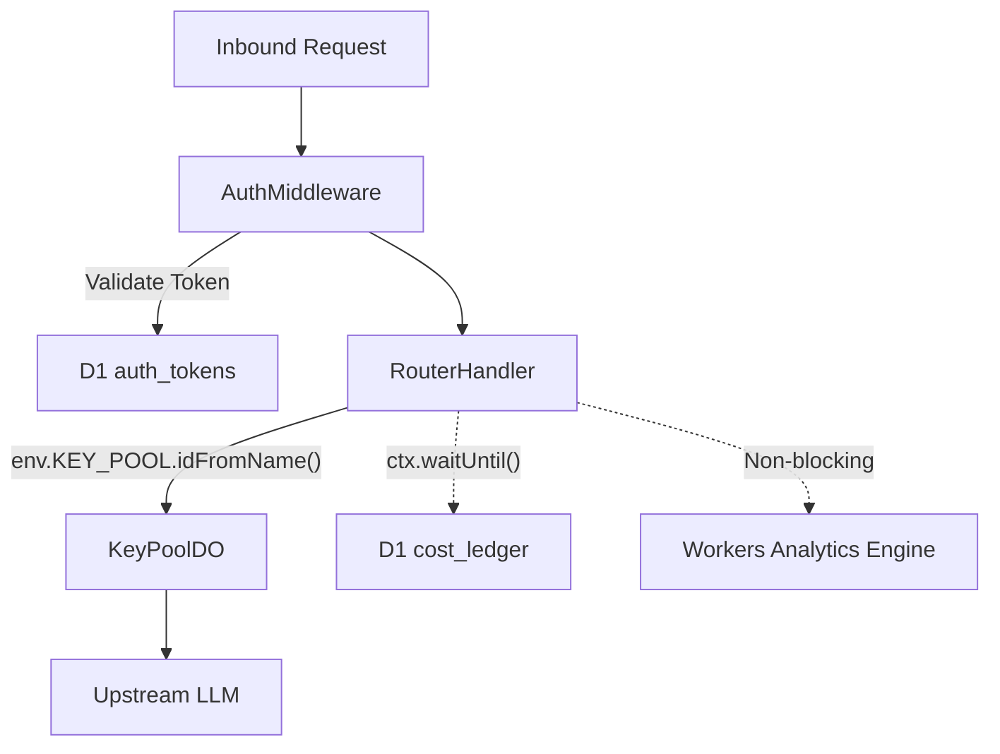
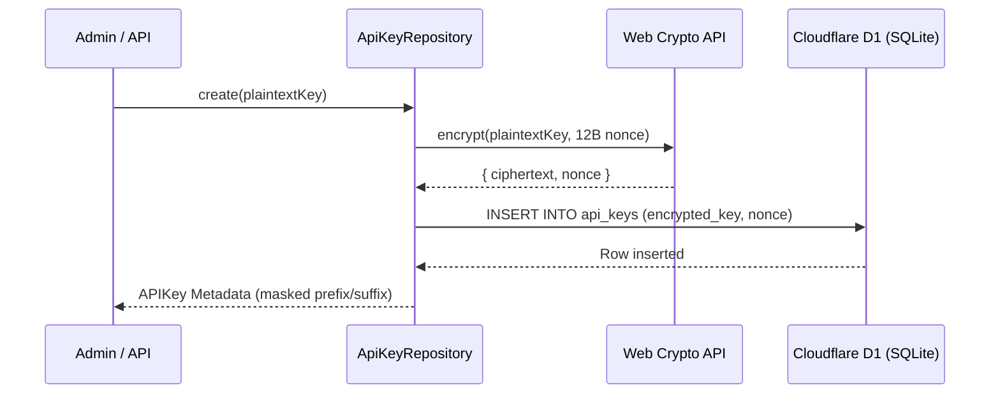

# Unit 4: Runtime Observability, Storage & Infrastructure

## Overview & The Zero-Idle Edge Architecture
At planetary scale, hosting monolithic backend proxies in containerized infrastructure incurs continuous idle compute charges and persistent cold starts. Key Collective v2 replaces the container tier entirely with serverless Cloudflare Workers, Cloudflare D1 (edge SQLite), and Cloudflare Workers Analytics Engine.

Unit 4 dissects the worker entrypoint, authentication middleware, repository persistence tier, and high-frequency telemetry pipelines.

---

## 1. Edge Worker Entrypoint & Execution Context
The root Cloudflare Worker serves as the public entrypoint:

```typescript
// src/worker/index.ts
export default {
  async fetch(request: Request, env: Env, ctx: ExecutionContext): Promise<Response> {
    const authMiddleware = new AuthMiddleware(env);
    const routerHandler = new RouterHandler(env);
    const telemetry = new TelemetryEmitter(env.TELEMETRY);

    const authResult = await authMiddleware.authenticate(request);
    if (!authResult.success) return authResult.response;

    return routerHandler.handle(request, authResult.context, ctx);
  }
} satisfies ExportedHandler<Env>;
```

Worker runtime types and configuration options include `MainWorker`, `Handler`, `WorkerEnv`, `WorkerOptions`, `Env`, and `DB`.

Request handling and authentication orchestration utilize `AuthMiddleware`, `AuthMiddlewareOptions`, `AuthMiddlewareResult`, `AuthMiddlewareSuccess`, `AuthMiddlewareFailure`, `TokenValidationResult`, `TenantConfigOptions`, `RouterHandler`, and `RouterHandlerOptions`.

---

## 2. Cloudflare D1 Repository Layer
Persistence for configuration, keys, pricing, and accounting rollups resides in Cloudflare D1:

```typescript
// src/storage/repositories/apiKeys.ts
export class ApiKeyRepository {
  constructor(private db: D1Database, private masterKey: string) {}

  async create(input: CreateApiKeyInput): Promise<APIKey> {
    // Encrypts plaintext key using AES-256-GCM and unique nonce; stores ciphertext in D1
  }
}
```

The repository suite encompasses:
- **API Keys:** `ApiKeyRepository`, `ApiKeysRepository`, `InsertEncryptedApiKeyInput`, `CreateApiKeyInput`, `UpdateApiKeyInput`, `CountApiKeysOptions`, `ListApiKeysOptions`.
- **Auth Tokens:** `AuthTokenRepositoryConfig`, `AuthTokensRepository`, `AuthTokenRow`, `CreateAuthTokenParams`, `UpdateAuthTokenParams`.
- **Cost Ledger & Financials:** `CostLedgerRepository`, `CostLedgerEvent`, `CostLedgerEventInput`, `CostBreakdown`, `DailySpendRollup`, `DailySpendRollupInput`, `ListCostEventsOptions`, `ListDailyRollupsOptions`.
- **Model Registry Persistence:** `ModelRegistryRepository`, `ModelRegistryRow`, `IModelRegistryRepository`, `RequestLog`.

Legacy compatibility proxies and bridges for migration include `KeyManager`, `ProxyServer`, and `ProxyStats`.

---

## 3. High-Frequency Non-Blocking Telemetry (`TelemetryEmitter`)
To guarantee that telemetry writes never block proxy latency, `TelemetryEmitter` streams structured events to the Cloudflare Workers Analytics Engine via non-blocking write buffers:

```typescript
// src/worker/telemetry_emitter.ts
export class TelemetryEmitter implements TelemetryContract {
  constructor(private dataset: AnalyticsEngineDataset, private options?: TelemetryEmitterOptions) {}

  emit(event: TelemetryEvent): void {
    // Emits blobs (tenantId, provider, model) and doubles (tokens, latencyMs, costMicrodollars)
  }
}
```

Telemetry types and filtering parameters include `TelemetryEmitter`, `TelemetryEmitterOptions`, `TelemetryEvent`, `TelemetryContract`, `CreateTelemetryEventParams`, and `FilterOptions`.

---

## Storage & Telemetry Architecture


| Infrastructure Node | Technology | Access Pattern | Latency SLA |
|---|---|---|---|
| Edge Auth | Cloudflare Workers | Per-request Bearer SHA-256 | < 2.0ms |
| Relational Persistence | Cloudflare D1 (SQLite) | Prepared SQL transactions | Warm reads: < 5ms |
| Hot State Sync | DO Transactional Storage | Key-value atomic commits | Co-located memory |
| High-Frequency Telemetry | Workers Analytics Engine | Non-blocking write stream | 0ms proxy impact |

---

## 4. Cryptographic Nonce Uniqueness & Integrity Assurance
The integrity of the encrypted API key storage rests upon AES-256-GCM authenticated encryption. AES-GCM requires that every encryption operation under a given secret key MUST use a unique initialization vector (nonce). Reusing a nonce with the same key completely compromises authenticity and leaks plaintext XOR differentials.

Key Collective enforces strict cryptographic invariants at the repository boundary:
- **CSPRNG Generation:** Every call to `ApiKeyRepository.create()` generates a cryptographically secure 12-byte (96-bit) nonce via `crypto.getRandomValues(new Uint8Array(12))`.
- **Database Nonce Storage:** The unique nonce is encoded to base64 and stored directly alongside the ciphertext in the D1 `api_keys` table (`nonce_b64`).
- **Zero In-Memory Plaintext Retention:** Plaintext keys are decrypted into ephemeral stack strings only at the exact instant an upstream HTTP request is dispatched, and discarded immediately from memory after headers are formatted.

```typescript
// Nonce generation & encryption flow
export async function encryptApiKey(plaintext: string, masterKey: CryptoKey): Promise<{ ciphertextB64: string; nonceB64: string }> {
  const nonce = crypto.getRandomValues(new Uint8Array(12));
  const encoded = new TextEncoder().encode(plaintext);
  const ciphertextBuffer = await crypto.subtle.encrypt(
    { name: "AES-GCM", iv: nonce, tagLength: 128 },
    masterKey,
    encoded
  );
  return {
    ciphertextB64: arrayBufferToBase64(ciphertextBuffer),
    nonceB64: uint8ArrayToBase64(nonce)
  };
}
```

### End-to-End Persistence Pipeline

