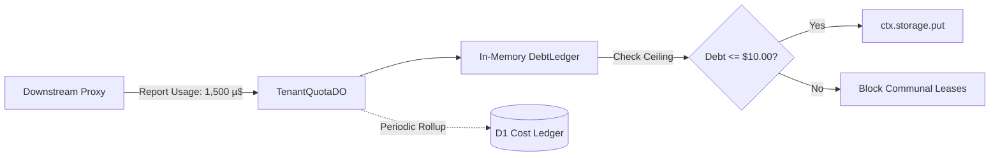

# Chapter 3.4: Community Debt Engine & Credit Economics (LLD)

The **Community Debt Engine** enforces the economic equilibrium of Key Collective. Operating inside `TenantQuotaDO`, this subsystem ensures that tenants who consume communal capacity incur exact debt in microdollars, while tenants who contribute keys receive proportional credit.

---

## 1. Architectural Role & Ledger Mechanics



All financial operations are calculated strictly in `int64` microdollars ($1\text{ USD} = 1,000,000\text{ µ\$}$) to eliminate floating-point drift.

---

## 2. Low-Level Design (LLD) Contracts

```typescript
// src/quota/tenant/types.ts
export interface TenantFinancialState {
  readonly tenantId: string;
  currentDebtMicrodollars: number;
  lifetimeEarnedMicrodollars: number;
  lifetimeConsumedMicrodollars: number;
  overdraftCeilingMicrodollars: number;
  lastSettledAtMs: number;
}

export interface ITenantQuota {
  canConsume(estimatedCostMicro: number): Promise<boolean>;
  recordConsumption(actualCostMicro: number): Promise<void>;
  recordEarnings(earnedCostMicro: number): Promise<void>;
  syncToD1(d1: D1Database): Promise<void>;
}
```

---

## 3. Production Implementation Walkthrough

### Overdraft Evaluation
Before granting access to communal keys, the tenant actor verifies that the tenant's current balance remains within allowable limits:

```typescript
// src/quota/tenant/tenant_do.ts
export class TenantQuotaDO implements DurableObject {
  private state!: TenantFinancialState;

  async canConsume(estimatedCostMicro: number): Promise<boolean> {
    const projectedDebt = this.state.currentDebtMicrodollars + estimatedCostMicro;
    return projectedDebt <= this.state.overdraftCeilingMicrodollars;
  }

  async recordConsumption(actualCostMicro: number): Promise<void> {
    this.state.currentDebtMicrodollars += actualCostMicro;
    this.state.lifetimeConsumedMicrodollars += actualCostMicro;

    // Persist to transactional storage
    await this.ctx.storage.put("financial_state", this.state);
  }
}
```

### Microdollar Settlement Logic
When a contributing tenant's key satisfies another user's request, credit is credited directly:

```typescript
// src/quota/tenant/debt.ts
export function settleCommunalEarnings(
  currentState: TenantFinancialState,
  earnedMicrodollars: number
): TenantFinancialState {
  return {
    ...currentState,
    currentDebtMicrodollars: Math.max(0, currentState.currentDebtMicrodollars - earnedMicrodollars),
    lifetimeEarnedMicrodollars: currentState.lifetimeEarnedMicrodollars + earnedMicrodollars,
    lastSettledAtMs: Date.now(),
  };
}
```

### Asynchronous D1 Ledger Rollup
To prevent D1 database lock contention on the hot path, rollups are synchronized asynchronously:

```typescript
// src/quota/tenant/tenant_do.ts
export async function syncFinancialRollupToD1(
  state: TenantFinancialState,
  d1: D1Database
): Promise<void> {
  await d1.prepare(
    `INSERT INTO cost_ledger_rollups (tenant_id, debt_microdollars, earned_microdollars, updated_at)
     VALUES (?, ?, ?, datetime('now'))
     ON CONFLICT(tenant_id) DO UPDATE SET
       debt_microdollars = excluded.debt_microdollars,
       earned_microdollars = excluded.earned_microdollars,
       updated_at = datetime('now')`
  )
  .bind(state.tenantId, state.currentDebtMicrodollars, state.lifetimeEarnedMicrodollars)
  .run();
}
```

---

## 4. Error Matrix & Invariant Boundaries

| Error Code | HTTP Status | Trigger Condition | System Action |
|---|---|---|---|
| `QUOTA_OVERDRAFT_EXCEEDED`| 402 Payment Required | Debt exceeds $10.00 ceiling | Block communal leases |
| `INVALID_FINANCIAL_DELTA`| 500 Internal Error | Negative cost input passed | Panic and reject transaction |
| `LEDGER_DESYNC` | 500 Internal Error | Checksum mismatch in D1 | Trigger SRE reconciliation |

---

## 5. Self-Check Active Recall Quiz

1. **Question:** What is the maximum allowable default overdraft in microdollars before a tenant is barred from leasing communal keys?
<details>
<summary>Click to reveal answer</summary>
10,000,000 microdollars (equivalent to exactly $10.00 USD).
</details>

2. **Question:** Why is floating-point arithmetic strictly forbidden in `TenantQuotaDO`?
<details>
<summary>Click to reveal answer</summary>
Because floating-point numbers accumulate rounding errors across high-frequency micro-transactions, causing ledger drift that violates financial audit compliance.
</details>

3. **Question:** How does the system reconcile hot in-memory actor balances with cold D1 persistence?
<details>
<summary>Click to reveal answer</summary>
Via background <code>ON CONFLICT DO UPDATE</code> batch queries executed outside the critical proxy routing loop.
</details>
