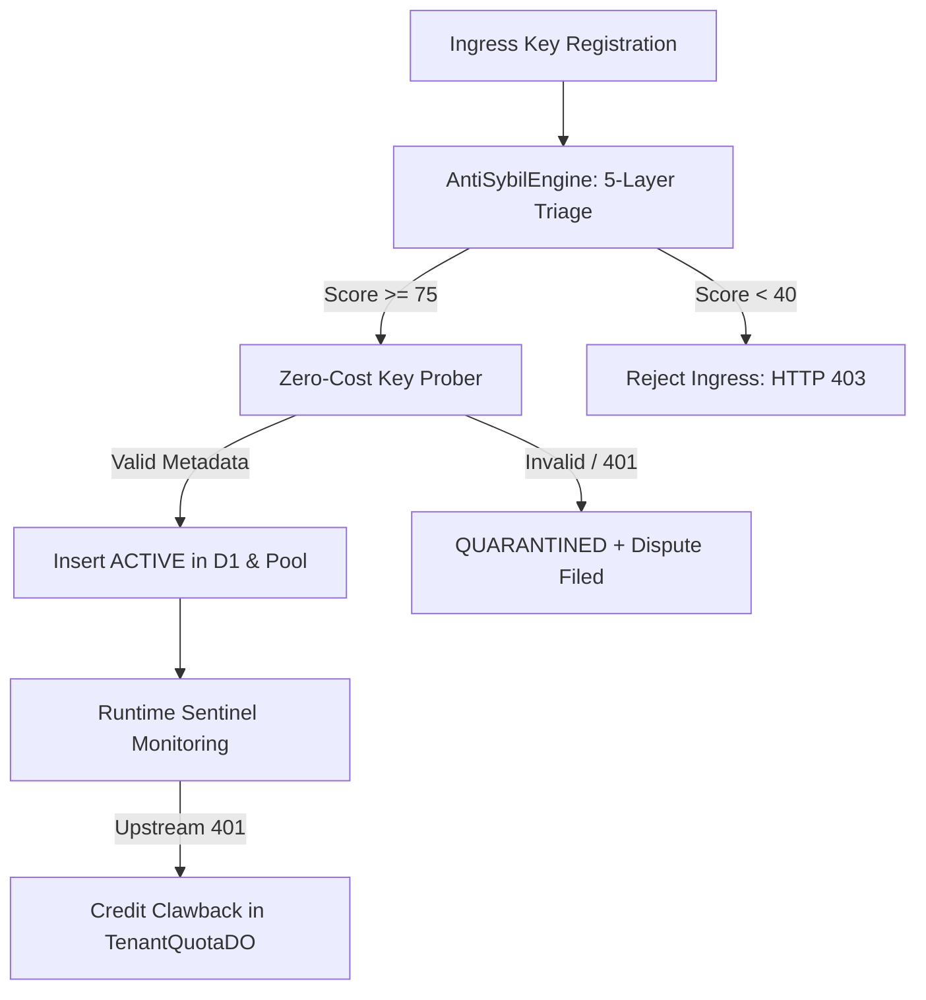

# Chapter 3.5: Anti-Cheat, Anti-Sybil & Key Sentinels (LLD)

The **Anti-Cheat Sentinel** subsystem defends Key Collective against malicious exploitation. It detects and quarantines invalid, stolen, or exhausted API credentials and blocks automated sybil attacks attempting to siphon communal compute capacity.

---

## 1. Architectural Role & Defense Perimeter



---

## 2. Low-Level Design (LLD) Contracts

```typescript
// src/contracts/v3_types.ts
export interface AntiSybilInput {
  clientIp: string;
  turnstileToken: string;
  asn: number;
  githubAccountAgeDays?: number;
  githubPublicRepos?: number;
  now?: number | Date;
}

export interface AntiSybilAssessment {
  score: number; // 0 to 100
  tier: "BUILDER" | "PROBATIONARY" | "BLOCKED";
  reasons: ReadonlyArray<string>;
}
```

---

## 3. Production Implementation Walkthrough

### 5-Layer Sybil Assessment Engine
The engine evaluates incoming registration signals across multiple vectors:

```typescript
// src/auth/sybil/engine.ts
export async function evaluateAntiSybil(
  input: AntiSybilInput,
  options: EvaluateAntiSybilOptions = {}
): Promise<AntiSybilAssessment> {
  const auditReasons: string[] = [];

  // Layer 1: Cryptographic Turnstile Proof-of-Work
  const turnstileValid = await verifyTurnstileToken(input.turnstileToken, options.turnstileSecret);
  if (!turnstileValid) {
    return { score: 0, tier: "BLOCKED", reasons: ["FAILED_TURNSTILE_POW"] };
  }

  // Layer 2: Network Subnet Velocity Check
  const subnet = extractSubnet(input.clientIp);
  const velocity = await globalSubnetTracker.increment(subnet);
  if (velocity > MAX_REGISTRATIONS_PER_SUBNET) {
    return { score: 10, tier: "BLOCKED", reasons: ["SUBNET_VELOCITY_EXCEEDED"] };
  }

  // Layer 3: Datacenter ASN Filter
  if (isDatacenterAsn(input.asn)) {
    auditReasons.push("DATACENTER_IP_DETECTED");
  }

  const score = calculateReputationScore(input, auditReasons);
  const tier = score >= 75 ? "BUILDER" : score >= 40 ? "PROBATIONARY" : "BLOCKED";
  return { score, tier, reasons: auditReasons };
}
```

### Zero-Cost Synthetic Probing
Before keys enter active routing, synthetic probes verify credentials without spending tokens:

```typescript
// src/ingress/probe.ts
export async function forceErrorGcpProbe(rawKey: string, provider: string): Promise<string | null> {
  if (provider !== "google" && provider !== "gemini") return null;

  try {
    // Deliberately request invalid model to trigger auth without compute
    const res = await fetch(
      `https://generativelanguage.googleapis.com/v1beta/models/invalid-model?key=${encodeURIComponent(rawKey)}`
    );
    if (res.status !== 400) return null;

    const data = await res.json() as any;
    const errorInfo = data?.error?.details?.find(
      (d: any) => d["@type"] === "type.googleapis.com/google.rpc.ErrorInfo"
    );
    return errorInfo?.metadata?.consumer?.replace("projects/", "") ?? null;
  } catch {
    return null;
  }
}
```

### Quarantine & Credit Clawback
When an active communal key triggers upstream authorization errors during live proxying, credit is reversed:

```typescript
// src/actors/anti_cheat.ts
export async function handleKeyQuarantine(
  keyHash: string,
  tenantId: string,
  unearnedMicrodollars: number,
  env: Env
): Promise<void> {
  // 1. Invalidate key in D1
  await env.DB.prepare("UPDATE api_keys SET status = 'QUARANTINED' WHERE key_hash = ?")
    .bind(keyHash).run();

  // 2. Debit tenant quota ledger with penalty multiplier
  const quotaDo = env.TENANT_QUOTA.get(env.TENANT_QUOTA.idFromName(tenantId));
  await quotaDo.fetch(new Request("http://actor/clawback", {
    method: "POST",
    body: JSON.stringify({ keyHash, amount: Math.floor(unearnedMicrodollars * 1.5) }),
  }));
}
```

---

## 4. Error Matrix & Quarantine Triggers

| Trigger Event | Severity | Automated Action | Financial Penalty |
|---|---|---|---|
| **Turnstile Token Failure** | High | Reject HTTP 403 | Zero credits issued |
| **Upstream 401 on Probe** | High | Key Quarantined | Key rejected at registration |
| **Upstream 401 Mid-Lease** | Critical | Key Quarantined + Dispute | 150% credit clawback |
| **Subnet Velocity Breach** | Medium | Temp IP block (1 hour) | Registration throttled |

---

## 5. Self-Check Active Recall Quiz

1. **Question:** Why does `forceErrorGcpProbe` request `/models/invalid-model` instead of a valid generation model?
<details>
<summary>Click to reveal answer</summary>
It forces the upstream Google API to authenticate the key and return an HTTP 400 with the project metadata in <code>google.rpc.ErrorInfo</code> without spending user tokens or incurring billing charges.
</details>

2. **Question:** What penalty multiplier is applied when fraudulent key earnings are reversed?
<details>
<summary>Click to reveal answer</summary>
A 1.5x penalty multiplier (150% clawback) is charged to discourage bad actors from submitting dying or low-balance keys.
</details>
