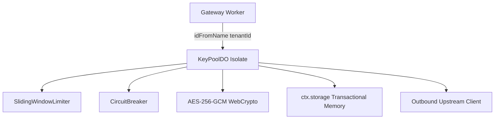

# Chapter 3.6: Private Key Actor & Circuit Breakers (LLD)

The **Private Key Actor** (`KeyPoolDO`) isolates tenant credentials, enforces sliding-window Rate-Per-Minute (RPM) limits, and trips circuit breakers when upstream endpoints degrade.

---

## 1. Architectural Role & Tenant Isolation



Each tenant has a strictly dedicated `KeyPoolDO` instance. Zero compute or memory is shared between tenants, guaranteeing **complete data isolation**.

---

## 2. Low-Level Design (LLD) Contracts

```typescript
// src/durable_objects/key_pool/types.ts
export interface KeyAllocationResult {
  readonly success: boolean;
  readonly decryptedKey?: string;
  readonly keyHash?: string;
  readonly provider?: string;
  readonly failureReason?: "RATE_LIMITED" | "CIRCUIT_OPEN" | "NO_KEYS";
  readonly retryAfterSeconds?: number;
}

export interface IKeyPoolActor {
  allocateKey(provider: string, model: string): Promise<KeyAllocationResult>;
  reportUpstreamResult(keyHash: string, status: number): Promise<void>;
}
```

---

## 3. Production Implementation Walkthrough

### Key Selection & Rate Limiting
The actor inspects key RPM buckets using a lock-free sliding window:

```typescript
// src/durable_objects/key_pool_do.ts
export class KeyPoolDO implements DurableObject {
  private keys: Map<string, StoredKeyRecord> = new Map();
  private rateLimiter = new SlidingWindowLimiter();
  private circuitBreakers = new Map<string, CircuitBreaker>();

  async allocateKey(provider: string, model: string): Promise<KeyAllocationResult> {
    const breaker = this.getOrCreateBreaker(provider);
    if (!breaker.canExecute()) {
      return { success: false, failureReason: "CIRCUIT_OPEN", retryAfterSeconds: 30 };
    }

    for (const [keyHash, key] of this.keys) {
      if (key.provider === provider && key.status === "ACTIVE") {
        if (this.rateLimiter.tryAcquire(keyHash, key.maxRpm)) {
          const decrypted = await decryptKey(key.encryptedKey, key.nonce);
          return { success: true, decryptedKey: decrypted, keyHash, provider };
        }
      }
    }

    return { success: false, failureReason: "RATE_LIMITED", retryAfterSeconds: 1 };
  }
```

### Circuit Breaker Tripping
When upstream providers return consecutive 5xx errors, the circuit trips:

```typescript
// src/durable_objects/circuit_breaker/breaker.ts
export class CircuitBreaker {
  private state: "CLOSED" | "OPEN" | "HALF_OPEN" = "CLOSED";
  private consecutiveFailures = 0;
  private lastStateChangeMs = Date.now();

  canExecute(): boolean {
    if (this.state === "OPEN") {
      if (Date.now() - this.lastStateChangeMs > 30_000) {
        this.state = "HALF_OPEN";
        return true;
      }
      return false;
    }
    return true;
  }

  recordResult(success: boolean): void {
    if (success) {
      this.consecutiveFailures = 0;
      this.state = "CLOSED";
    } else {
      this.consecutiveFailures++;
      if (this.consecutiveFailures >= 5) {
        this.state = "OPEN";
        this.lastStateChangeMs = Date.now();
      }
    }
  }
}
```

---

## 4. Error Matrix & Failure Isolation

| Failure Scenario | Actor State | System Behavior |
|---|---|---|
| **RPM Exceeded on Key** | Rate Limiter Bucket Full | Attempt next key; if all full, trigger communal failover |
| **5 Consecutive 5xx Errors** | Circuit trips to `OPEN` | Immediate local 503 fast-fail (<2ms) |
| **Isolate Memory Eviction** | Re-hydrate from `ctx.storage`| State restored in <5ms |

---

## 5. Self-Check Active Recall Quiz

1. **Question:** How does KeyPoolDO guarantee that Tenant A cannot access Tenant B's decrypted API keys?
<details>
<summary>Click to reveal answer</summary>
Durable Objects are addressed via <code>env.KEY_POOL.idFromName(tenantId)</code>, creating physically isolated V8 heaps per tenant with independent memory spaces.
</details>

2. **Question:** What is the cooldown period before an OPEN circuit breaker permits a probe request in HALF_OPEN?
<details>
<summary>Click to reveal answer</summary>
30 seconds.
</details>
