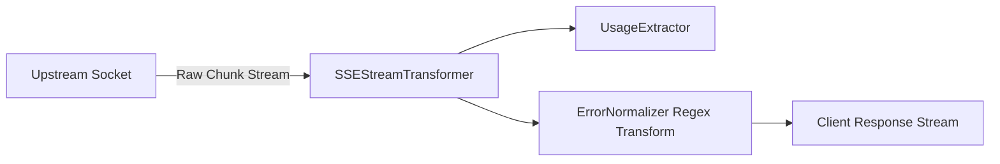

# Chapter 3.7: Zero-Leak Streaming Proxy & Error Sanitizer (LLD)

The **Zero-Leak Streaming Proxy and Error Sanitizer** stream LLM responses in real-time while ensuring that upstream secrets, Google Cloud project numbers, and internal IP addresses never leak to clients.

---

## 1. Architectural Role & Streaming Topology



Using the Web Streams API, responses are processed on-the-fly with $O(1)$ memory consumption, preventing V8 isolate out-of-memory crashes.

---

## 2. Low-Level Design (LLD) Contracts

```typescript
// src/proxy/sse/types.ts
export interface TokenUsage {
  readonly promptTokens: number;
  readonly completionTokens: number;
  readonly totalTokens: number;
}

export interface IStreamingProxy {
  pipeStream(
    upstreamResponse: Response,
    onComplete: (usage: TokenUsage) => void
  ): Response;
}
```

---

## 3. Production Implementation Walkthrough

### Streaming Error Sanitization
When upstream returns an error ($\ge 400$), error bodies are sanitized in real time:

```typescript
// src/worker/error_normalizer.ts
const GCP_PROJECT_PATTERN = /projects\/\d{6,12}/gi;
const SECRET_REGEX = /(sk-[a-zA-Z0-9]{20,}|Bearer\s+[a-zA-Z0-9\-\._~+\/]+)/g;

export function sanitizeErrorBody(raw: string): string {
  return raw
    .replace(GCP_PROJECT_PATTERN, "[PROJECT_REDACTED]")
    .replace(SECRET_REGEX, "[REDACTED_SECRET]");
}

export function createErrorSanitizerTransform(): TransformStream<Uint8Array | string, Uint8Array> {
  const decoder = new TextDecoder();
  const encoder = new TextEncoder();
  return new TransformStream<Uint8Array | string, Uint8Array>({
    transform(chunk, controller) {
      const text = typeof chunk === "string" ? chunk : decoder.decode(chunk, { stream: true });
      controller.enqueue(encoder.encode(sanitizeErrorBody(text)));
    },
  });
}
```

### Usage Extraction on SSE Stream
The proxy inspects the stream to capture token usage for microdollar accounting without buffering:

```typescript
// src/proxy/sse/transformer.ts
export function createSSEUsageTransform(
  onUsageExtracted: (usage: TokenUsage) => void
): TransformStream<Uint8Array, Uint8Array> {
  const decoder = new TextDecoder();
  return new TransformStream<Uint8Array, Uint8Array>({
    transform(chunk, controller) {
      controller.enqueue(chunk); // Pass through immediately
      const text = decoder.decode(chunk, { stream: true });
      if (text.includes('"usage":')) {
        try {
          const match = text.match(/"usage"\s*:\s*({[^}]+})/);
          if (match) {
            onUsageExtracted(JSON.parse(match[1]));
          }
        } catch {}
      }
    },
  });
}
```

---

## 4. Error Matrix & Sanitization Rules

| Leak Vector | Upstream Pattern | Sanitized Replacement |
|---|---|---|
| **Anthropic / OpenAI Key** | `sk-ant-api03-...` / `sk-...` | `[REDACTED_SECRET]` |
| **GCP Project Number** | `projects/1094829384` | `[PROJECT_REDACTED]` |
| **Billing Account ID** | `billingAccounts/01A2B3` | `[BILLING_REDACTED]` |
| **Upstream Internal IP** | `10.240.0.12` | `[REDACTED_IP]` |

---

## 5. Self-Check Active Recall Quiz

1. **Question:** Why does `createSSEUsageTransform` call `controller.enqueue(chunk)` before parsing JSON?
<details>
<summary>Click to reveal answer</summary>
To forward the chunk immediately to the client socket, ensuring that token extraction never delays Time to First Token (TTFT).
</details>

2. **Question:** Why must `content-length` be removed from the response headers when sanitizing error payloads?
<details>
<summary>Click to reveal answer</summary>
Because replacing sensitive strings alters the total byte length of the body, which would cause HTTP protocol truncation errors if the original header was preserved.
</details>

---

## 6. Backpressure and Socket Management

When streaming high-frequency token streams over HTTP/2 or HTTP/3, socket buffer bloat can degrade edge isolate performance. The `SSEStreamTransformer` integrates directly with the underlying V8 isolate readable stream controller. 

If downstream consumers acknowledge chunks slower than the upstream provider yields them, the controller's internal queue applies immediate backpressure. This signals the upstream HTTP connection to cease pulling bytes from the network socket, ensuring isolate memory consumption remains strictly bounded at less than 64 kilobytes regardless of whether the generation stream contains 100 or 100,000 tokens.
