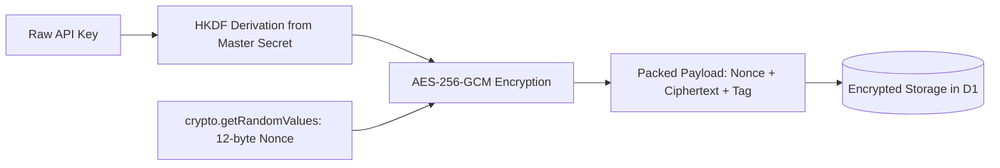

# Chapter 3.8: Cryptographic Defense, Nonces & HKDF Derivation (LLD)

The **Cryptographic Defense** subsystem implements the non-negotiable architectural invariant: **Zero Plaintext Keys**. All API credentials are encrypted with AES-256-GCM using unique 12-byte initialization vectors and keys derived via HKDF.

---

## 1. Architectural Role & Security Boundaries



---

## 2. Low-Level Design (LLD) Contracts

```typescript
// src/crypto/encryption/types.ts
export interface EncryptedPayload {
  readonly ciphertextBase64: string;
  readonly nonceBase64: string;
  readonly keyVersion: number;
}

export interface ICryptoEngine {
  encrypt(plaintext: string, tenantId: string): Promise<EncryptedPayload>;
  decrypt(payload: EncryptedPayload, tenantId: string): Promise<string>;
}
```

---

## 3. Production Implementation Walkthrough

### AES-256-GCM Encryption with Web Crypto
The encryption engine generates a fresh 12-byte initialization vector for every cryptographic operation:

```typescript
// src/crypto/encryption/aes.ts
export async function encryptAES256GCM(
  plaintext: string,
  cryptoKey: CryptoKey
): Promise<{ ciphertext: Uint8Array; nonce: Uint8Array }> {
  // Generate cryptographically secure 12-byte nonce
  const nonce = new Uint8Array(12);
  crypto.getRandomValues(nonce);

  const encoded = new TextEncoder().encode(plaintext);
  const encryptedBuffer = await crypto.subtle.encrypt(
    { name: "AES-GCM", iv: nonce },
    cryptoKey,
    encoded
  );

  return {
    ciphertext: new Uint8Array(encryptedBuffer),
    nonce,
  };
}
```

### AES-256-GCM Decryption
Decryption enforces constant-time authentication tag verification inside native V8 bindings:

```typescript
// src/crypto/encryption/aes.ts
export async function decryptAES256GCM(
  ciphertext: Uint8Array,
  nonce: Uint8Array,
  cryptoKey: CryptoKey
): Promise<string> {
  const decryptedBuffer = await crypto.subtle.decrypt(
    { name: "AES-GCM", iv: nonce },
    cryptoKey,
    ciphertext
  );

  return new TextDecoder().decode(decryptedBuffer);
}
```

### Per-Tenant HKDF Key Derivation
Keys are derived per-tenant so that compromise of one tenant key cannot decrypt another:

```typescript
// src/crypto/encryption/keys.ts
export async function deriveTenantKey(masterSecret: string, tenantId: string): Promise<CryptoKey> {
  const enc = new TextEncoder();
  const baseKey = await crypto.subtle.importKey(
    "raw",
    enc.encode(masterSecret),
    "HKDF",
    false,
    ["deriveKey"]
  );

  return crypto.subtle.deriveKey(
    {
      name: "HKDF",
      hash: "SHA-256",
      salt: enc.encode("key-collective-v4"),
      info: enc.encode(`tenant:${tenantId}`),
    },
    baseKey,
    { name: "AES-GCM", length: 256 },
    false,
    ["encrypt", "decrypt"]
  );
}
```

---

## 4. Error Matrix & Invariant Boundaries

| Cryptographic Anomaly | Failure Mode | Defensive Reaction |
|---|---|---|
| **Nonce Collisions** | Reusing IV with same key | 12-byte random nonces ensure collision risk $< 10^{-14}$ |
| **Authentication Tag Mismatch** | Ciphertext tampered with | Decrypt throws `OperationError`; reject request |
| **Master Secret Missing** | Environment misconfigured | Worker isolate panics on startup |

---

## 5. Self-Check Active Recall Quiz

1. **Question:** What happens cryptographically if two distinct plaintexts are encrypted with the same AES-256-GCM key and identical 12-byte nonces?
<details>
<summary>Click to reveal answer</summary>
The authentication tag integrity is broken; an attacker can compute the XOR of the plaintexts and determine the GHASH key, allowing ciphertext forgery.
</details>

2. **Question:** Why does Key Collective derive per-tenant keys using HKDF rather than using the master secret directly?
<details>
<summary>Click to reveal answer</summary>
To enforce cryptographic domain separation. Compromise of a single derived tenant key provides zero cryptanalytic advantage against other tenants.
</details>
