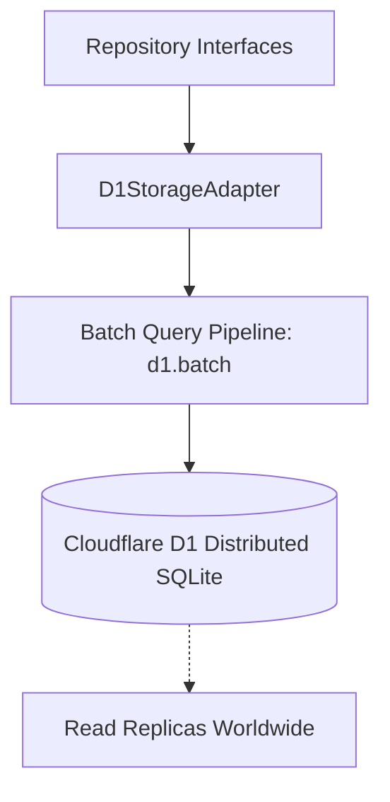

# Chapter 3.9: Storage Engine, D1 SQLite & Repositories (LLD)

The **Storage Engine** provides durable persistence for API keys, tenant accounts, and financial rollups using Cloudflare D1 (distributed serverless SQLite).

---

## 1. Architectural Role & Persistence Layers



D1 handles cold storage and historical ledgers, while hot state is cached in Durable Object transactional memory.

---

## 2. Low-Level Design (LLD) Contracts

```typescript
// src/storage/d1/types.ts
export interface ApiKeyEntity {
  readonly keyHash: string;
  readonly tenantId: string;
  readonly provider: string;
  readonly status: "ACTIVE" | "QUARANTINED" | "REVOKED";
  readonly encryptedKeyBase64: string;
  readonly nonceBase64: string;
  readonly keyVersion: number;
}

export interface IApiKeyRepository {
  insertKey(key: ApiKeyEntity): Promise<void>;
  updateStatus(keyHash: string, status: string, reason?: string): Promise<void>;
  getActiveKeys(tenantId: string): Promise<ApiKeyEntity[]>;
}
```

---

## 3. Production Implementation Walkthrough

### Repository Pattern Implementation
The API Key repository isolates SQL queries behind typed contracts:

```typescript
// src/storage/repositories/api_keys/repository.ts
export class ApiKeyRepository implements IApiKeyRepository {
  private db: D1Database;

  constructor(db: D1Database) {
    this.db = db;
  }

  async insertKey(entity: ApiKeyEntity): Promise<void> {
    await this.db.prepare(
      `INSERT INTO api_keys (key_hash, tenant_id, provider, status, encrypted_key, nonce, key_version, created_at)
       VALUES (?, ?, ?, ?, ?, ?, ?, datetime('now'))`
    )
    .bind(
      entity.keyHash,
      entity.tenantId,
      entity.provider,
      entity.status,
      entity.encryptedKeyBase64,
      entity.nonceBase64,
      entity.keyVersion
    )
    .run();
  }

  async updateStatus(keyHash: string, status: string, reason?: string): Promise<void> {
    await this.db.prepare(
      "UPDATE api_keys SET status = ?, quarantine_reason = ?, updated_at = datetime('now') WHERE key_hash = ?"
    )
    .bind(status, reason ?? null, keyHash)
    .run();
  }
}
```

### Atomic Batch Transactions
To minimize write latency, rollups and updates are submitted via `db.batch()`:

```typescript
// src/storage/d1/adapter.ts
export async function executeBatchLedgerUpdate(
  db: D1Database,
  statements: D1PreparedStatement[]
): Promise<D1Result[]> {
  return await db.batch(statements);
}
```

---

## 4. Error Matrix & Failure Mitigation

| D1 Failure Mode | Error String | Resolution Strategy |
|---|---|---|
| **Write Lock Contention** | `D1_ERROR: database is locked` | Defer to DO storage buffer; retry with exponential backoff |
| **Constraint Violation** | `UNIQUE constraint failed` | Treat as duplicate contribution; return HTTP 409 |
| **Read Timeout** | `D1_ERROR: query timeout` | Query local edge read-replica |

---

## 5. Self-Check Active Recall Quiz

1. **Question:** Why does Key Collective use the Repository Pattern rather than issuing raw SQL queries throughout the application code?
<details>
<summary>Click to reveal answer</summary>
It decouples domain routing and business logic from the underlying storage mechanism, making testing trivial through mock repositories without spinning up real D1 instances.
</details>

2. **Question:** What is the performance benefit of `db.batch()` in Cloudflare D1?
<details>
<summary>Click to reveal answer</summary>
<code>db.batch()</code> executes multiple SQL statements within a single network round-trip and atomic SQLite transaction, avoiding multiple serialization latencies.
</details>

---

## 6. Schema Migrations and Versioning

D1 schema definitions are tracked as versioned SQL migration scripts located in `src/storage/migrations/`. 

During local development and continuous integration runs, migrations are applied deterministically via the Cloudflare Wrangler CLI:
```bash
# Apply pending schema migrations locally
pnpm wrangler d1 migrations apply key-collective-db --local
```
This guarantees that all database tables—including `api_keys`, `tenants`, and `cost_ledger_rollups`—maintain strict schema parity across local Miniflare simulations and production edge deployments.
