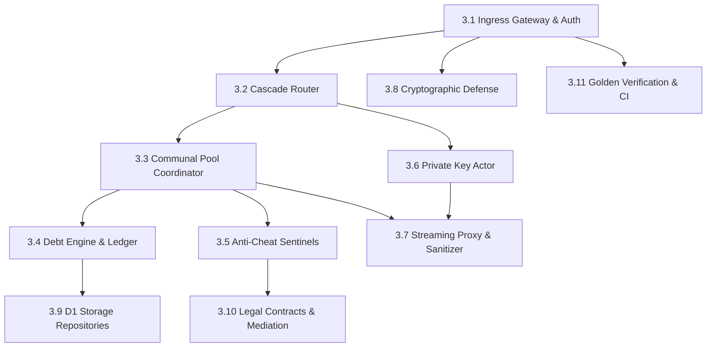

# Part 3: Guided Subsystem Tours & Low-Level Designs (LLDs)

Welcome to Part 3 of the Key Collective University Textbook. 

In this module, we step inside the codebase to perform an exhaustive, dependency-ordered architectural tour of the eleven core subsystems comprising the Key Collective proxy engine.

Each subsystem tour is structured according to a strict Low-Level Design (LLD) specification framework:
- **Architectural Context & Role**: Where the subsystem resides in the global edge topology.
- **TypeScript Interface Contracts**: Formal type definitions, state containers, and RPC boundaries.
- **State Machines & Data Structures**: Concurrency guarantees, in-memory structures, and lock-free execution.
- **Production Code Walkthrough**: Real snippets from `src/` demonstrating implementation details.
- **Error Matrix & Remediation**: Concrete failure modes and recovery procedures.
- **Self-Check Quizzes**: Active recall questions testing core design invariants.

## Subsystem Dependency & Reading Order

## Directory of Subsystem Tours

1. [3.1 Ingress Gateway & Edge Auth Middleware](./03_1_gateway_and_auth_middleware.md)
   - Edge request interception, bearer token resolution, and non-blocking telemetry.
2. [3.2 Intelligent Cascade Router & Capability Engine](./03_2_cascade_router_and_capability_engine.md)
   - Capability-based routing, model matching, and multi-provider failover chains.
3. [3.3 Communal Pool Engine & Coordinator Actor](./03_3_communal_pool_and_coordinator.md)
   - Lock-free key leasing, inventory indexing, and anti-stampede coordination.
4. [3.4 Community Debt Engine & Credit Economics](./03_4_debt_engine_and_quota_ledger.md)
   - Strict microdollar accounting, overdraft ceiling checks, and double-entry settlements.
5. [3.5 Anti-Cheat, Anti-Sybil & Key Sentinels](./03_5_anti_cheat_and_anti_sybil.md)
   - 5-layer sybil evaluation, zero-cost error probing, and automated quarantine triggers.
6. [3.6 Private Key Actor & Circuit Breakers](./03_6_private_key_actor_and_circuit_breakers.md)
   - Per-tenant isolate isolation, sliding-window RPM limiters, and 3-state circuit breakers.
7. [3.7 Zero-Leak Streaming Proxy & Error Sanitizer](./03_7_streaming_proxy_and_error_sanitizer.md)
   - TransformStream SSE parsing, upstream header allowlists, and regex error masking.
8. [3.8 Cryptographic Defense, Nonces & HKDF Derivation](./03_8_cryptographic_defense_and_nonces.md)
   - Hardware AES-256-GCM ciphers, 12-byte nonce generation, and master key derivation.
9. [3.9 Storage Engine, D1 SQLite & Repositories](./03_9_storage_repositories_and_d1.md)
   - Repository pattern abstractions, batch D1 transactions, and asynchronous rollups.
10. [3.10 Legal Contracts, Attestations & Mediation Protocols](./03_10_legal_contracts_and_mediation.md)
    - Client attestation verification, provider ToS alignment, and credit arbitration.
11. [3.11 Golden Verification Suites & CI/CD Quality Gates](./03_11_golden_verification_and_ci.md)
    - Deterministic Miniflare simulation, test harness design, and the `<10s` gate contract.
