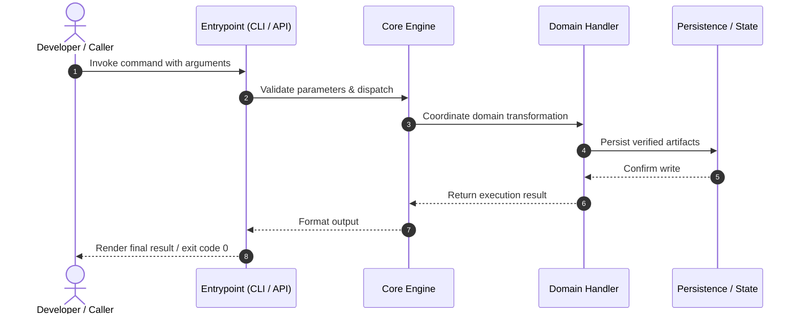

# Part 4: End-to-End Execution Flows (The "Hows")

> Tracing execution journeys through `key-collective` from invocation to completion.

---

## 🌊 Flow 1: Primary Lifecycle Journey

---

[← Previous: Part 3 — Subsystem Tours](03_subsystem_tours/README.md) | [Next: Part 5 — Idioms, Patterns & Trade-offs →](05_idioms_patterns_and_tradeoffs.md)
