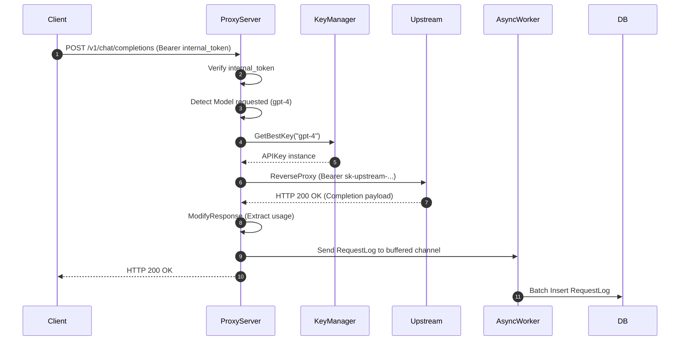
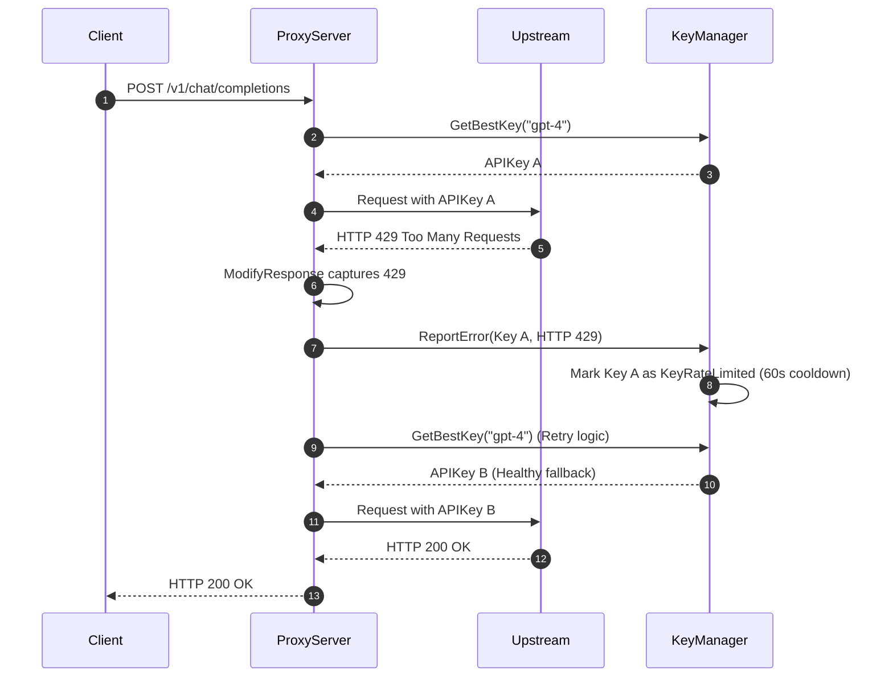
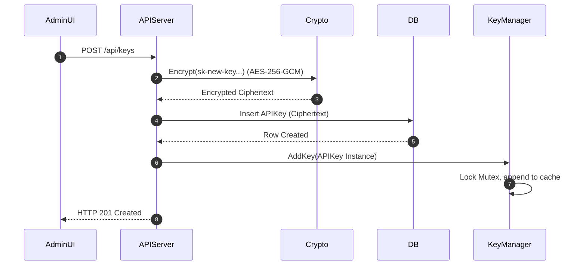

# Chapter 4: End-to-End Execution Flows

This section maps the concrete execution of critical operations within Key Collective. 
We examine the exact lifecycle of requests as they traverse the `ProxyServer`, `KeyManager`, and `DB` components.
We trace the flow from the initial HTTP request to the final database state mutation.

## Flow 1: Happy Path Proxy Request

When a client application requests an LLM completion, the system must act swiftly.
It authenticates the client, retrieves an upstream credential, proxies the request, and records telemetry.
It does all this with minimal overhead.



### Concrete HTTP Payloads

The client sends a standard OpenAI-compatible request structure:

```http
POST /v1/chat/completions HTTP/1.1
Host: proxy.keycollective.local
Authorization: Bearer kc_client_12345
Content-Type: application/json

{
    "model": "gpt-4",
    "messages": [{"role": "user", "content": "Hello"}]
}
```

The `ProxyServer` intercepts the request.
It strips the `Authorization` header containing `kc_client_12345`. 
It queries the `KeyManager` for an `APIKey` supporting `gpt-4`. 
The proxy modifies the outbound request to target `api.openai.com`.
It injects the upstream key into the new Authorization header.

The response from the upstream includes a `usage` block. 
The proxy parses this within the `httputil.ReverseProxy`'s `ModifyResponse` hook. 
It constructs a `RequestLog` and dispatches it to the async logging channel.
It does this before returning the payload to the client, ensuring the client receives the response immediately.

## Flow 2: 429 Circuit Breaker Trip & Automatic Cooldown

Upstream providers enforce rate limits aggressively. 
Key Collective implements an automatic circuit breaker.
It uses the `KeyRateLimited` state to prevent cascading failures.



When the upstream returns an HTTP 429, the `ModifyResponse` function intercepts the response. 
Instead of passing the error to the client, the `ProxyServer` acts on it.
It calls `ReportError` on the `KeyManager`. 

The `KeyManager` marks the specific `APIKey` instance as `KeyRateLimited`.
It records a timestamp for the penalty. 
The proxy then initiates a retry loop.
It requests a new key from the `KeyManager`. 
Because Key A is under a 60-second cooldown, `GetBestKey` evaluates the remaining healthy keys.
It returns Key B. 
The proxy retries the request using Key B.
The client receives a seamless 200 OK.
The client remains entirely unaware of the upstream 429 and the subsequent retry.

Upstream 429 Response Headers often look like this:
```http
HTTP/1.1 429 Too Many Requests
x-ratelimit-reset-requests: 60s
content-type: application/json

{
    "error": {
        "message": "Rate limit reached for requests",
        "type": "requests",
        "param": null,
        "code": "rate_limit_exceeded"
    }
}
```

This flow ensures high availability even when individual provider credentials hit their burst limits.

## Flow 3: Key Provisioning & Runtime Hydration

Adding a new key via the management UI requires specific safety guarantees.
We must persist the credential safely.
We must instantly update the hot path cache.
We must do this without requiring a restart or dropping active connections.



### Concrete Execution Details

The administrator submits a new OpenAI key via the Svelte interface.

Request:
```http
POST /api/keys HTTP/1.1
Authorization: Bearer admin_session_token
Content-Type: application/json

{
    "name": "Production GPT-4 Key",
    "provider": "openai",
    "key_value": "sk-proj-xyz789",
    "models": ["gpt-4", "gpt-3.5-turbo"]
}
```

The `APIServer` receives the payload. 
Before interacting with the `DB`, it protects the secret.
It passes the raw `key_value` to the cryptography module. 
The module generates a unique nonce.
It encrypts the key using AES-256-GCM. 

The encrypted blob and the nonce are stored in the `keys` table via the `DB` interface.
This guarantees that an attacker reading the SQLite file sees only random bytes.

Crucially, after the database transaction commits successfully, the workflow continues.
The `APIServer` constructs a plaintext `APIKey` struct in memory.
It calls `KeyManager.AddKey()`. 
The `KeyManager` acquires a write lock on its internal map.
It updates its routing tables.
It releases the lock instantly. 

The new key becomes immediately available to the `ProxyServer`.
It begins receiving routed inference requests on the very next cycle.
The entire operation requires zero downtime.
The hot path continues to process traffic seamlessly throughout the provisioning event.
