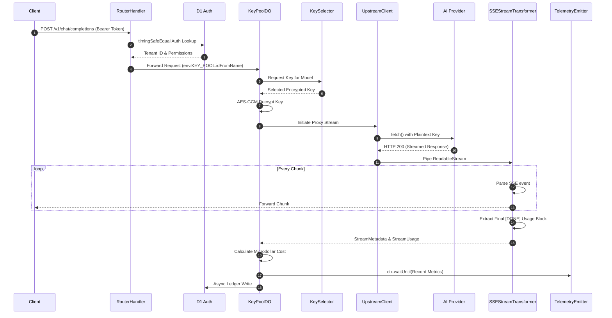
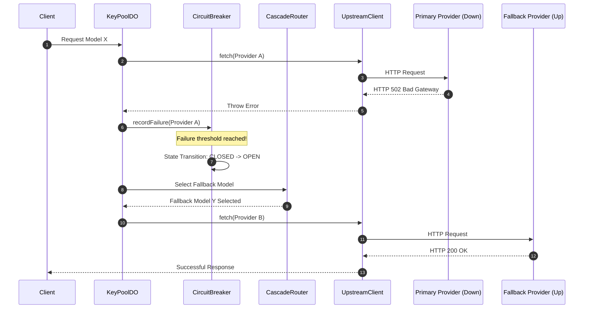

# 04 End-to-End Execution Flows

Understanding the static architecture is only half the battle. To truly grasp how Key Collective v2 operates, you need to follow a request through the system step by step. This document breaks down two of the most critical execution lifecycles: a successful streaming chat completion, and an upstream failure that triggers a cascade routing event.

By tracking the strict cause-and-effect of these flows, you will understand exactly how the actors collaborate in real-time, how data is passed across boundaries, and how errors are handled natively.

## Flow 1: Streaming Chat Completion Journey

This is the "happy path" for the most common operation in the system: a client requesting a streamed response from an LLM via the standard OpenAI `/v1/chat/completions` endpoint format. Because we are dealing with streams, we cannot wait for the entire response to finish before sending data to the client, nor can we calculate the final cost until the very last chunk arrives.

Here is the exact sequence of events, from the moment the HTTP request hits the Cloudflare edge to the moment the final billing ledger update is dispatched.



### Deep Breakdown of the Streaming Flow

1. **Inbound HTTP Request**: The client sends a `POST` request to the worker edge. The payload contains the user messages, system prompts, temperature settings, and the desired model choice. The edge worker immediately receives this stream.
2. **Bearer Token Extraction & Validation**: The `RouterHandler` extracts the `Authorization` header and hashes it. It queries D1 to verify the token using `timingSafeEqual` to prevent timing attacks. This prevents an attacker from inferring valid tokens based on response latency.
3. **Tenant Resolution**: D1 returns the associated `tenantId` and any applicable permissions. The router uses this ID to uniquely locate or wake up the specific Durable Object for this tenant via `env.KEY_POOL.idFromName(tenantId)`. This marks the transition from stateless edge logic to stateful tenant memory.
4. **DO Activation & Handoff**: The HTTP request is forwarded into the `KeyPoolDO` instance. At this point, we are inside the tenant's isolated memory space. The DO's `fetch` handler begins processing the payload.
5. **Key Selection**: The DO asks the `KeySelector` to find an available API key for the requested model from the in-memory pool. The `KeySelector` checks the `RateLimiter` to ensure the key hasn't exceeded its TPM/RPM limits.
6. **Key Decryption**: The selected key is retrieved from memory. It is stored encrypted. The DO uses the tenant's master key and the 12-byte nonce to decrypt the key via AES-GCM, yielding a temporary plaintext key string.
7. **Upstream Request**: The `UpstreamClient` constructs the outbound `fetch` request, injecting the newly decrypted plaintext key into the HTTP headers. It passes along the modified request body to the upstream provider (e.g., OpenAI, Anthropic).
8. **Stream Piping**: The upstream provider responds with a `Transfer-Encoding: chunked` stream. The `UpstreamClient` intercepts the `ReadableStream` rather than buffering the entire response into memory.
9. **Chunk Transformation**: The stream is passed through the `SSEStreamTransformer`. This is a custom `TransformStream`. As chunks arrive, it does two things simultaneously:
    - It immediately forwards the raw string payload to the Client, ensuring optimal Time-To-First-Token (TTFT).
    - It parses the SSE string looking for specific metadata markers to calculate usage.
10. **Usage Extraction**: When the stream concludes, modern providers send a final chunk containing token usage statistics. This generates the `StreamUsage` and `StreamMetadata` objects. The transformer extracts this data without interrupting the flow to the client.
11. **Cost Calculation**: The `KeyPoolDO` takes the token usage, looks up the `ModelRegistry` pricing for the specific model, and calculates the exact cost in `int64` microdollars. It increments the tenant's in-memory spend accumulator.
12. **Telemetry & Ledger Writes**: The DO fires off metrics to the `TelemetryEmitter` using `ctx.waitUntil()` so the client doesn't wait for the logging to finish. It also queues an asynchronous write to D1 to update the tenant's persistent spend ledger.

```typescript
// Example of the SSEStreamTransformer extracting usage from the final chunk
export class SSEStreamTransformer extends TransformStream {
  constructor(private onUsageExtracted: (usage: StreamUsage) => void) {
    super({
      transform(chunk, controller) {
        const text = new TextDecoder().decode(chunk);
        
        // Forward to client immediately to maintain low latency
        controller.enqueue(chunk);
        
        // Background parsing for billing and accounting
        if (text.includes('"usage":')) {
           try {
             // Strip the SSE prefix and parse the JSON block
             const parsed = JSON.parse(text.replace('data: ', '').trim());
             if (parsed.usage) {
               onUsageExtracted(parsed.usage);
             }
           } catch (e) {
             console.error("Failed to parse stream usage", e);
           }
        }
      }
    });
  }
}
```

## Flow 2: Circuit Breaker Trip & Cascade Failover

Things break. Upstream providers go down, API keys get rotated unexpectedly, and rate limits get exceeded. A resilient system must handle these failures gracefully without exposing them to the end user. This flow illustrates what happens when our primary model choice fails.



### Deep Breakdown of the Failover Flow

1. **Initial Request**: The user requests a generation. The system selects the primary provider configured for that tier (e.g., Anthropic Claude 3.5 Sonnet).
2. **Upstream Failure**: The `UpstreamClient` attempts the `fetch`, but the provider returns an HTTP 502 Bad Gateway. This could also be a 429 Too Many Requests, or simply a network timeout.
3. **Failure Recording**: The `UpstreamClient` catches the non-200 response and throws a specific internal error type. The `KeyPoolDO` catches this exception and reports the failure to the `CircuitBreaker` via `CircuitBreaker.recordFailure(modelId)`.
4. **Tripping the Breaker**: The `CircuitBreaker` increments its consecutive failure counter for that specific provider. If the counter exceeds the configured threshold (e.g., 5 consecutive failures within a time window), the breaker trips. Its internal state transitions from `CLOSED` (traffic flows normally) to `OPEN` (traffic is immediately blocked).
5. **Cascade Routing**: The `KeyPoolDO` realizes the primary path is blocked. It consults the `CascadeRouter`. The router looks at the `ModelRegistry` and finds the designated fallback model for the requested tier (e.g., it falls back from Claude 3.5 Sonnet to GPT-4o).
6. **Retry on Fallback**: The `KeyPoolDO` requests a new key from the `KeySelector`, this time specifically for the fallback provider. It initiates a new request via the `UpstreamClient` using the new credentials.
7. **Successful Resolution**: The fallback provider responds successfully. The client receives their streaming response without ever knowing that the primary provider was down. This is the definition of high availability and zero client downtime.

```typescript
// Conceptual implementation of CircuitBreaker tripping
export class CircuitBreaker {
  private consecutiveFailures = 0;
  private state: 'CLOSED' | 'OPEN' | 'HALF_OPEN' = 'CLOSED';
  private readonly threshold = 5;

  recordFailure() {
    this.consecutiveFailures++;
    if (this.state === 'CLOSED' && this.consecutiveFailures >= this.threshold) {
      console.warn(`Circuit Breaker tripped! Transitioning to OPEN state.`);
      this.state = 'OPEN';
      
      // Schedule half-open transition to test recovery later
      setTimeout(() => {
        console.info(`Circuit Breaker transitioning to HALF_OPEN to test recovery.`);
        this.state = 'HALF_OPEN';
      }, 30000); 
    }
  }

  canExecute(): boolean {
    return this.state !== 'OPEN';
  }
}
```

By thoroughly understanding these two critical flows, you understand the lifecycle of over 95% of the requests moving through Key Collective v2. The system is designed from the ground up to be deterministic, observable, and exceptionally resilient.
